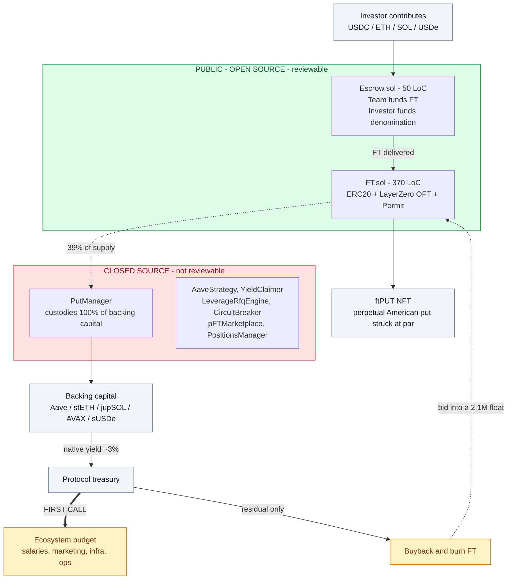

# flying-tulip-audit

Independent security + economic review of **Flying Tulip** (Andre Cronje).
Date: 2026-09-02. Updated: 2026-09-20 (supply, market data, backing size and the APY
analysis re-verified against live RPC, current docs, and the founder's public X
statements — corrections applied in place).

**Start here:** [`reports/FINAL_REPORT.md`](reports/FINAL_REPORT.md)

## System at a glance

The whole structure, with the trust boundary marked. Everything in red is code the
public cannot read — including the contract that holds 100% of the backing capital.



**Read that diagram as the pitch:** capital goes in, is never spent, earns yield, and the
yield buys back FT. The four headline conclusions are all failures of specific edges in
it — the closed-source box, the `FIRST CALL` edge, the `residual` edge, and the supply
number behind `FT.sol`.

## Headline conclusions

1. **The published code is fine; the important code is not published.** `FT.sol` is
   competent — no arithmetic, reentrancy, or signature-replay bugs found. But
   `PutManager`, the contract holding 100% of backing capital, is **closed source**.
2. **Best contract finding: `Escrow.withdraw()` bypasses the contract's only
   protection.** It excludes just the denomination token, so the owner can withdraw the
   FT deposited for the investor. The "escrow" is one-sided custody.
   *(Prior art: PeckShield PVE-002, rated Low — they recommended disclosure, not a fix.)*
   Also new: **the deployed source no longer matches the audited checksum (E-09)**, while
   the README still claims it is preserved "to keep the audited source exactly."
3. **The advertised APY is paid — but it is not a yield.** sftUSD measurably pays
   7-12% (daily since 2026-05-30) — yet its organic base is **0%**: the entire payout is
   **FT-token rewards bought on the open market, distributed at treasury discretion**.
   The yield-bearing story behind it fails twice over: unlevered collateral caps at
   ~3-4.7% (live data), and the founder's own scaling path — *"delta hedge of
   stETH/ETH … safe up to 8x"* — is the leverage the no-leverage mandate forbids. On the
   founder's $51M backing, the yield-funded surplus after first-call opex is zero to
   negative. The buyback that scales is funded by **other holders' principal**, executing
   into a **$2.1M float** the founder himself quotes.
4. **Docs say 10B supply; chain says 850M and shrinking** (1.199B at first read, −29% in
   18 days). The 8.8B reconciliation is disclosed **only in the founder's X posts**
   (8.79B unallocated burned) — the documentation was never updated.

## Structure

- `research/01-protocol-overview.md` — architecture, tokenomics, products, yield claims
- `research/02-onchain-facts.md` — verified supply, distribution, roles, market data
- `findings/01-FT-token.md` — FT.sol review + attack path
- `findings/02-Escrow.md` — Escrow.sol review
- `findings/03-economics-high-yield.md` — the yield critique
- `contracts/` — upstream source (cloned from `github.com/flyingtulipdotcom`)
- `scripts/keccak.py` — pure-Python keccak-256 used to verify EIP-712 typehashes
- `scripts/lint_mermaid.py` — dependency-free linter for the diagrams in these docs

## Reading the diagrams

There are 36 Mermaid diagrams across these documents. They are colour-coded, and the
colours are the argument:

| Colour | Meaning |
|---|---|
| **green** | Holds up — verified, or a genuine strength |
| **blue** | The project's own claim, stated as claimed |
| **amber** | Conditionally true, or a caveat that materially limits the claim |
| **red** | Broken, false, or a vulnerability |
| **purple** | Closed source — cannot be verified either way |

The pattern to look for is **a blue node feeding a red node**. That is the shape of
every false claim in this review: an assertion the project makes, followed by what the
chain or the docs' own numbers actually support.

Re-run the diagram linter with:

```
python scripts/lint_mermaid.py
```

## Method

Manual source review plus live RPC verification across Ethereum, BSC, Base, Avalanche
and Sonic (first read 2026-09-02). Re-verified 2026-09-20: live RPC re-reads, live
venue/market data, current docs (incl. Wayback), and a read-only harvest of the
founder's public X statements, cross-checked by an adversarial multi-agent swarm.
All on-chain numbers in `research/02-onchain-facts.md` were read live and are
reproducible.

## Disclaimer

Research notes only. Not investment advice. Not a substitute for a professional audit.
No exploit code is included; findings are descriptive.
