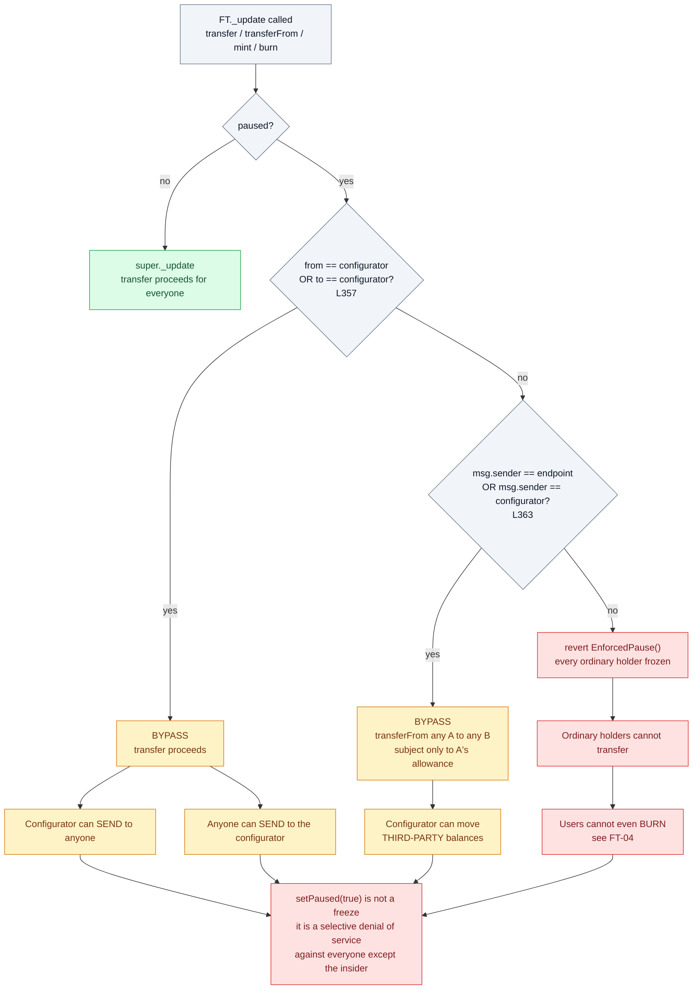
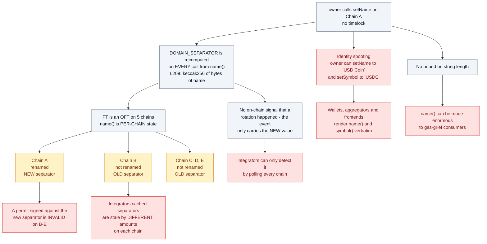
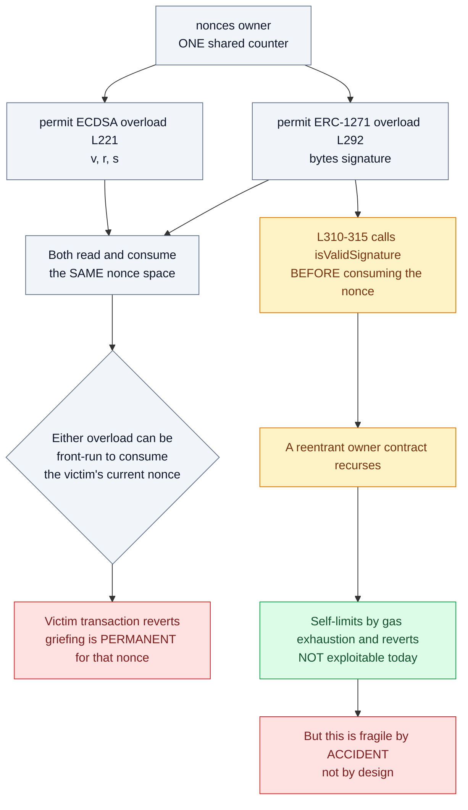
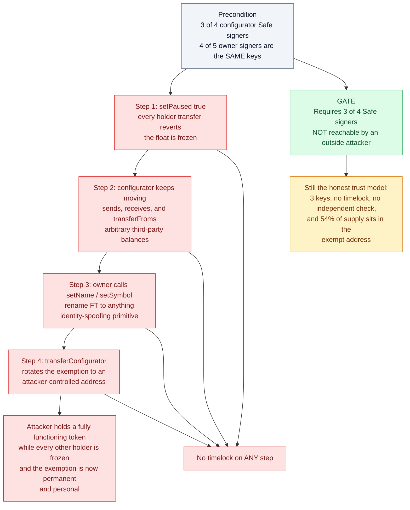
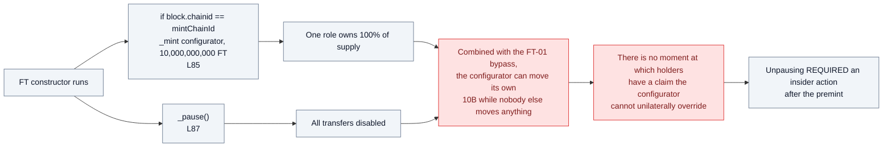

# Findings — `contracts/FT.sol`

Source: `github.com/flyingtulipdotcom/ft`, `contracts/FT.sol` (370 LoC, solc ^0.8.30,
ERC20 + LayerZero OFT + ERC20Permit + Pausable + Ownable).

> Framing note. `FT.sol` is a small, competently written token. I found **no
> arithmetic bug, no reentrancy, and no signature-replay flaw** — I verified the two
> hardcoded EIP-712 typehashes against independently computed keccak values and both
> match. The material issues below are **privilege and pause-semantics** issues, which
> is the right thing to focus on for a token whose entire supply was premined to a
> single role.

---

## FT-01 — The pause is a one-directional freeze: the configurator keeps full transfer ability

**Severity: High (centralisation) · Status: partially acknowledged upstream as "Low" (their Q-2)**

`_update` (L346–369):

```solidity
if (!paused()) { super._update(from, to, value); return; }

address ftConfigurator = _configurator;
if (from == ftConfigurator || to == ftConfigurator) {   // L357  <-- exempt
    super._update(from, to, value); return;
}

address sender = _msgSender();
if (sender == address(endpoint) || sender == ftConfigurator) {  // L363 <-- exempt
    super._update(from, to, value); return;
}

revert EnforcedPause();
```

### What `_update` actually does when paused



The `endpoint` exemption at L363 is **correct and necessary** — LayerZero V2 needs it for
OFT credit/debit, and I checked it. The problem is specifically the two `configurator`
branches sitting alongside it.

While paused, **every** ordinary holder reverts. The configurator does not:

- It can send FT to anyone (`from == configurator`).
- Anyone can send FT to it (`to == configurator`).
- As `msg.sender`, it can call `transferFrom(A, B, v)` for **any** A and B, subject only
  to A having granted it an allowance.

So `setPaused(true)` is not a freeze — it is a **selective denial of service against
everyone except the insider**. The insider retains a fully functioning token while the
float is immobilised. This matters here more than in a typical token because:

1. The configurator Safe **holds 54% of supply** (648M FT, verified on-chain).
2. The configurator is *also* the LayerZero `delegate` — the same key across all five
   chains (`utils/constants.ts`).
3. The configurator Safe shares **4 of 5 signers** with the `owner` Safe, so the pause
   power and the pause-exemption are not independently controlled.

**Upstream downgrades this to "Low / intentional for recovery workflows."** I think that
is the wrong rating for a token sold to the public on a "100% capital protection"
promise: the recovery carve-out is broad enough to move third-party balances, not just
to recover the protocol's own funds.

**Recommendation.** Narrow the exemption to `from == configurator` (protocol-owned
funds) and drop the open-ended `msg.sender == configurator` branch, or gate it behind a
separate, timelocked `emergencyRecovery` flag with an event and a bounded scope.

---

## FT-02 — Entire 10B supply premined to the configurator, contract deployed paused

**Severity: Medium · Status: by design, but worth stating plainly**

```solidity
if (block.chainid == mintChainId) {
    _mint(ftConfigurator, 10_000_000_000e18);   // L85
}
_pause();                                        // L87
```

Genesis state: one role owns 100% of supply, and all transfers are disabled. The token
only becomes usable when that role unpauses and distributes. Combined with FT-01, the
launch configuration is **complete insider control**; there is no moment at which
 holders have a claim the configurator cannot unilaterally override.

This is normal for a token launch, but "10B premined to a 3-of-4 Safe, deployed paused,
pause is asymmetric" is the honest description of the trust model, and it is not the
impression created by "no vesting, no lockup, no inflation, 100% capital protection."

---

## FT-03 — `setName` / `setSymbol` mutate the EIP-712 domain separator and the token's identity, with no timelock

**Severity: Medium · Status: upstream rates this Informational (their I-3)**

```solidity
function setName(string memory newName) external onlyOwner { _setName(newName); }   // L169
function _domainSeparatorDynamic() internal view returns (bytes32) { ... keccak256(bytes(name())) ... }  // L209
```

Two distinct problems:

**(a) Cross-chain domain-separator desynchronisation.** `name()` is per-chain state fed
into the domain separator. FT is an OFT deployed on five chains. Renaming on one chain
and not the others leaves the chains with different separators, so a permit valid on
chain A is invalid on chain B, and integrators' cached separators are stale *by
different amounts* on each chain. Because `DOMAIN_SEPARATOR()` is recomputed on every
call, there is no on-chain signal that a rotation happened; integrators can only detect
it by polling.

**(b) Identity spoofing.** The owner can rename FT to `"USD Coin"` / `"USDC"`. Any
wallet, aggregator, or frontend that renders `name()`/`symbol()` will display it. This
is a cheap, high-leverage phishing primitive and there is no bound on string length, so
`name()` can also be made enormous to gas-grief consumers.



**Recommendation.** Timelock renames, emit the old and new value in the event (currently
the event only carries the new value), cap string length, and treat a rename as a
coordinated multi-chain operation.

---

## FT-04 — Users cannot burn while paused; the configurator can

**Severity: Low**

`burn()` / `burnFrom()` route through `_update(from, address(0), v)`. While paused,
`from` is the user (not the configurator) and `to` is `address(0)` (not the
configurator), and `msg.sender` is the user → `revert EnforcedPause()`. The configurator
is exempt. There is no stated reason a user should be prevented from *destroying* their
own tokens during a freeze, and it removes the only action a holder might use to exit a
compromised position.

---

## FT-05 — Two `permit` entrypoints share one nonce space

**Severity: Low · ( partly inherent to ERC-2612 )**

`permit(..., uint8 v, bytes32 r, bytes32 s)` (L221) and the ERC-1271
`permit(..., bytes signature)` (L292) both read and consume `nonces(owner)`. Any third
party can front-run *either* overload to consume the victim's current nonce and revert
their transaction. This griefing is permanent for that nonce. Standard permit
front-running applies, but the second overload doubles the observable surface for
mempoel watchers.

The ERC-1271 branch (L310–315) calls `isValidSignature` **before** consuming the nonce,
so a reentrant owner contract recurses; this self-limits by gas exhaustion and reverts,
so it is not exploitable, but it is fragile-by-accident rather than by design.



**Recommendation.** Document the shared nonce space; consume the nonce before the
external call in the 1271 branch.

---

## Non-findings (checked and clean)

| Check | Result |
|---|---|
| `_EIP712_DOMAIN_TYPEHASH` | ✅ matches independent keccak |
| `_PERMIT_TYPEHASH` | ✅ matches independent keccak |
| Cross-chain permit replay | ✅ `block.chainid` + `address(this)` in separator |
| Signature malleability / replay | ✅ nonce consumed in both overloads; OZ `ECDSA` rejects high-s |
| OFT `_credit`/`_debit` under pause | ✅ `endpoint` caller exemption is correct for LZ V2 |
| Mint access control | ✅ only in constructor; no public mint |
| `transferConfigurator` zero-address | ✅ reverts |

---

## Attack path (insider or compromised configurator key)

Requires 3-of-4 configurator Safe signers — not reachable by an outside attacker, but
this is the full extent of what that key can do:

1. `setPaused(true)` — all holder transfers revert; the float is frozen.
2. Configurator still sends, receives, and (with any pre-existing allowance)
   `transferFrom`s arbitrary third-party balances.
3. `owner` (4/5 of the same signers) can `setName`/`setSymbol` to anything.
4. `transferConfigurator` can rotate the role to an attacker-controlled address,
   making the exemption permanent and personal.

There is no timelock on any of these four steps.



### Genesis state (FT-02)


