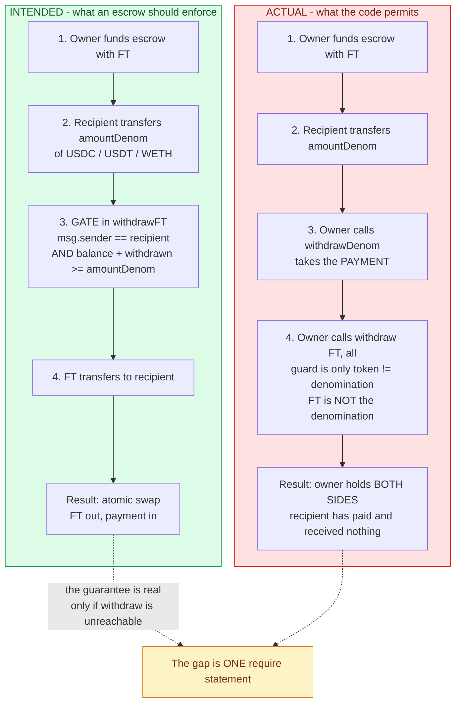
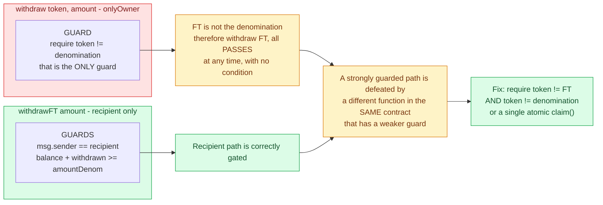
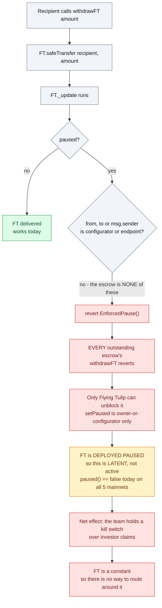
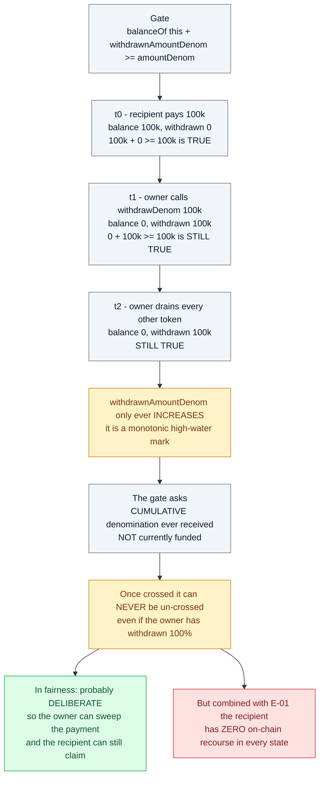
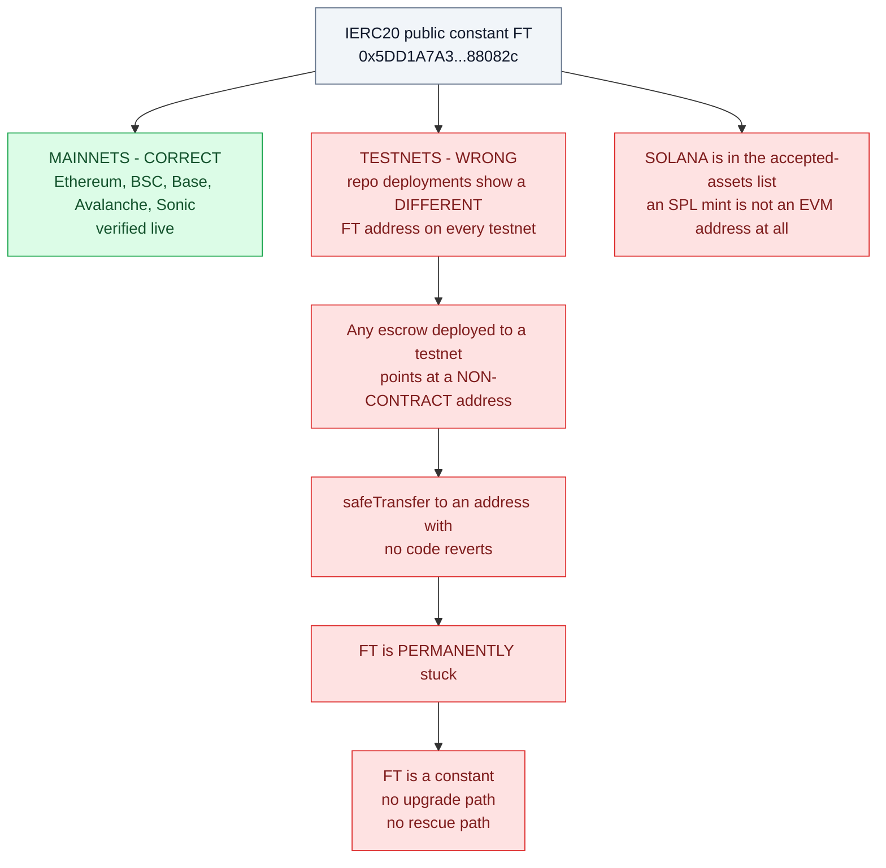
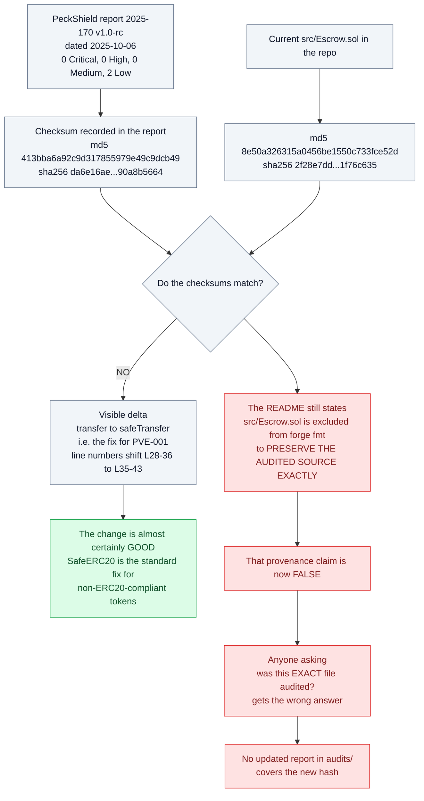

# Findings — `src/Escrow.sol`

Source: `github.com/flyingtulipdotcom/escrow`, `src/Escrow.sol` (50 LoC).

### Prior audit — PeckShield, report 2025-170, v1.0-rc, 2025-10-06

The repo ships `audits/*.pdf`: **PeckShield**, "Smart Contract Audit Report for Flying
Tulip (FT) Escrow". Result: **Critical 0 · High 0 · Medium 0 · Low 2 · Info 0**.

| ID | Title | Severity |
|---|---|---|
| PVE-001 | Accommodation of Non-ERC20-Compliant Tokens | Low |
| **PVE-002** | **Trust Issue of Admin Keys** (CWE-287) | **Low** (Likelihood Low / Impact Medium) |

PeckShield's PVE-002 covers what I call E-01 below: they quote `withdraw()` and
`withdrawDenom()` and note *"the extra power to these privileged accounts may also be a
**counter-party risk to the escrow-affected recipient**."* Their recommendation was only
to *"explicitly inform the involved recipient about the presence and capability of the
privileged owner account"* — i.e. **disclosure, not a code fix.**

So E-01 is **not novel**. What I add is the sharper framing: the contract's single
headline guarantee is enforced on the wrong function, making it a concrete bypass rather
than a generic "admins are powerful" note — and I argue Low underrates it for a sale
contract.

⚠️ **The current source no longer matches the audited source** — see **E-09**.

---

This is the contract used to swap FT for the contribution asset in the sale. Per the
repo's own README:

> **Owner (Flying Tulip)** funds the escrow with FT tokens.
> **Recipient** transfers the denomination token into the escrow.
> Once the escrow has received at least `amountDenom`, the **recipient can withdraw FT**.
> This design assumes a **trusted flow**: there is no price enforcement, timeouts, or
> partial-fill logic.

```solidity
function withdraw(address token, uint amount) external onlyOwner {
    require(token != address(denomination), "use withdrawDenom");
    IERC20(token).safeTransfer(owner, amount);
}

function withdrawDenom(uint amount) external onlyOwner {
    withdrawnAmountDenom += amount;
    denomination.safeTransfer(owner, amount);
}

function withdrawFT(uint amount) external {
    require(msg.sender == recipient, "Only recipient can call");
    require(denomination.balanceOf(address(this)) + withdrawnAmountDenom >= amountDenom, "Not enough denom");
    FT.safeTransfer(recipient, amount);
}
```

The README is honest that this is trusted. The findings below are about the gap between
what the contract *appears* to guarantee (an escrow) and what it *actually* guarantees
(one-sided custody).

---

## E-01 — `withdraw()` bypasses the FT gate entirely: the owner can reclaim the recipient's FT

**Severity: High (if the escrow is relied on as protection) · Low if "trusted" is truly accepted**
**Previously reported: PeckShield PVE-002, rated Low — recommendation was disclosure, not a fix**

The only guard in `withdraw` is `token != address(denomination)`. **FT is not the
denomination**, so:

```solidity
escrow.withdraw(FT_ADDRESS, allFT)   // callable by owner, at any time, no condition
```

The contract's headline property — *"the recipient can withdraw FT once the
denomination has been paid"* — is therefore **not enforced**. The owner can:

1. Fund the escrow with FT.
2. Wait for the recipient to transfer `amountDenom` of USDC/USDT/WETH into the escrow.
3. Call `withdrawDenom(amountDenom)` to take the payment **and**
   `withdraw(FT, all)` to take back the FT.

The recipient's only remedy is suing Flying Tulip. Every check in `withdrawFT` —
the recipient check, the "Not enough denom" check, the whole funding gate — is
circumvented by a different function with a weaker guard.

#### Intended flow vs what the code permits



#### The guard is on the wrong function



**This is a real code-level flaw, not just a centralisation observation:** the guard is
*placed on the wrong function*. If the intent is to protect the recipient, `withdraw`
must exclude FT as well.

**Recommendation.** `require(token != address(FT) && token != address(denomination))`,
or better: store an immutable `ftAmount` and have a single `claim()` that atomically
releases FT to the recipient and the denomination to the owner.

---

## E-02 — No on-chain binding between `amountDenom` and the FT amount; no cap on `withdrawFT`

**Severity: Medium**

The sale rate is **10 FT per $1**. Nothing in the contract encodes that rate. There is
no `ftAmount` state variable, no cap, and no `claimed` flag:

```solidity
function withdrawFT(uint amount) external {
    require(msg.sender == recipient, ...);
    require(... >= amountDenom, ...);
    FT.safeTransfer(recipient, amount);   // `amount` is arbitrary
}
```

Consequences:
- The recipient takes **whatever is in the contract**, not what they are entitled to.
- The function is **repeatable** — no state marks it as consumed. Call it N times and
  you get N × `amount` (until the balance runs out).
- If an escrow is over-funded, or a funder reuses an address, the recipient
  systematically over-withdraws. There is no on-chain arithmetic anywhere that could
  detect this.
- An integrator auditing the sale **cannot verify the 10 FT/$1 rate from chain state**;
  it is entirely an off-chain promise.

**Recommendation.** Add `uint256 public immutable ftAmount;` and
`bool public ftClaimed;`, and bound `amount == ftAmount`.

---

## E-03 — `withdrawFT` is bricked while FT is paused; the team controls the pause

**Severity: Medium**

`FT.safeTransfer(recipient, amount)` calls into `FT._update`, which reverts
`EnforcedPause()` unless `from`/`to` is the configurator or `msg.sender` is the
endpoint/configurator. The escrow is none of those.

FT is **deployed paused** (`_pause()` in the constructor), and `setPaused` is
owner-or-configurator only. So:

> If FT is ever paused, every outstanding escrow's `withdrawFT` reverts, and only
> Flying Tulip can unblock it.



Currently `paused() == false` on all five mainnets, so this is latent rather than
active — but it means the team holds a **kill switch over investor claims**, and
because `FT` is a `constant` there is no way to route around it.

---

## E-04 — `withdrawnAmountDenom` is a monotonic high-water mark, not a solvency test

**Severity: Low**

The gate is `balanceOf(this) + withdrawnAmountDenom >= amountDenom`. Since
`withdrawnAmountDenom` only ever increases, this tests *"cumulative denomination ever
received"*, not *"currently funded"*. Once the threshold is crossed it can never be
un-crossed, even if the owner has withdrawn 100% of the funds.



That is presumably deliberate (so the owner can sweep the payment and the recipient can
still claim), but it means `withdrawnAmountDenom` provides **no protection to the
recipient at any point**. Combined with E-01, the recipient has zero on-chain recourse
in every state.

---

## E-05 — Hardcoded immutable `FT` address is wrong on every testnet

**Severity: Low (mainnets are correct) · but permanent and unrecoverable**

```solidity
IERC20 public constant FT = IERC20(address(0x5DD1A7A369e8273371d2DBf9d83356057088082c));
```

I verified this address is correct on **Ethereum, BSC, Base, Avalanche and Sonic**. ✅

But the repo's own `deployments/` folder shows **different addresses on every testnet**:

| Network | FT address |
|---|---|
| Ethereum / BSC / Base / Avalanche / Sonic | `0x5DD1A7…88082c` ✅ |
| Sepolia | `0xA92d5C6a9E73D0EA221Eb0B1fB8effE5E68ED064` |
| Base Sepolia | `0x70c79f034aa3eBF1B840dB8AE0693070Ba5b7407` |
| BSC Testnet | `0x3a2bDE790512a95021d7E7D1315e237b1CfeF55c` |
| Fuji | `0x507eCe939c6576231cF4B5ce080A2e2Cf703BBF0` |

Any escrow deployed to a testnet points at a non-contract address. `safeTransfer` to an
address with no code reverts, and because `FT` is a `constant` there is **no upgrade or
rescue path** — the FT is permanently stuck. The same applies to **Solana**, which is in
the accepted-assets list: a Solana SPL mint is not an EVM address at all.



**Recommendation.** Make `FT` an immutable constructor argument validated at deploy time.

---

## E-06 — No events emitted anywhere

**Severity: Low**

The contract emits **zero** events. There is no `Funded`, `Withdrawn`, or `FTClaimed`.
Off-chain monitoring, indexers, and any recipient-side automation must poll
`balanceOf` / `withdrawnAmountDenom` to infer state. For a contract holding sale
proceeds this makes independent auditing of the raise materially harder.

---

## E-07 — Blacklistable and non-standard denomination tokens

**Severity: Low**

The accepted contribution assets include **USDC and USDT**, both of which support
issuer-level blacklisting. If the escrow address is blacklisted by the issuer, the
funds are frozen and `withdrawDenom` reverts — while `withdraw` (E-01) still lets the
owner remove every other token.

Separately, `denomination.balanceOf(address(this))` accounting breaks for rebasing or
fee-on-transfer tokens, and `amountDenom` cannot be trusted for those.

---

## E-08 — No timeout or refund path for the recipient

**Severity: Informational**

If the owner never funds the FT, the recipient has paid and has **no** on-chain
mechanism to reclaim the denomination. There is no deadline, no `refund()`, and no
`cancel()`. The recipient's sole protection is that the owner cannot take the
denomination until it has been sent — which is not a protection at all, since the owner
can simply never send the FT.

---

## E-09 — The deployed source no longer matches the audited source

**Severity: Medium (process / audit-integrity)**

PeckShield's report records the checksum of the artefact it reviewed:

```
md5     413bba6a92c9d317855979e49c9dcb49
sha256  da6e16ae3b16848d4086f2bed322bc75354b1cc9fb8baad8f5dcefb90a8b5664
```

Current `src/Escrow.sol`:

```
md5     8e50a326315a0456be1550c733fce52d
sha256  2f28e7dd7b1722ff33e384e9702006f23c865de9875a442ba286e56d1f76c635
```

**They do not match.** The visible diff is the fix for PVE-001 — PeckShield's listing 3.3
shows `IERC20(token).transfer(owner, amount)` and `denomination.transfer(...)`, while the
current code uses `safeTransfer(...)` with OpenZeppelin `SafeERC20`. Line numbers shift
accordingly (audited L28–36 → current L35–43).

That change is very likely correct and benign — adopting `SafeERC20` is the standard fix
for non-ERC20-compliant tokens. The problem is the **provenance claim**. The README
states:

> "Note: `src/Escrow.sol` is excluded from `forge fmt` to **preserve the audited source
> exactly**."

That is now false. The file changed after the audit, and the repo still presents it as
the audited artefact. Anyone verifying "was this exact file audited?" gets the wrong
answer. There is no updated report in `audits/` matching the new hash.



Note the important asymmetry: **the code change is fine, the provenance claim is not.**
This is not an accusation of tampering — it is an audit-integrity gap where an audit
badge implies coverage of code that postdates the audit.

**Recommendation.** Publish the re-audit (or a delta letter) against
`sha256 2f28e7dd…76c635`, or revert the README claim. Do not let an audit badge imply
coverage of code that postdates it.

---

## Summary

| ID | Finding | Severity | Prior art |
|---|---|---|---|
| E-01 | `withdraw()` bypasses the FT gate; owner can reclaim recipient's FT | **High** | PeckShield PVE-002 (rated Low) |
| **E-09** | **Deployed source ≠ audited source; README claims otherwise** | **Medium** | — |
| E-02 | No on-chain FT↔denomination rate; no cap; repeatable `withdrawFT` | Medium | — |
| E-03 | `withdrawFT` bricked while FT paused (team-controlled kill switch) | Medium | — |
| E-04 | Funding gate is a monotonic high-water mark; no recipient protection | Low | — |
| E-05 | Hardcoded FT address wrong on all testnets; unrecoverable | Low | — |
| E-06 | No events emitted | Low | — |
| E-07 | Blacklistable / non-standard denomination tokens | Low | PeckShield PVE-001 |
| E-08 | No timeout or refund path | Info | — |

**Bottom line:** this is not an escrow. It is a custodial arrangement in which the
owner can unilaterally take both sides of the trade. The README says so, but the
contract's shape — and the name — suggest otherwise.
