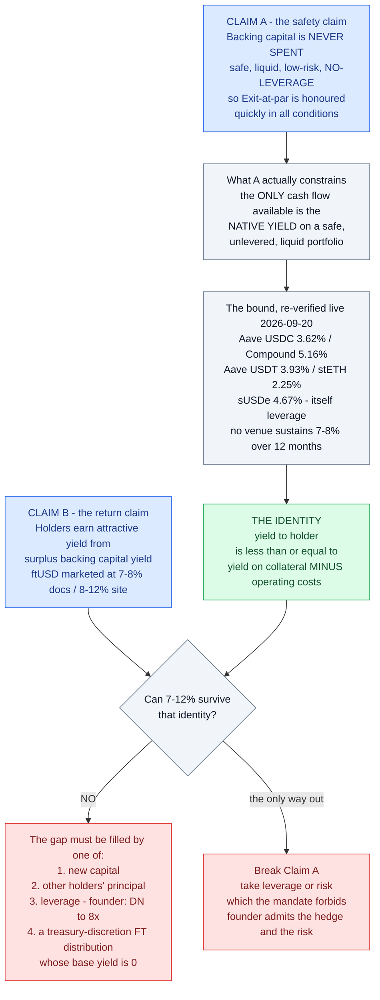
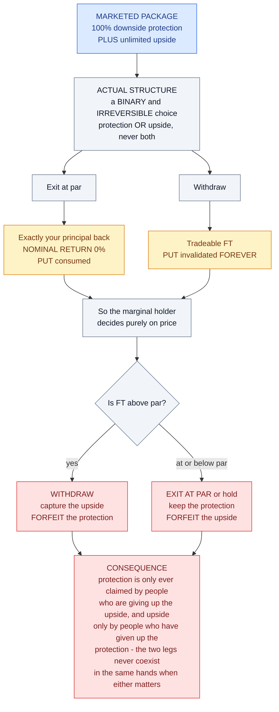
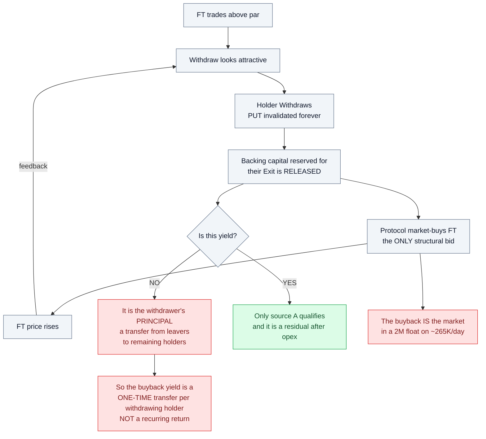
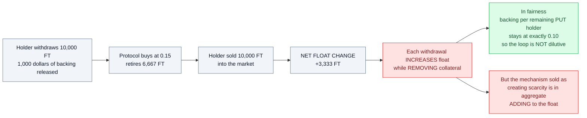
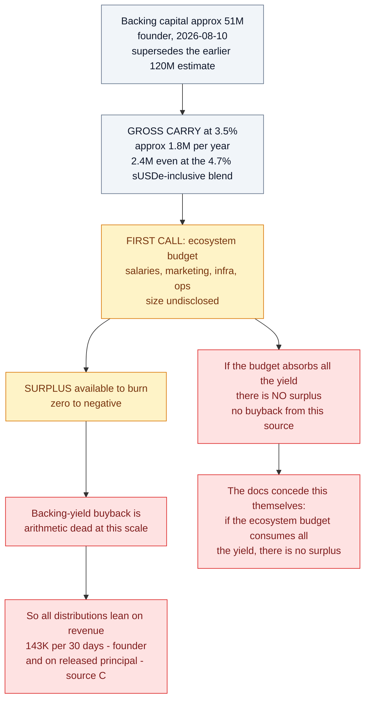
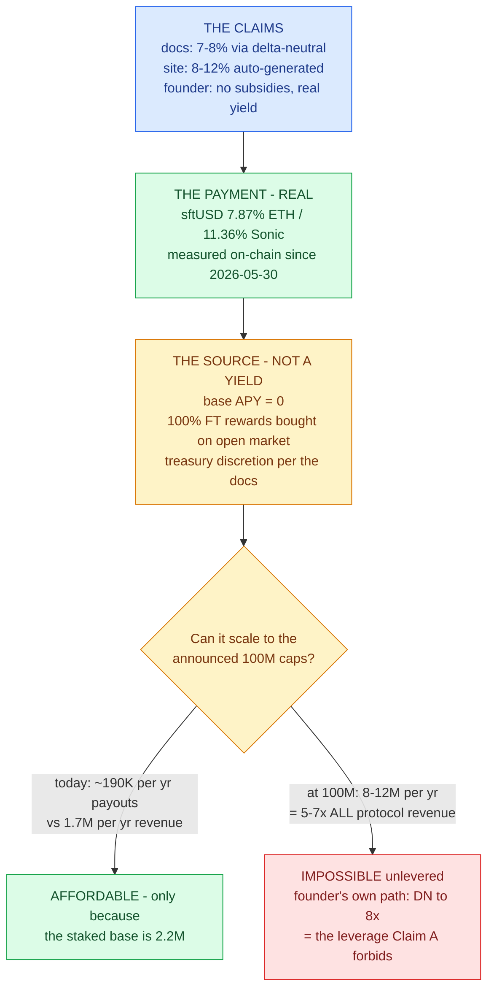
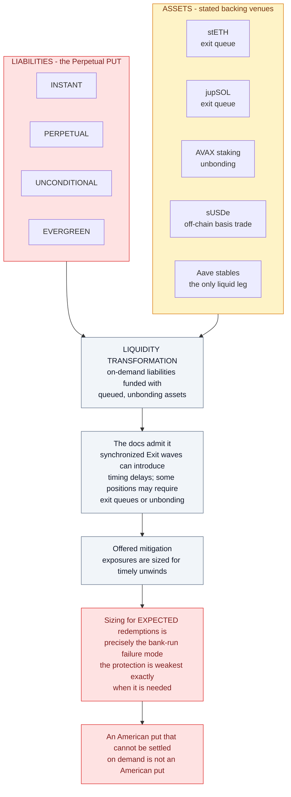
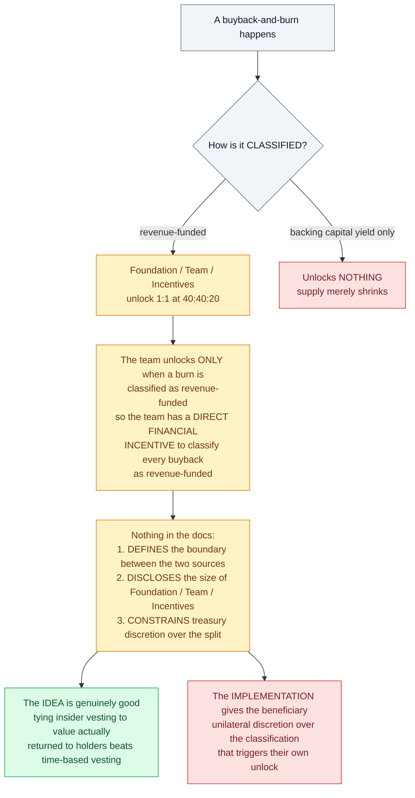
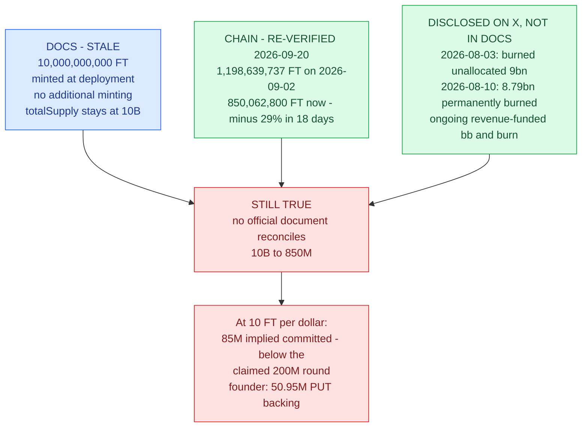
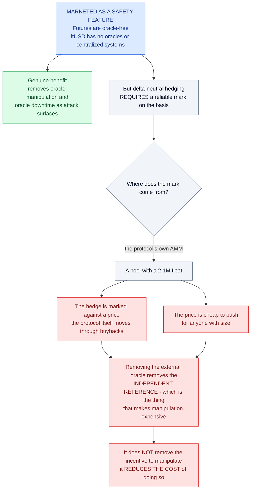

# Weaknesses in the "High Yield" Reasoning

This is the economic critique. It does **not** claim Flying Tulip is a scam or is
insolvent. It argues that the *reasoning used to justify a high yield* does not survive
contact with the protocol's own numbers — nor, as of the 2026-09-20 re-verification, with
the founder's own public statements.

**Re-verified 2026-09-20:** the ~3% ceiling, the float, the supply, and the marketed APY
were all re-checked against live RPC, live venue data, current docs, and the founder's X
account. Where this document previously erred, the text is corrected in place and the
correction is marked.

---

## The identity that breaks the pitch

The docs make two claims that cannot both be load-bearing:

> **Claim A:** "Backing capital is **never spent**." It sits in "safe, liquid,
> **low-risk, no-leverage**, no-bridging" positions so Exit-at-par can be honoured
> "quickly in all conditions."

> **Claim B:** Holders earn attractive returns, funded by buyback-and-burn from
> "surplus backing capital yield" — and ftUSD is marketed at **7-8% APY** (docs) /
> **8-12% APY** (marketing site, since escalated).

If Claim A is true, then the only cash flow the system can generate is **the native
yield on a safe, unlevered, liquid portfolio**. That yield is bounded, and the docs
publish the bound themselves:

| Benchmark (docs' own table, Ethereum) | APY | Live 2026-09-20 |
|---|---|---|
| Aave v3 USDC supply | **3.50%** | 3.62% (confirmed by direct `eth_call`) |
| Compound v3 USDC supply | **3.52%** | 5.16% |
| Aave v3 USDT supply | **2.56%** | 3.93% |
| Lido stETH staking | **2.55%** | 2.25% (Lido's own API) |
| Ethena sUSDe (stated venue) | — | 4.67% — off-chain leverage per W-06 |

> **Yield-to-holder ≤ (yield on collateral) − (operating costs).**

No stated venue has paid 7-8% **sustainably** in the last 12 months (12-mo means: Aave
USDC 3.45%, Compound 3.59%, stETH 2.46%, sUSDe 4.29%; every >7% reading was a days-long
utilization/funding spike). You cannot pay 7-12% out of a portfolio earning ~3-4.7%
while preserving principal, unless the gap is filled by **new capital**, by **leverage**,
or by **a token distribution**. That is the whole argument. Everything below is a
consequence of it.



---

## W-01 — "Principal protection" and "unlimited upside" are mutually exclusive

The Perpetual PUT offers three choices, but you can only ever *use* one per unit of FT:

| Choice | Outcome |
|---|---|
| **Exit at par** | Exactly your principal back. **0% nominal return.** |
| **Withdraw** | You get tradeable FT — but the PUT is **"invalidated forever"** on that portion. |



So the "100% downside protection + unlimited upside" package is not a package. It is a
**binary, irreversible choice**: protection *or* upside, never both simultaneously, and
once you take the upside the protection is gone permanently.

That is not a criticism by itself — it is the payoff of any put-plus-call structure. The
problem is that it is marketed as both at once, and the *marginal* holder will rationally
choose as follows:

- FT **above** par → Withdraw (capture upside, forfeit protection)
- FT **at or below** par → Exit at par (or hold and wait)

Which means **the protection is only ever claimed by people who are giving up the
upside, and the upside is only ever claimed by people who have given up the
protection.** The two legs never coexist in the same hands at the moment they matter.

---

## W-02 — The buyback is funded mainly by principal, not by yield

Three funding sources are listed. Only one is actually yield:

| Source | Is it yield? |
|---|---|
| **A.** Surplus backing-capital yield | ✅ Yes — but it is the *residual after opex* |
| **B.** Protocol revenue & fees | ⚠️ Real — **$143K per 30 days** (founder, 2026-08-26) — funds today's $1.2M cumulative burn |
| **C.** Released backing capital from **Withdrawals** | ❌ **No — this is someone's principal** |

Source **C** is the one that actually scales. When a holder Withdraws, the backing
capital reserved for their Exit is spent buying and burning FT. That is a **transfer
from the withdrawer to the remaining holders**, not value creation.

### The reflexivity loop

```
FT trades above par
  → Withdraw looks attractive
  → backing capital released
  → protocol market-buys FT (the only structural bid)
  → price rises
  → Withdraw looks more attractive
  → more backing released  ⟲
```



#### The float maths



This loop **consumes the collateral base**. Every pass converts hard backing capital
into burned FT. The burn is real, but it is paid for by shrinking the assets.

Run to completion: backing → 0, supply falls, float rises, and what remains is an
uncollateralised float token. Nobody is insolvent along the way (the 1:1 coverage holds
throughout), but **the "buyback yield" is a one-time transfer per withdrawing holder,
not a recurring return.**

### The float maths

Backing per remaining PUT holder stays at exactly $0.10 through the loop, so the loop is
**not** dilutive — credit where due (verified algebraically on re-review). But note what
happens to float:

- Holder withdraws 10,000 FT; $1,000 backing released.
- Protocol buys at $0.15 → retires 6,667 FT.
- Holder sold 10,000 FT into the market.
- **Net float change: +3,333 FT.**

Each withdrawal **increases** float. Buybacks offset only part of it. So the mechanism
that is supposed to create scarcity is, in aggregate, adding to the float while removing
collateral.

---

## W-03 — The float is far too small for the mechanism to be real

| Metric | Value | As of |
|---|---|---|
| Price | $0.1079 | 2026-09-20 |
| Float (`availableSupply`) | 20,668,218 FT | 2026-09-02 — founder concurs: *"$2m mcap"* (2026-09-18) |
| **Float market cap** | **≈ $2.10M** | — |
| FDV (850.06M × price) | **≈ $91.7M** | 2026-09-20 |
| 24h volume | **$267,438** (14 pairs) | 2026-09-20 |
| Holders | **688** | 2026-09-02 |

The docs' worked example has a holder withdrawing 10,000 FT and selling at $0.15. That is
$1,500 — fine. But:

- The buyback must buy into a **$2.1M float with $267K/day of volume**. Any
  non-trivial buyback *is* the market.
- Therefore the FT price — the thing that sets the "unlimited upside" for the
  ~830M locked FT — is set by the issuer's own bid in a market that cannot absorb the
  exits it advertises.
- The paper value of PUT holders' upside is a mark on an illiquid float. **It is not
  realisable at scale.** The founder himself caps it: *"$2m mcap $40m absolute max
  (assuming all PUT holders withdraw FT)"* (2026-09-07).

And the reverse: a $2M float with $267K daily volume is trivially manipulable in *both*
directions by anyone, not just the protocol.

---

## W-04 — The yield is junior to the team's operating budget

> "The **first call** on the backing capital yield is to fund the ongoing development of
> the ecosystem, infrastructure and operations."
> "Any **remaining** backing capital yield after the ecosystem budget is met is used for
> continuous buyback-and-burn."

Backing capital ≈ **$51M** — the founder's own figure (*"$50.95m in PUT backing
capital"*, 2026-08-10), consistent with issued supply (~520M FT at 10 FT/$1). This
supersedes this review's earlier $120M estimate, which was derived from total supply
and therefore too high; the true number makes the conclusion **worse**, not better:

```
Gross carry @ 3.5%          ≈  $1.8M / yr   (even @ 4.7% incl. sUSDe: $2.4M)
Less ecosystem budget       ≈ -$?.?M / yr   (salaries, marketing, infra, ops — first call, size undisclosed)
─────────────────────────────────────────
Surplus available to burn   ≈  zero to negative
```



The docs concede the point: *"if the ecosystem budget consumes all the yield,
there is no surplus → no buyback from this source."* On the founder's own backing
figure, the entire yield-bearing structure cannot fund a meaningful buyback from yield
at all — which is exactly what the observed distribution mechanism (W-05) shows:
**reward-only FT payouts, base APY 0.**

Sensitivity (holder yield as % of FDV/yr, using the earlier $120M/$121.6M frame —
recomputed and verified on re-review; the true frame is smaller and therefore worse):

```
carry:        2.5%    3.0%    3.5%    4.0%
opex $2M:     0.82    1.31    1.81    2.30
opex $3M:    -0.00    0.49    0.98    1.48
opex $4M:    -0.83   -0.33    0.16    0.65
opex $5M:    -1.65   -1.16   -0.66   -0.17
```

Yield exceeds 1% in only 4 of 16 cells — all requiring both low opex AND above-benchmark
carry. To pay 7-8% on $120M you need ~$260-392M of backing at unlevered carry; on the
founder's $51M the same rate needs the leverage he describes (W-05).

---

## W-05 — The 7-8% (now 8-12%) ftUSD APY is paid — but it is not a yield

**Correction (2026-09-20):** an earlier version of this finding stated the 7-8% figure
"does not appear anywhere in the documentation." That was wrong: it appears verbatim on
`docs.flyingtulip.com/product-suite/` (and did at first read, per the 2026-06-20 Wayback
snapshot). It is absent only from the detailed ftUSD page. Corrected here; the
substantive critique below is unaffected and is now backed by measured payout data.

| | |
|---|---|
| **Marketing site (2026-09-20)** | ftUSD *"auto-generating **8-12% APY**"* — **escalated** from 7-8% since first read |
| **Docs, product-suite page** | *"generates **7-8% APY** through delta-neutral strategies while maintaining a perfect $1 peg"* |
| **Docs, ftUSD detail page (updated 2026-09-16)** | "At launch, ftUSD is a **USDC/USDT to Aave wrapper** (Stage 0)." *"**The only on-chain strategy currently implemented is stablecoin lending via Aave**."* Delta-neutral tagged roadmap |
| **Founder, X (2026-06-17 / 09-15)** | *"Delta Neutral on Ethereum activated for ftUSD"* / *"8.68% stable now for over 6 months … pure onchain DN"* — **the docs and the founder contradict each other** |
| **Measured (DeFiLlama, on-chain-derived, 2026-09-20)** | sftUSD earns **7.87%** (Ethereum, $1.84M TVL) / **11.36%** (Sonic, $378K), daily since 2026-05-30 — **base APY 0, 100% FT-token rewards "bought on open market"** |

So the payout is real — stakers genuinely receive 7-12%. What is false is the *source*
attribution: **none of it is stablecoin strategy yield.** It is FT bought on the open
market and distributed at treasury discretion, per the docs' own mechanism.

### The founder confirms the leverage and the risk

> "DN scaling up, **still only 1x, safe up to 8x**." (2026-08-21)
> "New stable invariant version will allow **looping**. At current Lend rates would be
> **+9% per loop**." (2026-08-25)
> "ftUSD does carry additional risk, **the yield is from the delta hedge of stETH/ETH**
> (on ethereum or stS/S on Sonic), so you do carry the additional native asset and
> staked asset derivative risk." (2026-09-16)

A stETH/ETH delta hedge *is* a leveraged basis trade with derivative risk; "safe up to
8x" *is* leverage; "looping" *is* leverage. The backing-capital mandate says "no
leverage." The advertised yield, the deployed documentation, and the founder's
description cannot all be true at once.



### And the yield is paid in FT, at treasury discretion

> "Stakers claim rewards as **FT** from the rewards vault."
> "All net strategy yield and protocol fee revenue is collected by the protocol
> treasury; then **at treasury discretion** distributed via buyback-and-distribute."
> "Unstaked ftUSD receives no yield; proceeds accrue to the **protocol treasury**.**

So the "7-12% stablecoin yield" is:

1. Paid **in the protocol's own token**, not in USD;
2. Bought back **at the treasury's discretion**;
3. In a market with **$267K/day** of volume and a **$2.1M float** the founder himself quotes.

Your realised USD return = (FT received) × (price you can exit at). **Both legs are
controlled by the same party.** This is not a yield; it is a discretionary token
distribution priced by the issuer's own bid.

---

## W-06 — "No leverage, low risk" is not true of the stated venues

The backing venues are listed as "safe, liquid, low-risk, **no-leverage**". Two problems:

**(a) sUSDe is leverage that lives off-chain.** sUSDe (Ethena) *is* a delta-neutral basis
trade — perp funding plus staking, held at exchanges and custodians. It carries funding-rate
risk, exchange risk, and custody risk. Classifying it under "no leverage" is true only if
you define leverage as "on-chain borrow." The economic exposure is levered. The founder's
own description of ftUSD's yield — *"the delta hedge of stETH/ETH"* with *"additional
native asset and staked asset derivative risk"* (2026-09-16) — concedes the same point for
the in-house strategy.

**(b) The LSTs have exit queues.** stETH, jupSOL, and AVAX staking all involve unbonding.
The docs admit it:

> "In synchronized **Exit** waves, some positions (e.g. **LST withdrawals**) can
> introduce timing delays."
> "Some backing capital positions (e.g. stETH, jupSOL, AVAX) may require **exit queues**
> or unbonding."

### This is the deepest structural flaw: liquidity transformation

| Liabilities | Assets |
|---|---|
| Perpetual PUT: **instant, perpetual, unconditional, evergreen** | stETH / jupSOL / AVAX: **queued, unbonding** |



The docs say exposures are "sized for timely unwinds." Sizing for *expected* redemptions
is precisely the failure mode of every bank run: **the protection is most likely to be
stressed exactly when it is needed, and it weakest at that moment.**

An American put that cannot be settled on demand is not an American put. "100% capital
protection" and "may require exit queues" cannot both be true claims.

---

## W-07 — The 40:40:20 rule creates a self-served accounting conflict

> "**Revenue-funded** buybacks unlock Foundation / Team / Incentives **1:1** (40:40:20)."
> "Buyback-and-burn funded **only by backing capital yield does not unlock anything**."

So the team unlocks tokens **only** when a burn is classified as revenue-funded. The
team therefore has a **direct financial incentive to classify every buyback as
"revenue-funded"** rather than "yield-funded."

Nothing in the docs:
- defines the boundary between the two sources,
- discloses the **size** of the Foundation / Team / Incentives allocations, or
- constrains the treasury's discretion over the split.



The *idea* — tie insider vesting to value actually returned to holders — is genuinely
good, and better than time-based vesting. The *implementation* gives the beneficiary
unilateral discretion over the classification that triggers their own unlock.

---

## W-08 — The supply documentation is stale; the gap is explained on X, not in the docs

**Rewritten 2026-09-20.** The docs say: **10,000,000,000 FT**, "minted at deployment,"
"no additional minting," "totalSupply stays at 10B."

On-chain: **1,198,639,737 FT** at first read (2026-09-02), **850,062,800 FT** eighteen
days later — a −29% live reduction. An earlier version of this finding flagged the 8.8B
gap as *undisclosed*; that charge is now narrowed. The founder disclosed the
reconciliation publicly on X: *"Burned unallocated 9bn FT bringing FDV to 100m"*
(2026-08-03) and *"8.79bn unallocated FT permanently burned"* (2026-08-10), and burns
have continued since (*"From bb&burn, not non-circ."*, 2026-09-17). **The facts are
public; the documentation was never updated.** Anyone modelling from the docs alone —
*"10B minted, no additional minting"* — is modelling a supply that does not exist and
never did in the form described.

At the stated 10 FT/$1 rate, 850M FT implies **≈ $85M committed** if fully issued — still
below the claimed **$200M private round**; the founder's own PUT backing figure is
**$50.95M** (2026-08-10). FDV on current supply and price: **≈ $91.7M** (the founder's
"$48m fdv", 2026-09-18, matches neither — his "$2m mcap" matches the float exactly).



---

## W-09 — "Oracle-free" removes manipulation resistance, not manipulation incentive

Futures are marketed as "oracle-free," and ftUSD as having "no oracles or centralized
systems." These are framed as safety features.

But delta-neutral hedging requires a **reliable mark** on the basis. If the mark comes
from the protocol's own AMM — a pool with a **$2.1M float** — then:

- the hedge is marked against a price the protocol itself moves through buybacks, and
- the price is cheap to push for anyone with size.

Removing the external oracle removes the *independent reference*, which is the thing
that makes manipulation expensive. It does not remove the incentive to manipulate; it
reduces the cost of doing so.

---



## What is genuinely good

Being fair matters here, because the structure is more honest than most:

- **1:1 backing that is actually ring-fenced is a real improvement** over the
  emission-funded "yield" that dominates DeFi. If they honour it, par exits are
  substantially safer than the typical farm.
- **No inflation** is a real constraint, voluntarily accepted — re-confirmed on
  re-review: no mint path exists post-constructor.
- **Revenue-linked insider unlocks** are a better alignment mechanism than time vesting,
  even with the classification problem in W-07.
- **The perpetual put is a genuinely novel retail-protective idea**, and putting it
  on-chain rather than in a term sheet is a real contribution.
- **Publishing `KNOWN_ISSUES.md`** with candid residual-risk admissions
  (PM-02 "protocol-level losses are not handled on-chain", CB-01, MKT-01) is better
  practice than most projects at this stage.
- **The distributions themselves are real.** sftUSD stakers genuinely receive 7-12%
  today, buybacks genuinely execute ($1.2M cumulative, supply −29% in 18 days), and the
  founder discloses figures competitors would not (including the $2M float and the $51M
  backing). The criticism is about *what the payout is and whether it scales*, not about
  whether anything is happening.

---

## The one-sentence version

> **If the principal is genuinely never spent and genuinely unlevered, the yield is
> capped at the ~3-4.7% the collateral earns — so the measured 7-12% payout is being
> paid as a treasury-discretion FT-token distribution with a 0% organic base, at a
> scale that works only because it is tiny, with the founder's own path to advertised
> scale being the leverage the mandate forbids.**
