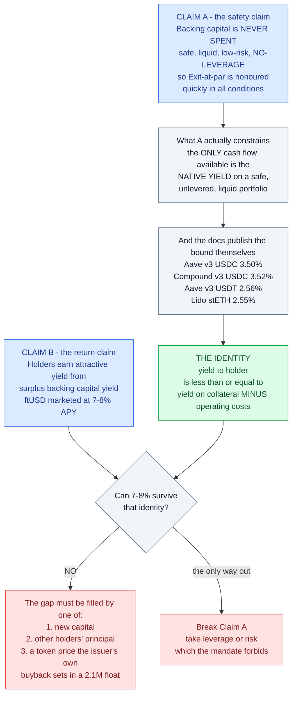
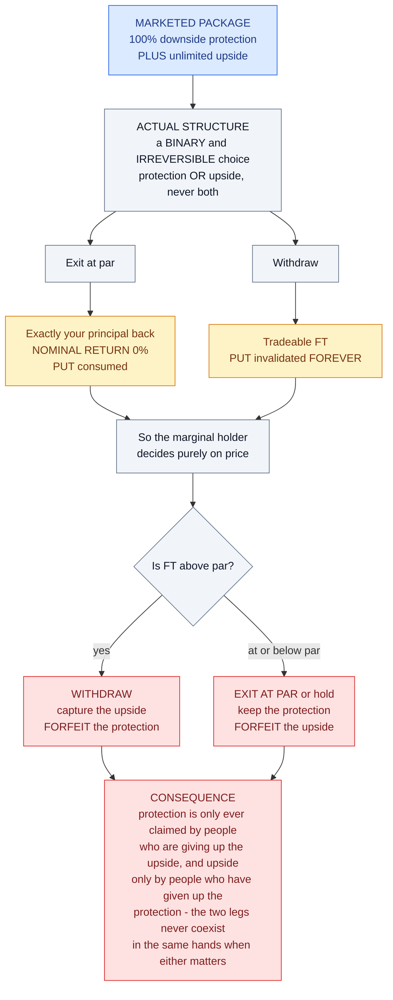
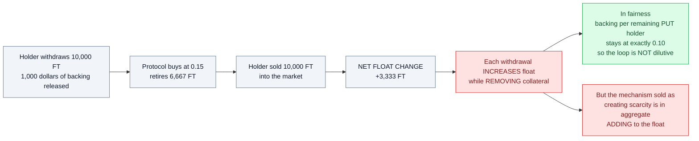
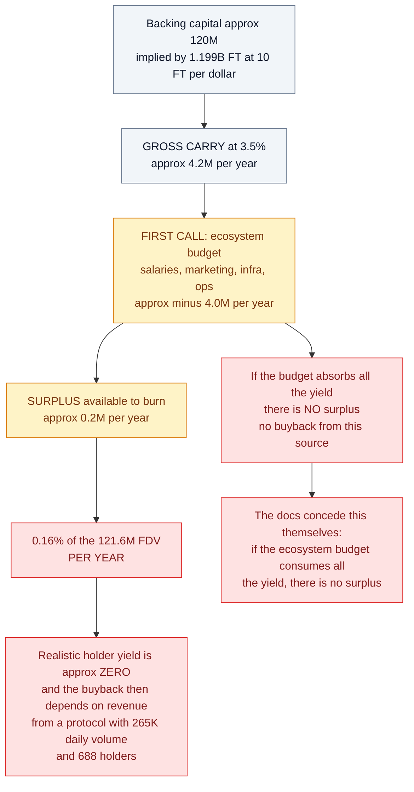
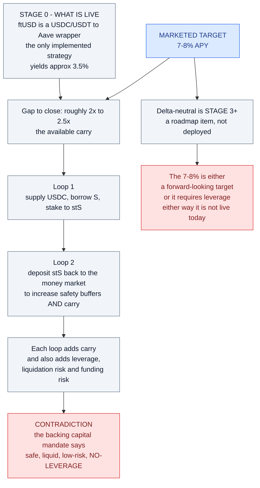
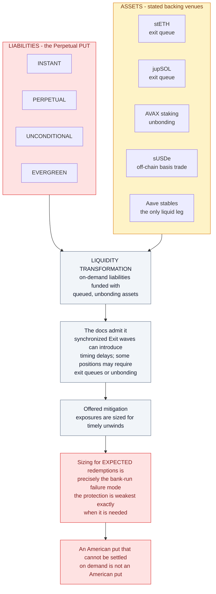
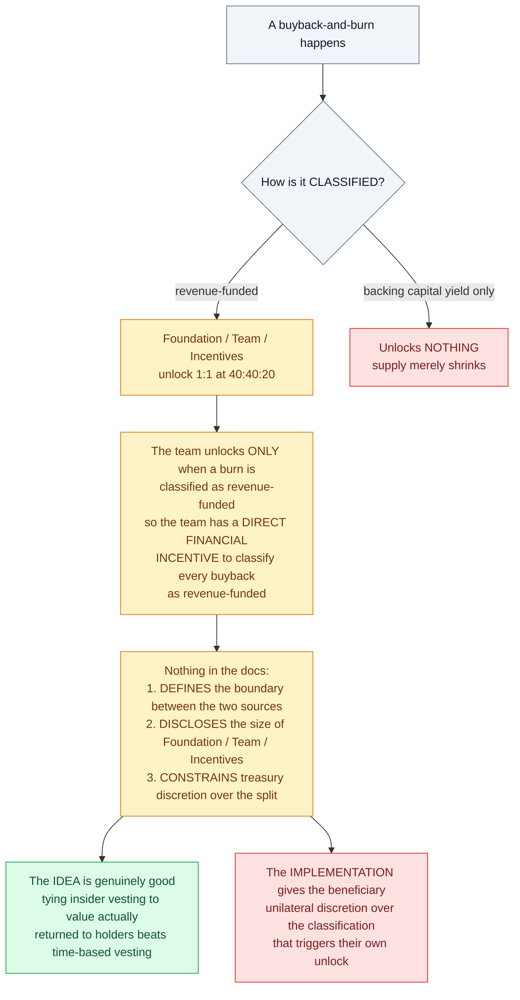
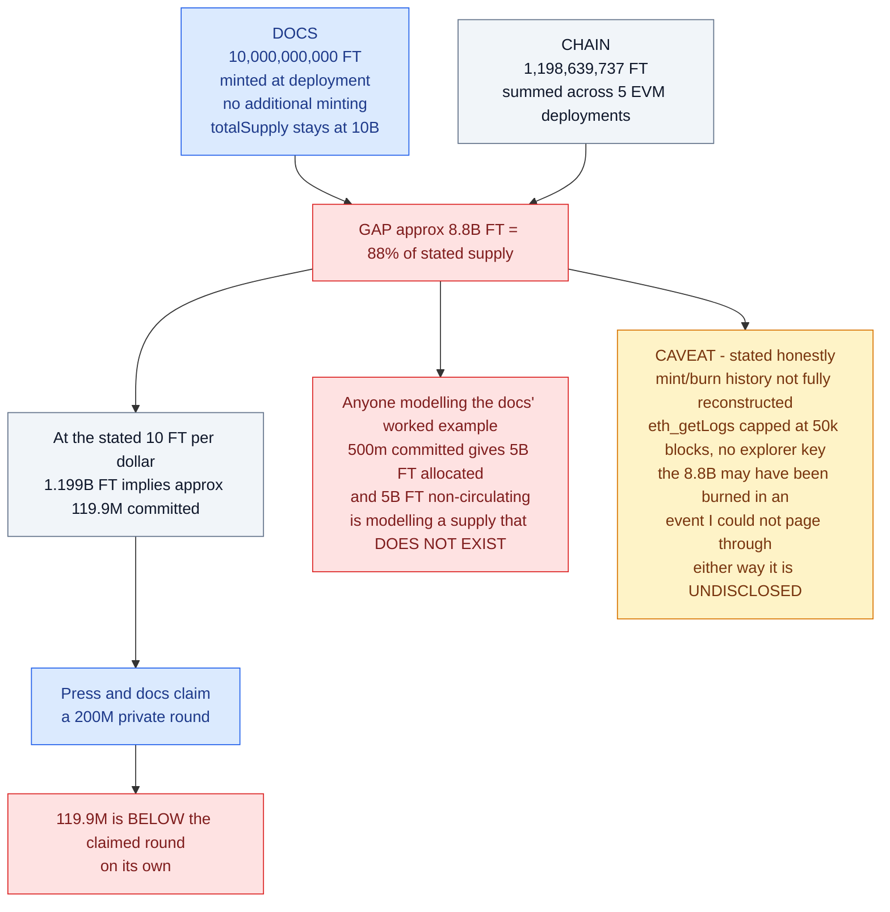
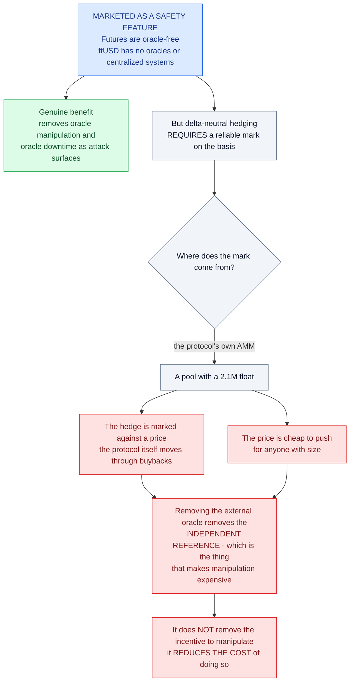

# Weaknesses in the "High Yield" Reasoning

This is the economic critique. It does **not** claim Flying Tulip is a scam or is
insolvent. It argues that the *reasoning used to justify a high yield* does not survive
contact with the protocol's own numbers.

---

## The identity that breaks the pitch

The docs make two claims that cannot both be load-bearing:

> **Claim A:** "Backing capital is **never spent**." It sits in "safe, liquid,
> **low-risk, no-leverage**, no-bridging" positions so Exit-at-par can be honoured
> "quickly in all conditions."

> **Claim B:** Holders earn attractive returns, funded by buyback-and-burn from
> "surplus backing capital yield" — and ftUSD is marketed at **7-8% APY**.

If Claim A is true, then the only cash flow the system can generate is **the native
yield on a safe, unlevered, liquid portfolio**. That yield is bounded, and the docs
publish the bound themselves:

| Benchmark (docs' own table, Ethereum) | APY |
|---|---|
| Aave v3 USDC supply | **3.50%** |
| Compound v3 USDC supply | **3.52%** |
| Aave v3 USDT supply | **2.56%** |
| Lido stETH staking | **2.55%** |

> **Yield-to-holder ≤ (yield on collateral) − (operating costs).**

You cannot pay 7-8% out of a portfolio earning ~3% while preserving principal, unless
the gap is filled by **new capital**. That is the whole argument. Everything below is a
consequence of it.



---

## W-01 — "Principal protection" and "unlimited upside" are mutually exclusive

The Perpetual PUT offers three choices, but you can only ever *use* one per unit of FT:

| Choice | Outcome |
|---|---|
| **Exit at par** | Exactly your principal back. **0% nominal return.** |
| **Withdraw** | You get tradeable FT — but the PUT is **"invalidated forever"** on that portion. |



So the "100% downside protection + unlimited upside" package is not a package. It is a
**binary, irreversible choice**: protection *or* upside, never both simultaneously, and
once you take the upside the protection is gone permanently.

That is not a criticism by itself — it is the payoff of any put-plus-call structure. The
problem is that it is marketed as both at once, and the *marginal* holder will rationally
choose as follows:

- FT **above** par → Withdraw (capture upside, forfeit protection)
- FT **at or below** par → Exit at par (or hold and wait)

Which means **the protection is only ever claimed by people who are giving up the
upside, and the upside is only ever claimed by people who have given up the
protection.** The two legs never coexist in the same hands at the moment they matter.

---

## W-02 — The buyback is funded mainly by principal, not by yield

Three funding sources are listed. Only one is actually yield:

| Source | Is it yield? |
|---|---|
| **A.** Surplus backing-capital yield | ✅ Yes — but it is the *residual after opex* |
| **B.** Protocol revenue & fees | ⚠️ Real, but currently trivial |
| **C.** Released backing capital from **Withdrawals** | ❌ **No — this is someone's principal** |

Source **C** is the one that actually scales. When a holder Withdraws, the backing
capital reserved for their Exit is spent buying and burning FT. That is a **transfer
from the withdrawer to the remaining holders**, not value creation.

### The reflexivity loop

```
FT trades above par
  → Withdraw looks attractive
  → backing capital released
  → protocol market-buys FT (the only structural bid)
  → price rises
  → Withdraw looks more attractive
  → more backing released  ⟲
```


#### The float maths



This loop **consumes the collateral base**. Every pass converts hard backing capital
into burned FT. The burn is real, but it is paid for by shrinking the assets.

Run to completion: backing → 0, supply falls, float rises, and what remains is an
uncollateralised float token. Nobody is insolvent along the way (the 1:1 coverage holds
throughout), but **the "buyback yield" is a one-time transfer per withdrawing holder,
not a recurring return.**

### The float maths

Backing per remaining PUT holder stays at exactly $0.10 through the loop, so the loop is
**not** dilutive — credit where due. But note what happens to float:

- Holder withdraws 10,000 FT; $1,000 backing released.
- Protocol buys at $0.15 → retires 6,667 FT.
- Holder sold 10,000 FT into the market.
- **Net float change: +3,333 FT.**

Each withdrawal **increases** float. Buybacks offset only part of it. So the mechanism
that is supposed to create scarcity is, in aggregate, adding to the float while removing
collateral.

---

## W-03 — The float is far too small for the mechanism to be real

Verified on-chain (2026-09-02):

| Metric | Value |
|---|---|
| Price | $0.1014 |
| Float (`availableSupply`) | **20,668,218 FT** |
| **Float market cap** | **≈ $2.10M** |
| FDV (1.199B × price) | **≈ $121.6M** |
| 24h volume | **$264,564** |
| Holders | **688** |

The docs' worked example has a holder withdrawing 10,000 FT and selling at $0.15. That is
$1,500 — fine. But:

- The buyback must buy into a **$2.1M float with $265K/day of volume**. Any
  non-trivial buyback *is* the market.
- Therefore the FT price — the thing that sets the "unlimited upside" for the
  1.199B locked FT — is set by the issuer's own bid in a market that cannot absorb the
  exits it advertises.
- The paper value of PUT holders' upside is a mark on an illiquid float. **It is not
  realisable at scale.**

And the reverse: a $2M float with $265K daily volume is trivially manipulable in *both*
directions by anyone, not just the protocol.

---

## W-04 — The yield is junior to the team's operating budget

> "The **first call** on the backing capital yield is to fund the ongoing development of
> the ecosystem, infrastructure and operations."
> "Any **remaining** backing capital yield after the ecosystem budget is met is used for
> continuous buyback-and-burn."

Backing capital ≈ $120M (implied by 1.199B FT at 10 FT/$1).

```
Gross carry @ 3.5%          ≈  $4.2M / yr
Less ecosystem budget       ≈ -$4.0M / yr   (salaries, marketing, infra, ops)
─────────────────────────────────────────
Surplus available to burn   ≈  $0.2M / yr
```



$0.2M/yr against a $121.6M FDV is **0.16% per year**. That is the entire yield if the
ecosystem budget absorbs the carry — which, for a team of this profile, it plausibly
does. The docs concede the point: *"if the ecosystem budget consumes all the yield,
there is no surplus → no buyback from this source."*

So in the realistic case, holder yield ≈ **0**, and the buyback depends on protocol
revenue from a protocol with **$265K of daily volume and 688 holders**.

---

## W-05 — The 7-8% ftUSD APY is not supported by the deployed product

| | |
|---|---|
| **Marketing site** | ftUSD "generates **7-8% APY** through delta-neutral strategies while maintaining a perfect $1 peg" |
| **Docs, actual Stage 0** | "At launch, ftUSD is a **USDC/USDT to Aave wrapper**." **Only implemented strategy.** |
| **Docs, delta-neutral** | **Stage 3+** — roadmap, not deployed |
| **Docs, benchmark rates** | Aave USDC **3.50%**, Aave USDT **2.56%**, Compound USDC **3.52%**, Lido stETH **2.55%** |
| **Docs, "7-8%"** | **The figure does not appear anywhere in the documentation.** |

To get from ~3% to 7-8% you need roughly 2.5x looping. The docs describe exactly that:

> "**Loop collateral prudently** (e.g. deposit stS back to the money market) to increase
> safety buffers and **carry**."



**Looping is leverage.** The backing-capital mandate says "no leverage." Either the
7-8% requires leverage (contradicting the safety claim), or it is a forward-looking
number for a strategy that does not exist yet.

### And the yield is paid in FT, at treasury discretion

> "Stakers claim rewards as **FT** from the rewards vault."
> "All net strategy yield and protocol fee revenue is collected by the protocol
> treasury; then **at treasury discretion** distributed via buyback-and-distribute."
> "Unstaked ftUSD receives no yield; proceeds accrue to the **protocol treasury**."

So the "7-8% stablecoin yield" is:

1. Paid **in the protocol's own token**, not in USD;
2. Bought back **at the treasury's discretion**;
3. In a market with **$265K/day** of volume.

Your realised USD return = (FT received) × (price you can exit at). **Both legs are
controlled by the same party.** This is not a yield; it is a discretionary token
distribution priced by the issuer's own bid.

---

## W-06 — "No leverage, low risk" is not true of the stated venues

The backing venues are listed as "safe, liquid, low-risk, **no-leverage**". Two problems:

**(a) sUSDe is leverage that lives off-chain.** sUSDe (Ethena) *is* a delta-neutral basis
trade — perp funding plus staking, held at exchanges and custodians. It carries funding-rate
risk, exchange risk, and custody risk. Classifying it under "no leverage" is true only if
you define leverage as "on-chain borrow." The economic exposure is levered.

**(b) The LSTs have exit queues.** stETH, jupSOL, and AVAX staking all involve unbonding.
The docs admit it:

> "In synchronized **Exit** waves, some positions (e.g. **LST withdrawals**) can
> introduce timing delays."
> "Some backing capital positions (e.g. stETH, jupSOL, AVAX) may require **exit queues**
> or unbonding."

### This is the deepest structural flaw: liquidity transformation

| Liabilities | Assets |
|---|---|
| Perpetual PUT: **instant, perpetual, unconditional, evergreen** | stETH / jupSOL / AVAX: **queued, unbonding** |



The docs say exposures are "sized for timely unwinds." Sizing for *expected* redemptions
is precisely the failure mode of every bank run: **the protection is most likely to be
stressed exactly when it is needed, and it weakest at that moment.**

An American put that cannot be settled on demand is not an American put. "100% capital
protection" and "may require exit queues" cannot both be true claims.

---

## W-07 — The 40:40:20 rule creates a self-served accounting conflict

> "**Revenue-funded** buybacks unlock Foundation / Team / Incentives **1:1** (40:40:20)."
> "Buyback-and-burn funded **only by backing capital yield does not unlock anything**."

So the team unlocks tokens **only** when a burn is classified as revenue-funded. The
team therefore has a **direct financial incentive to classify every buyback as
"revenue-funded"** rather than "yield-funded."

Nothing in the docs:
- defines the boundary between the two sources,
- discloses the **size** of the Foundation / Team / Incentives allocations, or
- constrains the treasury's discretion over the split.



The *idea* — tie insider vesting to value actually returned to holders — is genuinely
good, and better than time-based vesting. The *implementation* gives the beneficiary
unilateral discretion over the classification that triggers their own unlock.

---

## W-08 — The supply disclosure gap invalidates the published FDV maths

The docs say: **10,000,000,000 FT**, "minted at deployment," "no additional minting,"
"totalSupply stays at 10B."

On-chain across all five EVM deployments: **1,198,639,737 FT** — a gap of ~8.8B (88%).

At the stated 10 FT/$1 rate, 1.199B FT implies **≈ $119.9M committed**, which is *below*
the claimed **$200M private round** on its own.



Anyone modelling the docs' worked example — *"$500m committed → 5B FT allocated, 5B FT
remain non-circulating"* — is modelling a supply that does not exist. (I could not fully
reconstruct mint/burn history: public RPCs cap `eth_getLogs` at 50k blocks and I had no
explorer API key. The 8.8B may have been burned in an event I could not page through.
Either way it is undisclosed.)

---

## W-09 — "Oracle-free" removes manipulation resistance, not manipulation incentive

Futures are marketed as "oracle-free," and ftUSD as having "no oracles or centralized
systems." These are framed as safety features.

But delta-neutral hedging requires a **reliable mark** on the basis. If the mark comes
from the protocol's own AMM — a pool with a **$2.1M float** — then:

- the hedge is marked against a price the protocol itself moves through buybacks, and
- the price is cheap to push for anyone with size.

Removing the external oracle removes the *independent reference*, which is the thing
that makes manipulation expensive. It does not remove the incentive to manipulate; it
reduces the cost of doing so.

---



## What is genuinely good

Being fair matters here, because the structure is more honest than most:

- **1:1 backing that is actually ring-fenced is a real improvement** over the
  emission-funded "yield" that dominates DeFi. If they honour it, par exits are
  substantially safer than the typical farm.
- **No inflation** is a real constraint, voluntarily accepted.
- **Revenue-linked insider unlocks** are a better alignment mechanism than time vesting,
  even with the classification problem in W-07.
- **The perpetual put is a genuinely novel retail-protective idea**, and putting it
  on-chain rather than in a term sheet is a real contribution.
- **Publishing `KNOWN_ISSUES.md`** with candid residual-risk admissions
  (PM-02 "protocol-level losses are not handled on-chain", CB-01, MKT-01) is better
  practice than most projects at this stage.

---

## The one-sentence version

> **If the principal is genuinely never spent and genuinely unlevered, the yield is
> capped at the ~3% the collateral earns — so any yield materially above that is being
> paid out of new capital, out of other holders' principal, or out of a token price that
> the issuer's own buyback sets in a $2M float.**
