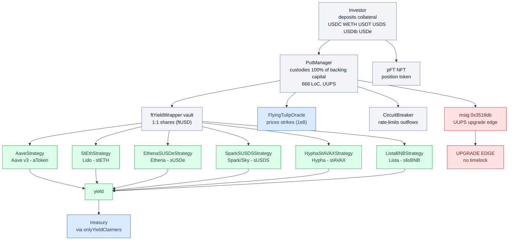
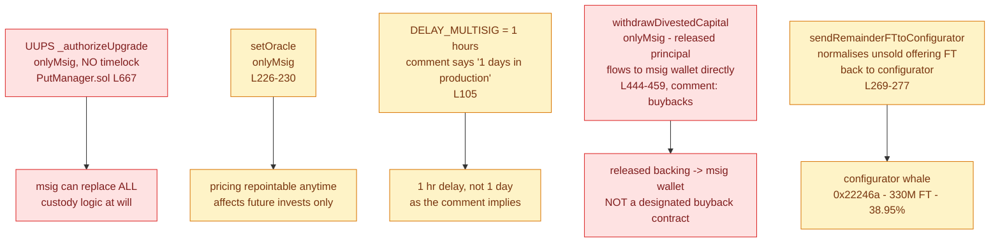
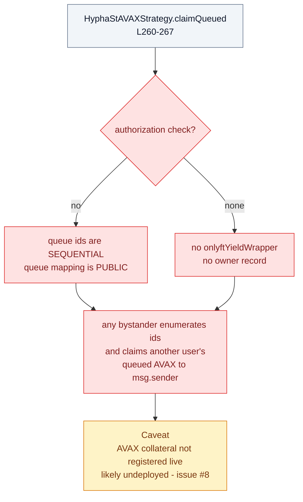
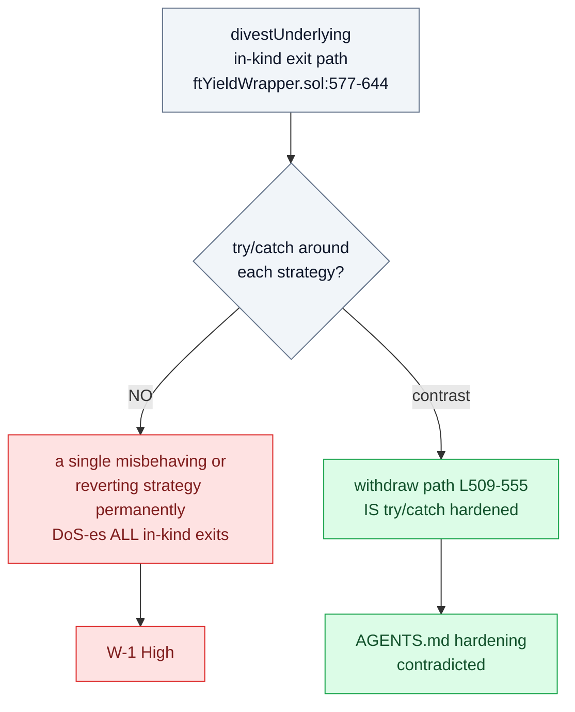
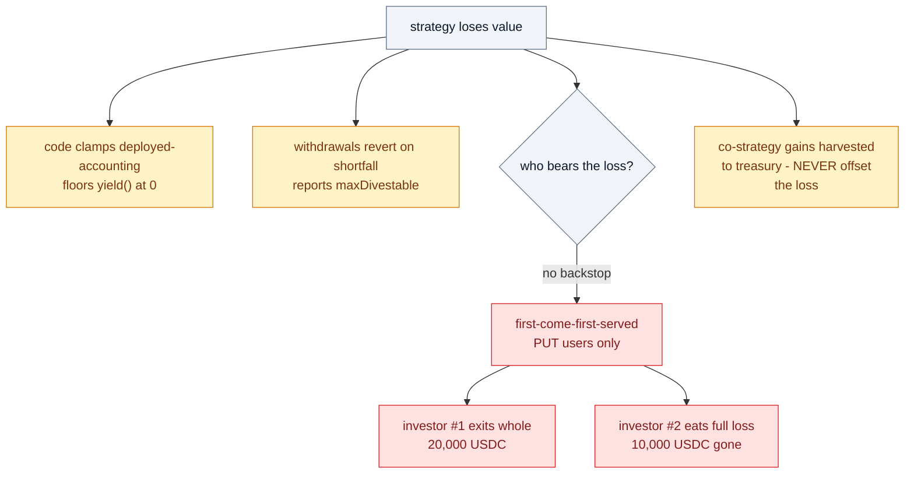

# Findings — ftPUT protocol: PutManager, strategies, wrapper, oracle, CircuitBreaker

Source: `github.com/flyingtulipdotcom/ftPUT`, commit `193074610…`, vendored at
`contracts/sherlock-2026-01-ftput/` (1,648 nsloc). Reviewed against the January 2026
Sherlock contest **#1223** codebase (2026-01-05 → 2026-01-17, prize pool 76,500 USDC,
1,704 raw watson submissions, judging stopped 2026-03-16 at ~2%, **no findings ever
published**).

> Framing note. This document is the contract-level audit of the **ftPUT** protocol —
> the capital-custody layer that sits behind the FT token (findings/01), the Escrow
> (findings/02), and the economic argument (findings/03). It is the one place where the
> PutManager, the six strategy adapters, the yield wrapper, the pFT position token, the
> ACL, the oracle, and the CircuitBreaker are audited together. The prior contract issues
> W-01/W-02/W-06 (economics) are re-verified here **at code level**; the deployed-state
> inventory lives in `research/02-onchain-facts.md`, and the protocol overview in
> `research/01-protocol-overview.md` — referenced, not duplicated.

---

## 1. Target and method

| Field | Value |
|---|---|
| Target | ftPUT protocol, commit `193074610…`, Sherlock contest #1223 |
| Date | 2026-09-20 (JST) |
| Method | Six-agent adversarial swarm + lead review + live RPC (`ethereum-rpc.publicnode.com`, `rpc.soniclabs.com`) |
| Vendored path | `contracts/sherlock-2026-01-ftput/ftPUT/contracts/` |

### Scope

| Contract | LoC | In scope? |
|---|---|---|
| `PutManager.sol` | 668 | ✅ in-scope (contest) |
| `ftYieldWrapper.sol` | 745 | ✅ in-scope (contest) |
| `CircuitBreaker.sol` | 533 | ✅ in-scope (contest) |
| `pFT.sol` | 375 | ✅ in-scope (contest) |
| `ftACL.sol` | 126 | ✅ in-scope (contest) |
| `FlyingTulipOracle.sol` | — | ✅ in-scope (contest) |
| `AaveStrategy.sol` | — | ✅ in-scope (contest) |
| StEth / Ethena SUSDe / Spark SUSDS / Hypha stAVAX / Lista BNB strategies | — | ⚠️ out-of-scope but reviewed |
| `pFTMarketplace`, `LeverageRfqEngine`, `PositionsManager` | — | ❌ never available (referenced by KNOWN_ISSUES LEV-01/MKT-01..03, **not present** in this tree) |

---

## 2. Architecture map

The whole system is a single custody funnel: investor capital enters `PutManager`,
is wrapped 1:1 into `ftYieldWrapper` shares, deployed by the wrapper into one of the
six strategy adapters, and its yield is swept to treasury by `onlyYieldClaimers`.
`pFT` is the NFT position token; `FlyingTulipOracle` prices the strike; `CircuitBreaker`
rate-limits outflows. The **msig UUPS upgrade edge** (red) sits at the top of the funnel.

---

## 3. Trust model

The trust model is **single-role centralised with no timelock**. The PutManager msig
(`0x3518db…`, distinct from the oracle msig `0x1118e1…` and the configurator
`0x22246a…`) can upgrade the entire custody contract at will, repoint the oracle, and
receive released principal directly. `DELAY_MULTISIG` is 1 hour while the comment claims
"1 day in production" — a documentation/behaviour mismatch. The configurator whale is
also the beneficiary of unsold-offering FT normalisation.

---

## 4. PutManager findings (F-01..F-07)

| ID | Title | Severity | Lines |
|---|---|---|---|
| F-01 | Rounding favors protocol on every conversion (`Math.mulDiv` floors both ways); dust accrues as unallocated backing | Low | 382-383, 429-431, 525-527, 598, 622 |
| F-02 | `withdrawFT` decrements ftOfferingSupply/ftAllocated but not collateralSupply; released capital leaves only via `withdrawDivestedCapital` | Info/by-design | 425-437, 444-459 |
| F-03 | `divest`/`divestUnderlying`/`withdrawFT` lack `whenNotPaused` — pause halts only inflows (users can still exit) | Info/intended | 331,346 vs 417,518,542 |
| F-04 | Oracle staleness/manipulation at invest: strike read live, no staleness/validity check in PutManager | Medium | 642-644, 285-286 |
| F-05 | Vault-liquidity shortfall makes `divest` revert atomically (no partial) → forced in-kind exit via `divestUnderlying` | Info/by-design | 502-511, 533-534, 558-559 |
| F-06 | Residual FT dust cannot be divested (rounds to zero collateral → revert); permanently stuck position dust | Low | 525-527, pFT.sol:197,241 |
| F-07 | Whitelist cap bypass when `proofAmount == 0` (see A-2 in wrapper issue) | Info/by-design | 393-396 |

### Verified arithmetic (python3)

- Full invest→divest round-trip is **exact** (dust = 0) for tested USDC amounts.
- Partial splits lose **≤1 wei** of collateral-unit to the protocol.
- `mulDiv` floors in every direction: invest (fewer FT), divest (less collateral),
  `withdrawFT` (smaller msig earmark) — **always protocol-favorable**.

### Prior-claim verdicts (code level)

| Prior claim | Verdict | Evidence |
|---|---|---|
| W-01 — withdraw invalidates PUT forever | **CONFIRMED** | pFT.sol:199-207, irreversible |
| W-02 source C — released backing → msig for buybacks | **CONFIRMED** | to msig wallet, not a designated buyback contract (L444-459) |
| W-06 — maxDivestable caps claims when vault is short; in-kind position tokens | **CONFIRMED** | L483-514, 542-563 |

---

## 5. Strategy layer

### Per-strategy table

| Strategy | Venue | Yield (unit) | Leverage? | Liquidity | Key findings |
|---|---|---|---|---|---|
| AaveStrategy | Aave v3 | supply interest (aToken) | none (supply only, L125) | atomic if pool liquid; in-kind aToken | execute() blocklists only aToken + pool — underlying token/ETH drainable by privileged caller (L188-194); guard measures aToken floor only |
| StEthStrategy | Lido | rebase (stETH) | none | ~0 atomic; Lido queue; in-kind stETH | 1 stETH == 1 ETH accounting (L158-159); donation-inflatable execute guard (L352-362); queue may pay < shares burned (L295-302) |
| EthenaSUSDeStrategy | Ethena sUSDe | funding pass-through (sUSDe) | none at contract level (venue = basis trade) | 7-day cooldown queue; in-kind sUSDe | **the one robust strategy**: position tokens hard-blocklisted, atomic solvency check (L351-356); minor ceil/floor leaks |
| SparkSUSDSStrategy | Spark/Sky | vault rate (sUSDS) | none | capped by vault maxWithdraw; no queue | execute() solvency check vacuous (L209-215); deposit-then-exit yield front-running (L111/L130) |
| HyphaStAVAXStrategy | Hypha (Avalanche) | staking (stAVAX) | none; 100% AVAX price risk | unbonding queue; in-kind stAVAX | **claimQueued unauthenticated (critical)**; availableToWithdraw counts locked stAVAX as atomic (L147-150); execute() lacks nonReentrant |
| ListaBNBStrategy | Lista DAO (BSC) | staking (slisBNB) | none | unbonding queue; in-kind slisBNB | claimYield can export principal if rateProvider stale/inflated — and the same role sets the rate (L124-127, L365-378); withdrawQueued id return unimplemented |

### CRITICAL — HyphaStAVAXStrategy.claimQueued unauthenticated

`claimQueued` (L260-267) has **no authorization**: no `onlyftYieldWrapper`, no owner
record. Queue ids are **sequential** and the `queue` mapping is **public** → any
bystander can enumerate ids and claim another user's queued AVAX withdrawal to
`msg.sender`. Verified in source.

> Caveat: Avalanche collateral is **not registered** on the live PutManagers checked —
> this strategy is likely **undeployed**. Must be confirmed before a live impact claim.
> Tracked as follow-up issue #8.

### execute()-guard gaming

| Strategy | Guard | Weakness |
|---|---|---|
| AaveStrategy | L188-194 | blocklists only aToken + pool; **underlying token/ETH not blocklisted** — drainable by privileged caller |
| StEthStrategy | L352-362 | 1 stETH == 1 ETH accounting (L158-159); **donation-inflatable** guard |
| HyphaStAVAXStrategy | — | execute() **lacks nonReentrant** |
| ListaBNBStrategy | L365-378 | **rateProvider principal export** — claimYield can export principal if rateProvider stale/inflated, and the same role sets the rate (L124-127) |
| SparkSUSDSStrategy | L209-215 | execute() solvency check **vacuous** |
| EthenaSUSDeStrategy | L351-356 | **robust** — position tokens hard-blocklisted, atomic solvency check; minor ceil/floor leaks |

### Verdicts

1. **"No leverage" is TRUE at contract level** — no borrow/loop anywhere in the six
   files. But the founder's "stETH/ETH delta hedge, safe up to 8x" is **implemented
   nowhere** in the strategy layer. **There is no 8x hedge anywhere in the code.**
2. **"Principal is protected" does NOT hold in general.** Four concrete failure modes:
   execute() guard gaming (Aave/StEth/Hypha), donation-inflated counterfeit yield to
   treasury, queue/unbonding losses (incl. outright theft via Hypha claimQueued), and
   oracle-dependent valueOfCapital (Lista). Only Ethena is robust.
3. Actual yields are unhedged pass-throughs (Ethena funding, staking APRs) with venue
   de-peg/slashing risk — not "safe fixed coupons".

---

## 6. Wrapper / pFT / ACL / oracle findings

| ID | Title | Severity | Lines |
|---|---|---|---|
| W-1 | `withdrawUnderlying` (in-kind path) lacks the try/catch hardening of `withdraw` — a single misbehaving/reverting strategy permanently DoS-es ALL `divestUnderlying` exits; contradicts AGENTS.md hardening | High | ftYieldWrapper.sol:577-644 vs 509-555 |
| W-2 | Exact all-or-nothing withdrawals: a strategy value-loss below totalSupply **freezes exits** (reverts); "principal protected" holds in ledger only, not economic value | Medium | ftYieldWrapper.sol:559-561, 635-637 |
| W-3 | yieldClaimer/subYieldClaimer over-permissioned: harvest, deploy, forced migration, queue withdrawals AND godmode `execute`; single-key ops dependency | Low | ftYieldWrapper.sol:98-110, 334-376, 655-740 |
| O-1 | Collateral priced via Aave oracle with **no staleness check** (AGENTS.md-admitted); stale in-band price fixes every strike at invest | High | FlyingTulipOracle.sol:84-92; PutManager.sol:642 |
| O-2 | "Oracle-free" claim is false: collateral = Aave (Chainlink-backed) oracle; FT price = governance-fixed `10 FT/USD = $0.10` constant, msig-mutable, not market-derived | Info | FlyingTulipOracle.sol:19,25,85 |
| A-1 | Merkle root owned by deployer EOA (not msig); `updateMerkleRoot` has no delay | Low | ftACL.sol:28-32, 107-109 |
| A-2 | Merkle cap bypass: unbounded `(who,asset,0)` leaf + user-supplied `proofAmount` ⇒ cap void; `proofAmount=0` with unbounded leaf ⇒ instant cap | Medium | ftACL.sol:59-74, 86-101; PutManager.sol:369,393-396 |
| A-3 | ACL leaf binds only who/asset/amount — no chainid/contract; cross-chain replay possible where root reused | Low | ftACL.sol:59-74 |
| P-1 | `divest` ungated by `saleEnabled`: invest→immediate-divest churn at locked strike, no fee | Low | pFT.sol:220-253; PutManager.sol:518-538 |

### Key answers

- **Oracle-free? NO** — collateral via Aave external oracle; FT price is an issuer
  parameter ($0.10/FT default, confirmed live on mainnet: `ftPerUSD` reads exactly
  1,000,000,000 on 1e8 scale = 10 FT/USD).
- **1:1 principal guarantee? PARTIAL** — accounting strictly 1:1 with exact
  all-or-nothing withdrawals, but it is a nominal ledger guarantee: strategy loss below
  totalSupply freezes exits (W-2) and losses are first-come-first-served (see §7).
- **Yield → treasury:** three paths, all `onlyYieldClaimers`: per-strategy surplus in
  **position tokens** (e.g. aTokens), `sweepIdleYield` for idle underlying, donations
  enlarging both. The wrapper never uses `valueOfCapital − totalSupply` for claiming.

---

## 7. CircuitBreaker + loss handling

### Strategy-loss verdict (PM-02 confirmed by the team's own tests)

When a strategy loses money, **the loss is borne entirely by PUT users,
first-come-first-served** — no treasury backstop, no pro-rata socialization, and a
co-strategy's gains are harvested to treasury and **never** offset the loss:

- `StrategyLoss.t.sol:92-136`: 10,000 USDC in, one strategy −50% → full divest
  **reverts**; user recovers exactly **7,500 USDC**; 2,500 USDC gone, borne by the user.
- `StrategyLoss.t.sol:138-229`: two investors, 40,000 USDC total, 30,000 available
  after loss — **investor #1 exits whole (20,000 USDC), investor #2 eats the full loss
  (10,000 USDC)**.

What the code does instead: clamps deployed-accounting, floors `yield()` at 0, reverts
withdrawals on shortfall, reports `maxDivestable` — PM-02 "not handled on-chain",
Status: Acknowledged.

### CircuitBreaker

- Rate limiter: capacity buffers refilled over time; **CB-01 verified** — the
  state-changing path can leave a stale (pre-block) over-cap buffer; reachable by
  privileged flows only.
- **Fail-open by design** — a reverting/malicious CB is silently bypassed
  (ftYieldWrapper.sol:475,488-495).

### Invariant-suite blind spots (the fuzzer cannot see the loss path)

- `ProtocolHandler` never deploys to any strategy → all wrappers stay idle-only ⇒
  INV-YW-1/2/3 and CB invariants **pass vacuously**; INV-YW-2
  (`totalSupply ≤ valueOfCapital`) is exactly the invariant a real loss violates.
- INV-CB-1 **cannot detect CB-01**: it reads the clamped view `_calculateBuffers`, not
  raw storage.
- Reentrancy fuzz covers only the pFT `_safeMint` callback; privileged-role surface
  (deploy/claimYield/forceWithdraw/sweep/withdrawDivestedCapital/setStrategy) **not
  fuzzed at all**.

### Team-admitted issues reconstructed (KNOWN_ISSUES ↔ tests)

PM-01 rounding (Mitigated) · PM-02 losses (Acknowledged) · PM-03 no slippage protection
in invest (Mitigated) · SM-01..04 strategy-management roles · AAVE-01 pool-reserve blind
spot · YC-01 responsive-claimer dependency · CB-01 (Acknowledged). LEV-01/MKT-01..03
reference contracts **not present** in this tree (LeverageRfqEngine, pFTMarketplace).

---

## 8. Deployed-state confirmation

Live RPC verification (2026-09-20) confirms the deployed Ethereum PutManager is
plausibly the contest code. **Full inventory lives in `research/02-onchain-facts.md`** —
referenced here, not duplicated:

- **EIP-1167 minimal proxy** `0xba49d0ac42f4fba4e24a8677a22218a4df75ebaa` (141 bytes),
  implementation `0x1e4e741e5f0f4f258def137e196871eddae4bf5` (19,098 bytes).
- **All 41 contest PutManager selectors present** (incl. `upgradeToAndCall`, `divest`,
  `withdrawFT`) → plausible contest code (selector-set match is strong but **not**
  byte-identical proof).
- State: `saleEnabled=false` (sale closed), `transferable=true`, `paused=false`,
  `ftACL=0x0` (disabled).
- Offering: `ftOfferingSupply` = **427,039,967.11 FT** (== proxy FT balance),
  `ftAllocated` = **399,436,072.55 FT**.
- 6 collaterals: USDC ($0.99985), WETH ($2,581.74), USDT ($0.99970), USDS ($0.99982),
  USDtb ($1.00), USDe ($0.99970) — USD 1e8 scale.
- **Governance split**: PutManager msig `0x3518db…` vs oracle msig `0x1118e1…` vs
  configurator `0x22246a…` — custody admin, price admin, and configurator are distinct.

---

## 9. Summary findings table

| ID | Area | Severity |
|---|---|---|
| S-01 | HyphaStAVAXStrategy.claimQueued unauthenticated (L260-267) | **CRITICAL** |
| W-1 | divestUnderlying lacks try/catch → permanent in-kind-exit DoS | High |
| O-1 | Oracle no staleness check → stale strikes | High |
| F-04 | Oracle staleness/manipulation at invest | Medium |
| W-2 | Exact withdrawals freeze exits on strategy loss | Medium |
| A-2 | Merkle cap bypass via unbounded leaf + proofAmount | Medium |
| F-01 | Rounding favors protocol; dust as unallocated backing | Low |
| F-06 | Residual FT dust cannot be divested (stuck) | Low |
| W-3 | yieldClaimer godmode / single-key ops dependency | Low |
| A-1 | Merkle root owned by deployer EOA, no delay | Low |
| A-3 | ACL leaf no chainid/contract → cross-chain replay | Low |
| P-1 | divest ungated by saleEnabled (churn, no fee) | Low |
| F-02 | withdrawFT doesn't decrement collateralSupply | Info/by-design |
| F-03 | divest paths lack whenNotPaused (pause = inflow-only) | Info/intended |
| F-05 | Vault shortfall → atomic revert, forced in-kind exit | Info/by-design |
| F-07 | Whitelist cap bypass when proofAmount == 0 | Info/by-design |
| O-2 | "Oracle-free" false; FT pinned 10 FT/USD | Info |
| CB-01 | Stale over-cap buffer; fail-open by design | Acknowledged |
| PM-01 | Rounding | Mitigated |
| PM-02 | Losses first-come-first-served, not handled on-chain | Acknowledged |
| PM-03 | No slippage protection in invest | Mitigated |
| SM-01..04 | Strategy-management roles | Acknowledged |
| AAVE-01 | Pool-reserve blind spot | Acknowledged |
| YC-01 | Responsive-claimer dependency | Acknowledged |
| LEV-01 / MKT-01..03 | Referenced contracts not present in tree | N/A |

Prior-claim verdicts: **W-01, W-02 source C, W-06 CONFIRMED at code level** (§4).
**W-05** ("no 8x hedge") confirmed — no hedge anywhere in the strategy layer (§5).
**W-09** ("oracle-free") refuted at code level (O-2).

---

## 10. What is genuinely good

- **Exact-withdrawal accounting** — invest→divest round-trip is exact (dust = 0);
  partial splits lose ≤1 wei, always to the protocol's favor.
- **Rounding discipline** — `Math.mulDiv` floors consistently in the protocol's
  direction on every conversion.
- **Ethena strategy robustness** — the one strategy with hard-blocklisted position
  tokens and an atomic solvency check (L351-356); minor ceil/floor leaks only.
- **Pause that does not freeze exits** — F-03: the pause halts inflows but users can
  still divest, avoiding a trap-door freeze.
- **try/catch liquidity hardening on the underlying path** — `withdraw` (L509-555) is
  hardened against a single reverting strategy (the gap is only the in-kind twin, W-1).
- **Comprehensive KNOWN_ISSUES** — the team's own documented issue list (PM-01..03,
  SM-01..04, AAVE-01, YC-01, CB-01) is unusually candid and maps cleanly onto the
  contest test suite.