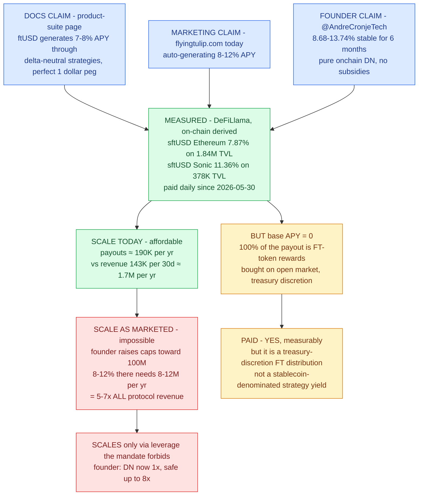
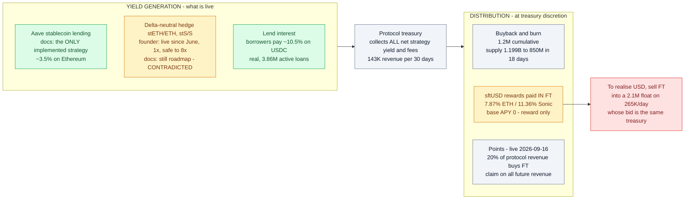

# APY Re-Verification — Are Flying Tulip's advertised yields true?

**Date:** 2026-09-20 (18 days after the 2026-09-02 review)
**Question:** are the APYs Flying Tulip advertises — 7-8% on ftUSD (docs), now **8-12%**
(marketing site), 8-12% stablecoin lending — **true or not?**
**Method:** six independent adversarial verification agents (DeepSeek V4 Flash swarm, each
instructed to prove this repo's audit *wrong*), live RPC re-reads on 5 chains, live web/API
data (DeFiLlama, Lido, DexScreener, CoinGecko, Wayback Machine), and a **read-only harvest
of the founder's X account** (`@AndreCronjeTech`, 127 posts collected) plus
`@flyingtulip_` / ecosystem accounts, read through an authenticated CDP browser session.
No interaction of any kind with X (no clicks, likes, posts, scroll-jacking of the user's
tabs — the harvest ran in its own tab, which was closed afterwards).

---

## The answer, up front

| # | Claim | True as advertised? | What the evidence shows |
|---|---|---|---|
| 1 | sftUSD pays 7-8%+ | **Paid — yes, measurably** | Ethereum **7.87%** on $1.84M TVL, Sonic **11.36%** on $378K, daily since 2026-05-30 (DeFiLlama, on-chain-derived; independently spot-checked today) |
| 2 | ..."through delta-neutral strategies" as a stablecoin yield | **No** | **Base APY = 0.** 100% of the payout is **FT-token rewards** bought on the open market and distributed **at treasury discretion** — the docs' own words |
| 3 | ..."no leverage" | **No — contradicted by the founder** | Cronje, 2026-08-21: *"DN scaling up, still only 1x, **safe up to 8x**"*; the yield is the *"delta hedge of stETH/ETH"* with *"additional risk"* (his words, 2026-09-16) |
| 4 | ...at the advertised scale | **No** | Paid on ~**$2.2M** staked. At the $100M cap the founder announces, 8-12% needs $8-12M/yr = **5-7x all protocol revenue** ($143K/30d) |
| 5 | Lend USDC 8-12% (Sonic) | **Conditionally true, small** | Real borrower-funded lending yield (borrowers pay ~10.5% on USDC, $3.86M active loans). Variable, capped, not the marketed headline |
| 6 | Buyback-and-burn is real | **True, and continuing** | $1.2M cumulative (founder, 2026-09-18); supply fell 1.199B → **850.06M** in 18 days (live RPC, this review) |

**One-paragraph verdict:** the APYs are **true as cash flows and false as yields**. People
really are being paid 7-12% today — the payments exist, are measured on-chain, and have
run for months. But they are not produced by the advertised machine: the measured payout
is **0% organic strategy yield and 100% FT-token rewards distributed at treasury
discretion**, paid into a float whose price the same treasury sets. It is affordable only
because the program is tiny ($2.2M), and the founder's own scaling path — *"safe up to
8x"* leverage on the delta-neutral leg — is exactly the leverage the "no-leverage"
backing mandate forbids. That is precisely the structure this repo's 2026-09-02 review
described; the new evidence strengthens its economics and corrects two of its details.



---

## 1. What the six-agent swarm verified

Each agent was given one pillar and told to attack the audit, not defend it.

### 1.1 On-chain facts — re-read live, 2026-09-20 (RPC, 5 chains)

FT `0x5DD1A7A369e8273371d2DBf9d83356057088082c`, identical 10,002-byte runtime on all 5 chains:

| Metric | Audit 2026-09-02 | Live 2026-09-20 | Δ |
|---|---|---|---|
| Ethereum totalSupply | 1,196,643,745.86 | **847,330,958.55** | **−349.3M** |
| Sonic | 1,979,127.96 | 2,714,977.56 | +0.7M |
| Base / BSC / Avalanche | 16,622.64 / 241.37 / 0 | unchanged | ~0 |
| **Sum** | **1,198,639,737.83** | **850,062,800.12** | **−348.6M (−29%)** |
| Configurator (`0x22246a…`) | 648,033,208 | **330,000,000** | −318.0M |
| `0xba49d0…` (likely PutManager) | 428,358,985 | 427,039,967 | −1.3M |
| `owner()` | `0x1118e1c0…370Cb` | same, all 5 chains | — |
| `paused()` | false | false, all 5 chains | — |

Supply is actively shrinking (buyback-and-burn plus further unallocated burns from the
configurator's own balance). **Verdict: the audit's structure holds; its supply magnitude
is stale** — and every backing/FDV figure derived from 1.199B must be revised *downward*.

### 1.2 The yield ceiling — live venue data, 2026-09-20

| Venue (stated backing) | Audit table | Live today | 12-mo behaviour |
|---|---|---|---|
| Aave v3 USDC (Ethereum) | 3.50% | **3.62%** (confirmed by direct `eth_call` to the pool) | mean 3.45%, spikes only |
| Aave v3 USDT (Ethereum) | 2.56% | 3.93% | mean 3.16% |
| Compound v3 USDC | 3.52% | 5.16% | mean 3.59% |
| Lido stETH | 2.55% | 2.25% (Lido's own API) | mean 2.46% |
| Ethena sUSDe | (venue) | 4.67% | mean 4.29%, peak 7.58% — never sustained |
| Aave v3 Sonic USDC | — | 1.85% | >7% on ~6 days all year |

**No stated venue has paid 7-8% sustainably in the last 12 months.** Same-asset looping is
negative-carry (borrow 4.34% > supply 3.62%); cross-asset looping is leverage with price
risk. **Verdict: the audit's ~3% ceiling is directionally fair** (today's generous blend
≈ 3.6-4.7% including sUSDe, itself off-chain leverage per W-06). The ceiling survives.

### 1.3 The marketed claim — live web, 2026-09-20

| Audit assertion | Result | Evidence |
|---|---|---|
| (a) Marketing site claims "7-8% ... perfect $1 peg" | **CHANGED** | Site now says **"auto-generating 8-12% APY"** (`flyingtulip.com/llms-full.txt`, line 121). Escalated, not retracted |
| (b) "7-8% appears nowhere in the documentation" | **REFUTED** | Verbatim on `docs.flyingtulip.com/product-suite/` — live today and in the 2026-06-20 Wayback snapshot. The audit was wrong here; it is absent only from the *detailed* ftUSD page |
| (c) Stage 0 = Aave wrapper, DN = Stage 3+ | **CONFIRMED in docs** | Docs (updated **2026-09-16**) still say: *"The only on-chain strategy currently implemented is stablecoin lending via Aave"* — directly contradicting the founder's "DN live since June" (see §2) |
| (d) Benchmark table 3.50/3.52/2.56/2.55 | **CONFIRMED** | Still in `docs.flyingtulip.com/llms.txt` today |

### 1.4 The audit's arithmetic — independently recomputed

All four numbered calculations reproduce **exactly**: $119.9M backing, $4.2M gross carry,
$0.2M surplus = 0.16% of $121.6M FDV; the +3,333 FT float math; the non-dilution proof
(verified algebraically). Sensitivity (surplus as % of FDV, opex rows × carry cols):

```
carry:        2.5%    3.0%    3.5%    4.0%
opex $2M:     0.82    1.31    1.81    2.30
opex $3M:    -0.00    0.49    0.98    1.48
opex $4M:    -0.83   -0.33    0.16    0.65
opex $5M:    -1.65   -1.16   -0.66   -0.17
```

Holder yield exceeds 1% in only 4 of 16 cells; **7-8% needs ~$260-392M of backing at
unlevered carry** — 2.2-3.3x even the audit's (now known to be overstated) $120M.

### 1.5 Published contracts — re-reviewed against the APY story

- **No mint path exists** post-constructor (10B premint on chain 146 only) — "no
  additional minting" is code-true today, enforced by *absence* of a function, not a cap.
- `burn()` is permissionless; the **pause exemption** (FT-01) is confirmed verbatim:
  while paused, only the configurator can move — including burning. A paused market cannot
  produce a "market-set" price.
- **Escrow PVE-002 / E-01 confirmed line-by-line**: `withdraw()` (L35-38) is gated only by
  `token != denomination`; FT is not the denomination; owner can sweep the FT any time,
  while the guarded `withdrawFT` (L45-49) checks recipient and funding. The protection is
  on the wrong function.
- `KNOWN_ISSUES.md` items PM-02 / AAVE-01 / YC-01 confirm: **no on-chain loss backstop**,
  and yield collection / principal withdrawal depend on *operational* responsiveness, not
  code. The advertised yield is an operational promise.

### 1.6 Ground truth of ftUSD — what is actually deployed

- ftUSD is live: **3,913,448.58 supply** (6 decimals) on Ethereum
  (`0xf7d85ec4e7710f71992752eac2111312e73e9c9c`), plus Sonic deployment; DeFiLlama stablecoin id 421.
- sftUSD pools (DeFiLlama, reward-only): Ethereum pool `2b01f4a8…` **7.87%**, TVL $1.84M;
  Sonic pool `1b7b94f8…` **11.36%**, TVL $378K. Base APY = 0 on both.
- The "MultiCollateralDN Strategy" contract is deployed (47.5KB bytecode) — but holds
  **0 USDC / 0 USDT / 0 aUSDC** on direct `eth_call`. The founder shows a DeBank profile of
  the same address as "the strategy"; the docs say it isn't implemented. Mixed evidence.
- FT market today: **$0.1079**, 24h volume **$267K** across 14 pairs (DexScreener,
  spot-checked) — the float story is unchanged.

---

## 2. What the founder says — X harvest (`@AndreCronjeTech`)

His old handle `@AndreCronje` is **suspended** ("X suspends accounts which violate the X
Rules"); his active account is `@AndreCronjeTech` ("Founder @flyingtulip_. Creator of
Yearn + Keep3r…", 459 posts). The yield-relevant posts, in his own words:

| Date | Post | Permalink |
|---|---|---|
| 2026-02-09 | "Deposits are capped at $1bn, whatever is raised is deployed into **low risk yield (currently 100% into Aave)**. This allows the depositor to get their full refund at any time." | [link](https://x.com/AndreCronjeTech/status/2020864718630519238) |
| 2026-03-17 | "ftUSD growing steadily with **7.54% APY** without additional token incentives being active yet. Almost $1m bought back and burned. **$50m safely exited** that would otherwise have sold on secondary." | [link](https://x.com/AndreCronjeTech/status/2033915411243147581) |
| 2026-06-17 | "**Delta Neutral on Ethereum activated for ftUSD.** ~$4m in current TVL, forward projection puts APY around ~9%. Should only drop to ~6% post $20m tvl." | [link](https://x.com/AndreCronjeTech/status/2067299647400391037) |
| 2026-06-19 | "USDC & USDT earning **13.74% APY** on Ethereum via ftUSD. **Room for another ~$2m at this APY.** … No subsidies. No points. Real yield." | [link](https://x.com/AndreCronjeTech/status/2067935155130397177) |
| 2026-07-24 | "ftUSD has maintained its **> 7% APY target / anchor for 3 consecutive months**" | [link](https://x.com/AndreCronjeTech/status/2080636235421220896) |
| 2026-08-03 | "USDC & USDT still earning 10% on ftUSD. **Burned unallocated 9bn FT** bringing FDV to 100m." | [link](https://x.com/AndreCronjeTech/status/2084252341222396227) |
| 2026-08-10 | "**8.79bn unallocated FT permanently burned** … $50.95m in PUT backing capital … $1.14m in cumulative yield" | [link](https://x.com/AndreCronjeTech/status/2086806388114690269) |
| 2026-08-10 | "$5m earning 9.04% current and **16.06% projected** … No subsidies. No lockups. Instantly liquid." | [link](https://x.com/AndreCronjeTech/status/2086803303694828002) |
| 2026-08-21 | "ftUSD earning 10% stable now for 3 months @ $5m. **DN scaling up, still only 1x, safe up to 8x.**" | [link](https://x.com/AndreCronjeTech/status/2090797766163177578) |
| 2026-08-26 | "$12.12m TVL … $3.86m in active loans … **$149k in 30-day fees … $143k in 30-day protocol revenue** … 10.31% average tracked supply APY" | [link](https://x.com/AndreCronjeTech/status/2092685779755499832) |
| 2026-09-07 | "**$2m mcap** $40m absolute max (assuming all PUT holders withdraw FT)" | [link](https://x.com/AndreCronjeTech/status/2097007707110711717) |
| 2026-09-15 | "USDC & USDT earning **8.68% stable now for over 6 months** on Ethereum. … pure onchain DN." | [link](https://x.com/AndreCronjeTech/status/2099924067675430938) |
| 2026-09-16 | **Risk admission**, reply on ftUSD vs Aave risk: "ftUSD does carry additional risk, **the yield is from the delta hedge of stETH/ETH** (on ethereum or stS/S on Sonic, etc), so you do carry the additional native asset and staked asset derivative risk." | [link](https://x.com/AndreCronjeTech/status/2100294840986562825) |
| 2026-09-16 | "Points live. Redeemable anytime. The longer you hold the larger your claim of **all future revenue**." | [link](https://x.com/AndreCronjeTech/status/2100294103128735939) |
| 2026-09-17 | "From bb&burn, not non-circ." (on the shrinking supply) | [link](https://x.com/AndreCronjeTech/status/2100602869145538755) |
| 2026-09-18 | "20% of total supply rewards live. **8% - 12% stable yield** on USDC/USDT … $1.2m bb & burn … $2m mcap $48m fdv. All pure onchain." | [link](https://x.com/AndreCronjeTech/status/2100958345959964837) |

Ecosystem/official accounts corroborate the pattern: `@flyingtulip_` weekly updates
(2026-08-28: "$23.57M live-product TVL … protocol fees $73.43K … buybacks crossed 947K
FT"), `@SonicEcosystem` (2026-09-18: "**20% of protocol revenue used to buy FT from the
open market for rewards** … ftUSD earning 12.63% APY on Sonic").

**Three founder statements do real work:**

1. **The yield source, admitted (2026-09-16):** *"the yield is from the delta hedge of
   stETH/ETH … so you do carry the additional native asset and staked asset derivative
   risk."* That is a leveraged basis trade with derivative risk — not "safe, liquid,
   low-risk, no-leverage" Aave lending. W-05/W-06 confirmed by the founder.
2. **The scaling path, admitted (2026-08-21, 08-12):** *"still only 1x, safe up to 8x."*
   The advertised rate holds only because DN is at 1x on $5M. Scaling to his announced
   $100M caps requires the leverage the mandate forbids.
3. **The float, conceded (2026-09-07, 09-18):** *"$2m mcap"* — the founder quotes the
   same $2M float this repo flags as unable to absorb the advertised exits (W-03).

---

## 3. Corrections to the 2026-09-02 audit

Being fair cuts both ways. Four items in the original review need updating:

1. **W-05, "the 7-8% figure does not appear anywhere in the documentation" — wrong.** It
   appears verbatim on `docs.flyingtulip.com/product-suite/` and did at audit time
   (Wayback 2026-06-20). It is absent from the detailed ftUSD page, which is likely how it
   was missed. The substantive critique stands; the "nowhere" claim does not.
2. **"Stage 0 only, DN is roadmap" — outdated, but messier than "DN shipped."** The
   founder says DN activated 2026-06-17 and confirmed the hedge composition on 2026-09-16.
   The official docs — **updated 2026-09-16, four days before this review** — still say
   *"the only on-chain strategy currently implemented is stablecoin lending via Aave."*
   The DN strategy contract exists but is empty of the assets it is named for. The
   project's own artifacts contradict each other; the truth is at most "DN live at ~$5M,
   undocumented."
3. **W-08 supply gap — answered, on X only.** The docs still say 10B; the founder publicly
   stated the 8.79-9B unallocated burn on 2026-08-03/08-10, and supply has since fallen to
   **850.06M** (live, §1.1). The gap is disclosed in posts, not in the documentation.
4. **Backing estimate — the audit's $120M was too high.** Founder (2026-08-10):
   *"$50.95m in PUT backing capital"* — consistent with issued supply (850M − 330M
   unallocated = 520M FT at 10/$1 ≈ $52M). Working the identity with the true number makes
   the conclusion **worse**, not better: gross carry at 3.5-4.7% on $51M is **$1.8-2.4M/yr**,
   below any plausible ecosystem budget, so backing-yield surplus is ≈ **zero or negative**,
   and *all* distributions lean on revenue ($143K/30d), released principal, and the
   treasury's discretion.

Also noted: the founder's "$48m fdv" (2026-09-18) is inconsistent with market data
(850.06M × $0.108 ≈ **$91.8M**, CoinGecko/DexScreener). His $2M-float figure agrees with
the market; his FDV does not.

---

## 4. The money flow, as measured today



Every edge in this diagram is now evidenced: the generation side by the docs and the
founder, the treasury edge by the docs' own "all net strategy yield … at treasury
discretion", the distribution side by DeFiLlama's reward-only pools and live supply data,
and the exit edge by DexScreener volume and the founder's own "$2m mcap".

---

## 5. Final verdict

**Are the APYs true?**

- **"Is anyone actually being paid 7-12% today?" — TRUE.** Measured on-chain, sustained
  for months, ~$2.2M of sftUSD. The audit's framing should not be read as "the APY isn't
  being paid" — it is.
- **"Is it the advertised yield — organic, delta-neutral, no-leverage, stablecoin
  yield?" — NOT TRUE.** The measured payout is 0% base / 100% FT rewards at treasury
  discretion; the founder himself attributes the yield to a leveraged stETH/ETH hedge
  with derivative risk, and his scaling path to the marketed caps requires up to 8x
  leverage — exactly what the "no-leverage" mandate forbids. At marketed scale the payout
  would need 5-7x all protocol revenue.
- **"So what is it?"** A real, currently affordable, treasury-funded token distribution —
  part-covered by genuine but small revenue ($143K/30d) — that is marketed as strategy
  yield. Both legs of the realised USD return (reward rate; FT exit price into a $2M
  float) remain controlled by the same party. That is the audit's 2026-09-02 conclusion,
  now confirmed by harder evidence, including the founder's own posts.

## 6. Method & limitations

- Six-agent DeepSeek V4 Flash swarm (hermes CLI), each adversarially briefed; all
  conclusions above were re-spot-checked by the reviewer where marked (sftUSD APY series,
  FT price/volume, tweet full texts).
- X harvest was read-only DOM reads over the user's own authenticated CDP session
  (loopback :9222), in a dedicated tab, closed afterwards. X search surfaces recent posts
  only; posts before ~2026-02 and reply threads are under-sampled. Some posts were
  truncated in-timeline; two key ones were fetched in full and are quoted complete.
- `configurator()` via selector `0x904c3b21` reverted on all chains today; role
  continuity is inferred from balances/behaviour, not re-read directly.
- The DN strategy's real holdings were not fully enumerated (only USDC/USDT/aUSDC checked,
  all zero); the founder's DeBank link suggests assets held in other forms.
- Revenue figures ($143K/30d) are the founder's, citing DefiLlama methodology; not
  independently re-derived from fee contracts.

*Research notes only. Not investment advice.*
