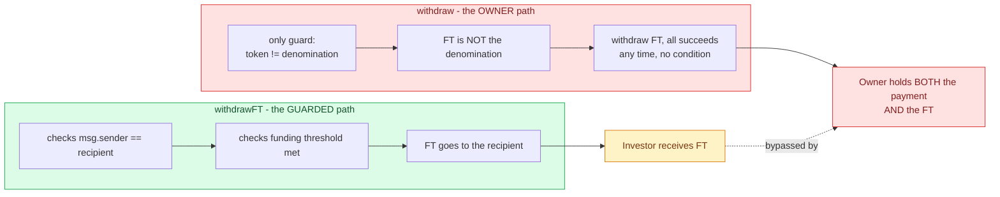
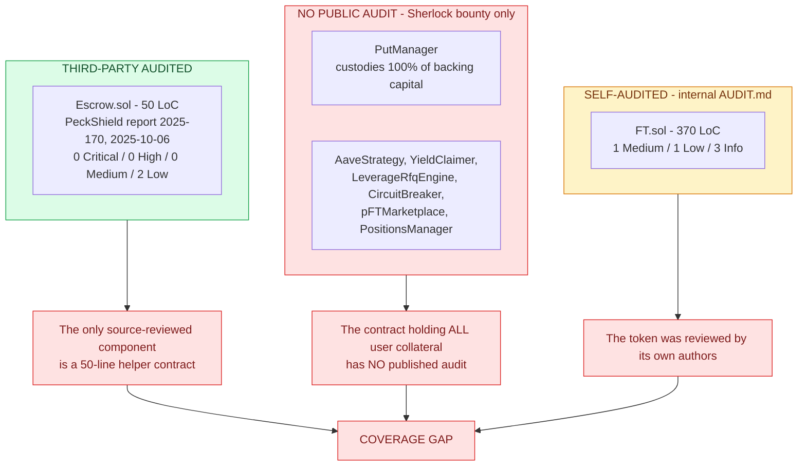
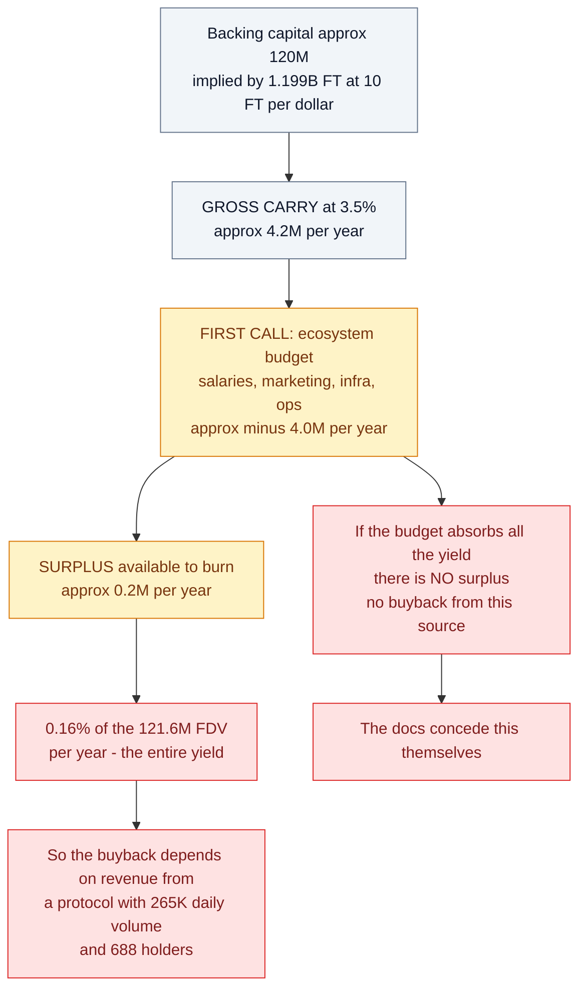
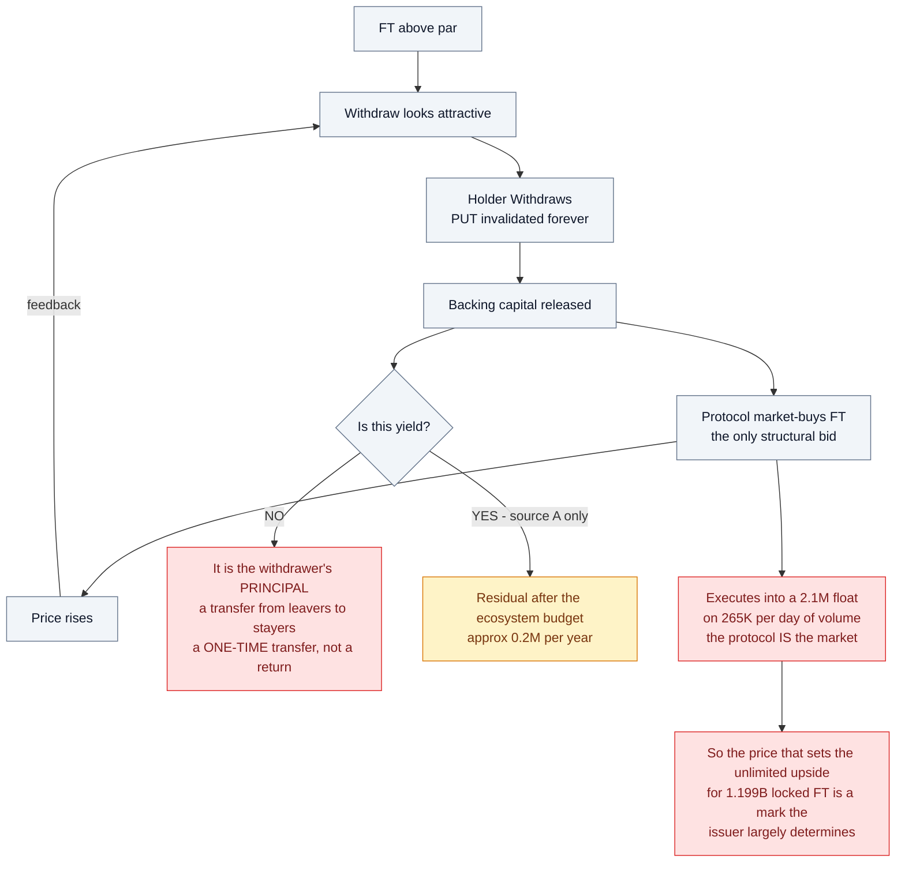
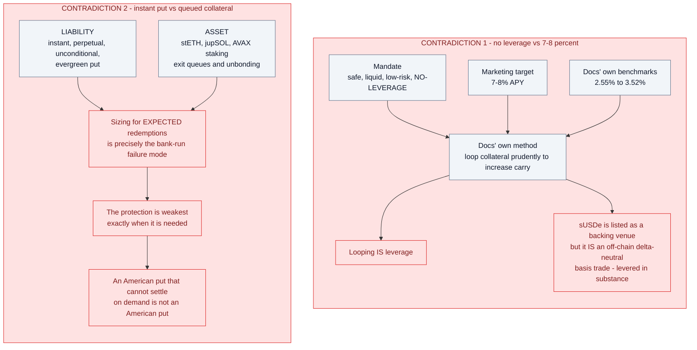

# Flying Tulip — Security & Economic Review

**Target:** Flying Tulip (Andre Cronje) — FT token, Capital Allocation sale, Perpetual PUT, ftUSD
**Date:** 2026-09-02
**Scope:** public source (`github.com/flyingtulipdotcom/*`), official docs, and live on-chain state
**Method:** manual source review + live RPC verification on 5 chains

> **Not a professional audit.** Two-person-weeks of formal review, full test harness, and
> access to the closed-source protocol contracts would be required for that. This is a
> research assessment. Not investment advice.

---

## Executive summary

Flying Tulip's pitch is **"100% downside protection, unlimited upside"** plus a **7-8% APY**
stablecoin. My assessment:

**The code I could read is fine.** `FT.sol` is small, competent, and I found no arithmetic,
reentrancy, or signature-replay bug — I independently verified both hardcoded EIP-712
typehashes. The problems in the code are **privilege and pause-semantics** problems, not
logic bugs.

**The code I could not read is the important part.** `PutManager` — the contract that
custodies 100% of the backing capital — **is not open source.** Only the token and a
50-line escrow are public. The protocol's own `KNOWN_ISSUES.md` names eight subsystems
(`PutManager`, `AaveStrategy`, `YieldClaimer`, `LeverageRfqEngine`, `CircuitBreaker`,
`pFTMarketplace`, `PositionsManager`, strategy roles) and **none of them are published.**
Coverage is a Sherlock bug bounty, not public review.

**The economics is where the real weakness is.** The structure contains a hard
contradiction: if the principal is genuinely never spent and genuinely unlevered, the
yield is capped at what safe collateral earns — **~3%**, per the project's own benchmark
table. Any yield materially above that must come from new capital, from other holders'
principal, or from a token price the issuer's own buyback sets in a **$2.1M float**.

**On prior art.** PeckShield audited the Escrow in October 2025 (report 2025-170) and
found only 2 Low issues — one of which is my E-01, the escrow admin-key problem. It is
therefore **not novel**; I re-flag it because I think Low underrates it for a sale
contract, and because PeckShield's recommendation was *disclosure* rather than a code
fix. I did find one thing they did not: **the deployed source no longer matches the
audited checksum** (E-09), while the README still claims the file is preserved "to keep
the audited source exactly."

### Where the argument holds and where it breaks

This is the whole review in one picture. The left column is genuinely creditable — this
structure is more honest than most. The right column is what does not survive the
protocol's own numbers.

```mermaid
flowchart TB
    subgraph HOLDS["WHAT HOLDS UP - genuinely creditable"]
        direction TB
        H6["FT.sol is competently written<br/>no arithmetic bug, no reentrancy,<br/>no signature-replay flaw<br/>both EIP-712 typehashes verified"]
        H1["1:1 ring-fenced backing is a real<br/>improvement over emission-funded yield"]
        H2["No inflation<br/>enforced by constructor-only minting"]
        H3["Revenue-linked insider unlocks<br/>beat time-based vesting in principle"]
        H4["The perpetual put is a genuinely novel<br/>retail-protective idea, and putting it<br/>on-chain beats putting it in a term sheet"]
        H5["KNOWN_ISSUES.md is candid<br/>admits protocol-level losses are not<br/>handled on-chain, circuit-breaker lag"]
    end

    subgraph BREAKS["WHAT DOES NOT SURVIVE THE NUMBERS"]
        direction TB
        B6["PutManager holds 100% of backing capital<br/>and is CLOSED SOURCE<br/>only a 50-line escrow was third-party audited"]
        B1["Docs say 10B supply<br/>chain says 1.199B<br/>an 88% gap"]
        B2["7-8% APY marketed<br/>vs 2.55-3.52% in the docs' own table<br/>Stage 0 is only a USDC/USDT to Aave wrapper"]
        B3["Yield is JUNIOR to team opex<br/>realistic surplus approx 0.16% of FDV"]
        B4["The buyback scales only on PRINCIPAL<br/>released by leavers, not on yield<br/>reflexive, consumes collateral, adds float"]
        B5["Instant, perpetual, unconditional puts<br/>funded with queued, unbonding LSTs"]
    end

    HOLDS --> VERDICT["Both columns are true at once.<br/>The mechanism is well built;<br/>the yield claim layered on top of it<br/>is not supported by the deployed system."]
    BREAKS --> VERDICT

    style HOLDS fill:#dcfce7,stroke:#16a34a,color:#14532d
    style BREAKS fill:#fee2e2,stroke:#dc2626,color:#7f1d1d
    classDef warn fill:#fef3c7,stroke:#d97706,color:#78350f
    class VERDICT warn
```



### The three things I would want answered before putting capital in

1. **Where are the other 8.8B FT?** Docs say 10B fixed supply. Chain says **1.199B**.
2. **Which is it: "no leverage" or 7-8%?** Their own benchmarks top out at 3.52%. The
   delta-neutral strategy that would justify 7-8% is **Stage 3+**, i.e. not deployed.
   Stage 0 is a USDC/USDT → Aave wrapper.
3. **Why does the escrow let the owner take both sides?** `Escrow.withdraw()` excludes only
   the denomination token — so the owner can withdraw the **FT** deposited for the
   investor, defeating the contract's only stated protection.



---

## Findings summary

### Contract-level

| ID | Finding | Severity | Contract | Prior art |
|---|---|---|---|---|
| **E-01** | `withdraw()` bypasses the FT gate — owner can reclaim the recipient's FT | **High** | Escrow | PeckShield PVE-002 (Low) |
| **FT-01** | Pause is one-directional: configurator keeps full transfer ability | **High** | FT | their AUDIT.md Q-2 (Low) |
| **FT-02** | Entire 10B premined to configurator; deployed paused | Medium | FT | by design |
| **E-09** | Deployed source ≠ audited source; README claims it is preserved | Medium | Escrow | — |
| **E-02** | No on-chain FT↔denomination rate; uncapped, repeatable `withdrawFT` | Medium | Escrow | — |
| **E-03** | `withdrawFT` bricked while FT paused (team-controlled kill switch) | Medium | Escrow | — |
| **FT-03** | `setName`/`setSymbol` mutate domain separator + enable identity spoofing | Medium | FT | their AUDIT.md I-3 (Info) |
| **FT-04** | Users cannot burn while paused; configurator can | Low | FT | — |
| **FT-05** | Two `permit` overloads share one nonce space (griefing surface) | Low | FT | — |
| **E-04** | Funding gate is a monotonic high-water mark; no recipient protection | Low | Escrow | — |
| **E-05** | Hardcoded FT address wrong on all testnets; unrecoverable | Low | Escrow | — |
| **E-06** | No events emitted anywhere | Low | Escrow | — |
| **E-07** | Blacklistable / non-standard denomination tokens | Low | Escrow | PeckShield PVE-001 |
| **E-08** | No timeout or refund path for the recipient | Info | Escrow | — |

### Coverage map — what was actually reviewed



### Prior audits on record

| Target | Auditor | Date | Result |
|---|---|---|---|
| **FT Escrow** | **PeckShield** (report 2025-170, v1.0-rc) | 2025-10-06 | **0 Critical · 0 High · 0 Medium · 2 Low** |
| FT token | internal `AUDIT.md` in `ft` repo | — | 1 Medium (Q-1, deploy script) · 1 Low (Q-2) · 3 Info |
| Full protocol | **Sherlock bug bounty** only | ongoing | no published public report |

Note the gap: the only third-party source-reviewed component is a **50-line helper
escrow**. The contract holding all user collateral has no published audit.

### Economic

| ID | Weakness | Severity |
|---|---|---|
| **W-01** | Principal protection and upside are mutually exclusive and irreversibly so | High |
| **W-02** | Buyback funded mainly by principal (withdrawals), not yield — reflexive loop | High |
| **W-03** | $2.1M float / $265K daily volume cannot absorb the exits it advertises | High |
| **W-04** | Yield is junior to team opex; realistic surplus ≈ $0.2M/yr (0.16% of FDV) | High |
| **W-05** | 7-8% APY unsupported: Stage 0 is an Aave wrapper; benchmarks are 2.55–3.52% | High |
| **W-06** | Liquidity transformation: instant perpetual puts funded with queued LSTs | High |
| **W-07** | 40:40:20 gives the team discretion over what unlocks their own tokens | Medium |
| **W-08** | Supply disclosure gap: docs 10B vs chain 1.199B | Medium |
| **W-09** | "Oracle-free" removes the independent mark, not the incentive to game it | Medium |

---

## Key on-chain facts (verified 2026-09-02)

Canonical FT: `0x5DD1A7A369e8273371d2DBf9d83356057088082c` (same on Ethereum, BSC, Base,
Avalanche, Sonic).

| Metric | Value |
|---|---|
| Total supply (all EVM chains) | **1,198,639,737 FT** — docs claim **10,000,000,000** |
| Price | $0.1014 (≈ the $0.10 par) |
| Float (`availableSupply`) | **20,668,218 FT** ≈ **$2.10M** |
| FDV | **≈ $121.6M** — vs $1B headline private valuation |
| 24h volume | **$264,564** |
| Holders | **688** |
| Top holder | `0x22246a…` = the **configurator** — **648,033,208 FT (54.15%)** |
| Second holder | `0xba49d0…` (unidentified, likely `PutManager`) — **428,358,985 FT (35.80%)** |
| Top-2 concentration | **89.95%** |
| `paused()` | false on all 5 mainnets (but the contract is *deployed* paused) |

### Privileged roles — and why they are not independent

| Role | Address | Type | Powers |
|---|---|---|---|
| `owner()` | `0x1118e1c0…370Cb` | Safe **3-of-5** | pause, `setName`, `setSymbol`, rotate configurator |
| `configurator()` | `0x22246a91…35017c` | Safe **3-of-4** | pause, rotate configurator, **pause-bypass transfers** |

**4 of the 5 owner signers are also configurator signers.** The apparent separation
between the role that can freeze the token and the role exempt from the freeze is
largely cosmetic — and the exempt role holds **54% of supply**.

### Audit-integrity check (E-09)

PeckShield recorded the checksum of the Escrow source it reviewed. It does not match what
is in the repo today:

| | Hash |
|---|---|
| Audited (PeckShield 2025-170) | `sha256 da6e16ae…90a8b5664` |
| Current `src/Escrow.sol` | `sha256 2f28e7dd…1f76c635` |

The visible delta is `transfer(...)` → `safeTransfer(...)` — almost certainly the fix for
PVE-001 (non-ERC20-compliant tokens), i.e. a *good* change. The issue is that the README
still says the file is excluded from formatting "to preserve the **audited source
exactly**." It does not. Anyone checking "was this exact file audited?" is misled, and no
updated report in `audits/` covers the new hash.

---

## The central economic argument

The docs make two claims that cannot both do work:

> **A.** "Backing capital is **never spent**" — safe, liquid, **no-leverage** positions so
> Exit-at-par is honoured "quickly in all conditions."

> **B.** Holders earn attractive yield; ftUSD pays **7-8% APY**.

If A holds, the only cash flow available is the native yield on a safe unlevered
portfolio. The docs publish that number:

| Benchmark (their table) | APY |
|---|---|
| Aave v3 USDC | **3.50%** |
| Compound v3 USDC | **3.52%** |
| Aave v3 USDT | **2.56%** |
| Lido stETH | **2.55%** |

**Yield-to-holder ≤ (yield on collateral) − (operating costs).**

Worked through with ~$120M of backing capital (implied by 1.199B FT at 10 FT/$1):

```
Gross carry @ 3.5%          ≈  $4.2M / yr
Less ecosystem budget       ≈ -$4.0M / yr   ← "the FIRST call on backing capital yield"
──────────────────────────────────────────
Surplus available to burn   ≈  $0.2M / yr   = 0.16% of the $121.6M FDV
```



The docs concede this: *"if the ecosystem budget consumes all the yield, there is no
surplus → no buyback from this source."*

So the buyback that does scale is **source C — backing capital released when someone
Withdraws**. That is not yield. It is **other people's principal** being spent to buy FT
from people who are leaving. It is a transfer, and it is reflexive:

```
FT above par → Withdraw attractive → backing released → protocol buys FT
             → price rises → Withdraw more attractive → more backing released ⟲
```



Each pass converts collateral into burned FT while **increasing float**
(+10,000 withdrawn, −6,667 burned at $0.15 = **+3,333 float**). The loop is *not*
dilutive to remaining PUT holders — backing per remaining FT stays at $0.10 — but it is
**not a yield**. It is a one-time transfer per withdrawing holder, funded by shrinking
the asset base.

And it executes into a **$2.1M float with $265K/day of volume**, where the protocol is
the only structural bid. The price that sets the "unlimited upside" for 1.199B locked FT
is therefore a mark the issuer largely determines, in a market that cannot absorb the
exits the docs advertise.

### Two further contradictions

**"No leverage" vs. 7-8%.** sUSDe — Ethena's delta-neutral basis trade, i.e. a levered
perp-funding position held at exchanges and custodians — is listed as a *backing* venue
under "no leverage." And the docs' own path to higher carry is *"loop collateral
prudently… to increase… carry."* Looping is leverage.



**Instant put vs. queued collateral.** The Perpetual PUT is instant, perpetual, and
unconditional. The backing includes stETH, jupSOL, and AVAX staking, which have
**unbonding queues**. The docs admit *"synchronized Exit waves… can introduce timing
delays."* Sizing for expected redemptions is exactly the bank-run failure mode: the
protection is weakest precisely when it is needed. An American put that cannot settle on
demand is not an American put.

---

## What is genuinely good

Worth stating, because this structure is more honest than most:

- **1:1 ring-fenced backing is a real improvement** over emission-funded "yield." If
  honoured, par exits are substantially safer than a typical farm.
- **No inflation**, voluntarily accepted and enforced by constructor-only minting.
- **Revenue-linked insider unlocks (40:40:20)** beat time-based vesting in principle.
- **The perpetual put is a genuinely novel retail-protective idea**, and putting it
  on-chain rather than in a term sheet is a real contribution.
- **`KNOWN_ISSUES.md` is candid** — it admits *"protocol-level losses are not handled
  on-chain"* (PM-02), circuit-breaker lag (CB-01), and marketplace snapshot gaps
  (MKT-01). Better practice than most projects at this stage.

---

## Recommendations

**For the team**
1. Open-source `PutManager` and the strategy layer. A bug bounty is not a substitute for
   public review of the contract holding 100% of user collateral.
2. Fix `Escrow.withdraw()` — exclude FT, add an immutable `ftAmount` and a `claimed` flag.
   PeckShield recommended *disclosure* for this (PVE-002); it is fixable in code instead.
3. Narrow the configurator's pause exemption to `from == configurator`; drop the
   open-ended `msg.sender == configurator` branch.
4. Publish a re-audit or delta letter against `sha256 2f28e7dd…1f76c635`, or drop the
   README's "preserve the audited source exactly" claim (E-09).
5. Publish the reconciliation from 10B to 1.199B FT, and the size of the
   Foundation/Team/Incentives allocations.
6. Either retract the 7-8% figure or state plainly that it is a Stage 3+ target not
   achievable with the deployed Aave wrapper.
7. Put a hard cap on queued/unbonding backing assets, and disclose the cap.

**For anyone considering capital**
- The put protects **par**, not purchasing power and not opportunity cost. Exiting at par
  after two years means a **0% nominal return**.
- Realistic holder yield is the **residual** after the team's operating budget — plausibly
  near zero today.
- The "unlimited upside" is denominated in a price set in a **$2.1M float**.
- FT bought on the secondary market carries **no** Perpetual PUT and **no** protection.

---

## Repository contents

```
flying-tulip-audit/
├── README.md
├── research/
│   ├── 01-protocol-overview.md     architecture, tokenomics, products, yield claims
│   └── 02-onchain-facts.md         verified supply, distribution, roles, market data
├── findings/
│   ├── 01-FT-token.md              FT.sol review + attack path
│   ├── 02-Escrow.md                Escrow.sol review
│   └── 03-economics-high-yield.md  the yield critique
├── reports/
│   └── FINAL_REPORT.md             this document
├── contracts/                      cloned upstream repos (ft, escrow, security, …)
└── scripts/
    ├── keccak.py                   pure-Python keccak-256 for selector verification
    └── lint_mermaid.py             dependency-free linter for the diagrams
```

These documents contain **36 Mermaid diagrams**, colour-coded so the argument is
readable without the surrounding prose:

| Colour | Meaning |
|---|---|
| **green** | Holds up — verified, or a genuine strength |
| **blue** | The project's own claim, stated as claimed |
| **amber** | Conditionally true, or a caveat that materially limits the claim |
| **red** | Broken, false, or a vulnerability |
| **purple** | Closed source — cannot be verified either way |

The recurring shape is **a blue node feeding a red node**: an assertion the project
makes, followed by what the chain or the docs' own numbers actually support.
Validate them with `python scripts/lint_mermaid.py`.
