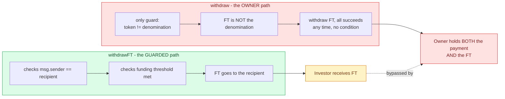
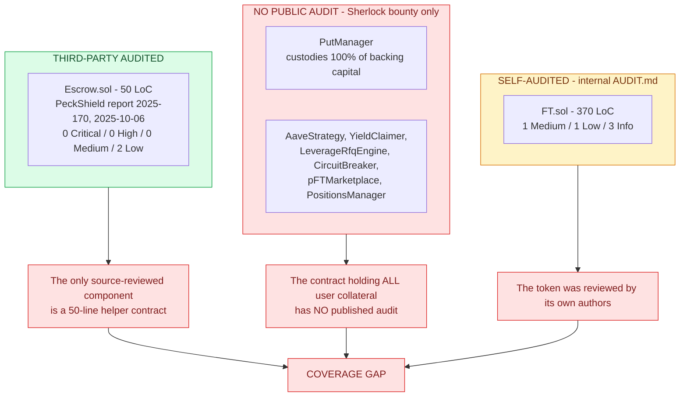
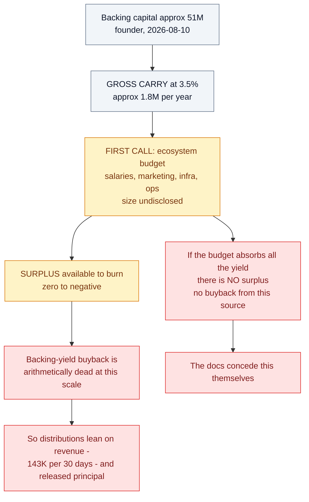
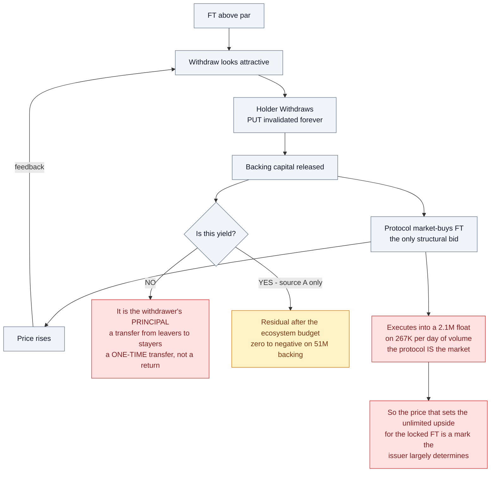
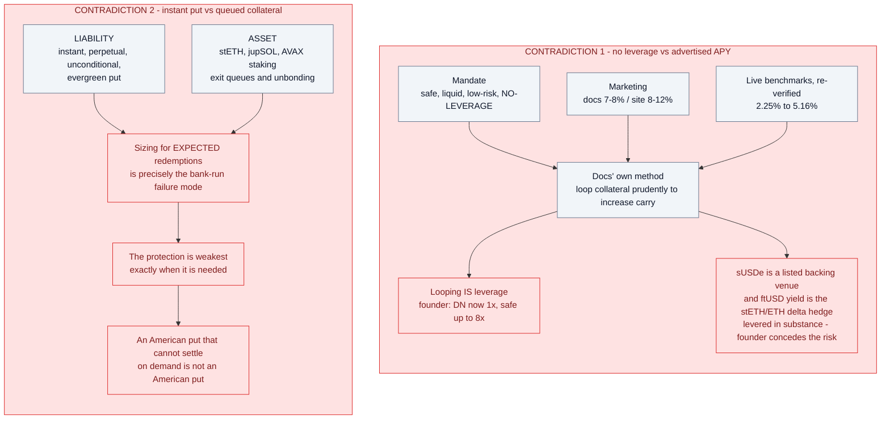

# Flying Tulip — Security & Economic Review

**Target:** Flying Tulip (Andre Cronje) — FT token, Capital Allocation sale, Perpetual PUT, ftUSD
**Date:** 2026-09-02
**Updated:** 2026-09-20 — supply, market data, backing size, and the APY analysis revised
against live RPC, live venue data, current docs, and the founder's public X statements
(see *Corrections since first publication* below)
**Scope:** public source (`github.com/flyingtulipdotcom/*`), official docs, live on-chain
state, founder's public statements
**Method:** manual source review + live RPC verification on 5 chains; re-verification by
an adversarial multi-agent swarm plus read-only review of the founder's X account

> **Not a professional audit.** Two-person-weeks of formal review, full test harness, and
> access to the closed-source protocol contracts would be required for that. This is a
> research assessment. Not investment advice.

---

## Executive summary

Flying Tulip's pitch is **"100% downside protection, unlimited upside"** plus a **7-8% APY**
stablecoin (docs) — escalated to **8-12%** on the marketing site since first read. My assessment:

**The code I could read is fine.** `FT.sol` is small, competent, and I found no arithmetic,
reentrancy, or signature-replay bug — I independently verified both hardcoded EIP-712
typehashes. The problems in the code are **privilege and pause-semantics** problems, not
logic bugs.

**The code I could not read is the important part.** `PutManager` — the contract that
custodies 100% of the backing capital — **is not open source.** Only the token and a
50-line escrow are public. The protocol's own `KNOWN_ISSUES.md` names eight subsystems
(`PutManager`, `AaveStrategy`, `YieldClaimer`, `LeverageRfqEngine`, `CircuitBreaker`,
`pFTMarketplace`, `PositionsManager`, strategy roles) and **none of them are published.**
Coverage is a Sherlock bug bounty, not public review.

**The economics is where the real weakness is — and it is now measured, not just
inferred.** The structure contains a hard contradiction: if the principal is genuinely
never spent and genuinely unlevered, the yield is capped at what safe collateral earns —
**~3-4.7%** on re-verified live data. The advertised 7-12% **is genuinely being paid**
(sftUSD 7.87% Ethereum / 11.36% Sonic, daily since 2026-05-30) — but DeFiLlama's
on-chain-derived tracking shows **base APY 0: the entire payout is FT-token rewards
bought on the open market and distributed at treasury discretion.** It is affordable
only because the staked base is ~$2.2M; the founder's own scaling path — *"still only
1x, safe up to 8x"* on a yield he attributes to *"the delta hedge of stETH/ETH"* — is
the leverage the no-leverage mandate forbids. The buyback that scales remains funded by
other holders' principal, executing into a **$2.1M float** the founder himself quotes.

**On prior art.** PeckShield audited the Escrow in October 2025 (report 2025-170) and
found only 2 Low issues — one of which is my E-01, the escrow admin-key problem. It is
therefore **not novel**; I re-flag it because I think Low underrates it for a sale
contract, and because PeckShield's recommendation was *disclosure* rather than a code
fix. I did find one thing they did not: **the deployed source no longer matches the
audited checksum** (E-09), while the README still claims it is preserved "to keep the
audited source exactly."

### Where the argument holds and where it breaks

This is the whole review in one picture. The left column is genuinely creditable — this
structure is more honest than most. The right column is what does not survive the
protocol's own numbers.

```mermaid
flowchart TB
    subgraph HOLDS["WHAT HOLDS UP - genuinely creditable"]
        direction TB
        H6["FT.sol is competently written<br/>no arithmetic bug, no reentrancy,<br/>no signature-replay flaw<br/>both EIP-712 typehashes verified"]
        H1["1:1 ring-fenced backing is a real<br/>improvement over emission-funded yield"]
        H2["No inflation<br/>enforced by constructor-only minting"]
        H3["Revenue-linked insider unlocks<br/>beat time-based vesting in principle"]
        H4["The perpetual put is a genuinely novel<br/>retail-protective idea, and putting it<br/>on-chain beats putting it in a term sheet"]
        H5["KNOWN_ISSUES.md is candid<br/>admits protocol-level losses are not<br/>handled on-chain, circuit-breaker lag"]
        H7["The distributions are REAL<br/>sftUSD paid 7-12% daily since May<br/>supply burned 1.199B to 850M in 18 days<br/>founder discloses even the awkward numbers"]
    end

    subgraph BREAKS["WHAT DOES NOT SURVIVE THE NUMBERS"]
        direction TB
        B6["PutManager holds 100% of backing capital<br/>and is CLOSED SOURCE<br/>only a 50-line escrow was third-party audited"]
        B1["Docs say 10B supply - stale<br/>chain: 850M and shrinking<br/>burn disclosed on X, never in docs"]
        B2["8-12% marketed, 7-12% paid - but<br/>base APY 0, 100% FT rewards at<br/>treasury discretion; scaling path is<br/>leverage the mandate forbids"]
        B3["Backing is ~51M per founder<br/>gross carry ~1.8M/yr is JUNIOR to opex<br/>yield-funded surplus is zero to negative"]
        B4["The buyback scales only on PRINCIPAL<br/>released by leavers, not on yield<br/>reflexive, consumes collateral, adds float"]
        B5["Instant, perpetual, unconditional puts<br/>funded with queued, unbonding LSTs"]
    end

    HOLDS --> VERDICT["Both columns are true at once.<br/>The mechanism is well built and the<br/>payments are real; the yield claim<br/>layered on top of them is not what<br/>it is marketed as."]
    BREAKS --> VERDICT

    style HOLDS fill:#dcfce7,stroke:#16a34a,color:#14532d
    style BREAKS fill:#fee2e2,stroke:#dc2626,color:#7f1d1d
    classDef warn fill:#fef3c7,stroke:#d97706,color:#78350f
    class VERDICT warn
```



### The three questions from first publication — two now answered

1. **Where are the other 8.8B FT?** — **Answered by the founder, on X:** *"Burned
   unallocated 9bn FT"* (2026-08-03), *"8.79bn unallocated FT permanently burned"*
   (2026-08-10). The docs still say 10B; supply is 850M and falling.
2. **Which is it: "no leverage" or 7-8%?** — **Answered by the founder:** the yield is
   *"from the delta hedge of stETH/ETH"* with *"additional … derivative risk"*
   (2026-09-16), at *"1x, safe up to 8x"* (2026-08-21). It is leverage by his own
   description — plus treasury-discretion FT rewards (base APY 0) for the measured payout.
3. **Why does the escrow let the owner take both sides?** — **Unanswered.** The finding
   stands as published.



---

## Findings summary

### Contract-level

| ID | Finding | Severity | Contract | Prior art |
|---|---|---|---|---|
| **E-01** | `withdraw()` bypasses the FT gate — owner can reclaim the recipient's FT | **High** | Escrow | PeckShield PVE-002 (Low) |
| **FT-01** | Pause is one-directional: configurator keeps full transfer ability | **High** | FT | their AUDIT.md Q-2 (Low) |
| **FT-02** | Entire 10B premined to configurator; deployed paused | Medium | FT | by design |
| **E-09** | Deployed source ≠ audited source; README claims it is preserved | Medium | Escrow | — |
| **E-02** | No on-chain FT↔denomination rate; uncapped, repeatable `withdrawFT` | Medium | Escrow | — |
| **E-03** | `withdrawFT` bricked while FT paused (team-controlled kill switch) | Medium | Escrow | — |
| **FT-03** | `setName`/`setSymbol` mutate domain separator + enable identity spoofing | Medium | FT | their AUDIT.md I-3 (Info) |
| **FT-04** | Users cannot burn while paused; configurator can | Low | FT | — |
| **FT-05** | Two `permit` overloads share one nonce space (griefing surface) | Low | FT | — |
| **E-04** | Funding gate is a monotonic high-water mark; no recipient protection | Low | Escrow | — |
| **E-05** | Hardcoded FT address wrong on all testnets; unrecoverable | Low | Escrow | — |
| **E-06** | No events emitted anywhere | Low | Escrow | — |
| **E-07** | Blacklistable / non-standard denomination tokens | Low | Escrow | PeckShield PVE-001 |
| **E-08** | No timeout or refund path for the recipient | Info | Escrow | — |

### Coverage map — what was actually reviewed



### Prior audits on record

| Target | Auditor | Date | Result |
|---|---|---|---|
| **FT Escrow** | **PeckShield** (report 2025-170, v1.0-rc) | 2025-10-06 | **0 Critical · 0 High · 0 Medium · 2 Low** |
| FT token | internal `AUDIT.md` in `ft` repo | — | 1 Medium (Q-1, deploy script) · 1 Low (Q-2) · 3 Info |
| Full protocol | **Sherlock bug bounty** only | ongoing | no published public report |

Note the gap: the only third-party source-reviewed component is a **50-line helper
escrow**. The contract holding all user collateral has no published audit.

### Economic

| ID | Weakness | Severity |
|---|---|---|
| **W-01** | Principal protection and upside are mutually exclusive and irreversibly so | High |
| **W-02** | Buyback funded mainly by principal (withdrawals), not yield — reflexive loop | High |
| **W-03** | $2.1M float / $267K daily volume cannot absorb the exits it advertises — founder concurs: *"$2m mcap"* | High |
| **W-04** | Yield is junior to team opex; on the founder's $51M backing the yield-funded surplus is zero to negative | High |
| **W-05** | 7-12% APY is paid — but as 100% FT rewards at treasury discretion (base 0); scaling path is founder-admitted leverage | High |
| **W-06** | Liquidity transformation: instant perpetual puts funded with queued LSTs; founder concedes derivative risk on the hedge | High |
| **W-07** | 40:40:20 gives the team discretion over what unlocks their own tokens | Medium |
| **W-08** | Supply docs stale: docs 10B vs chain 850M; reconciliation disclosed on X, never in docs | Medium |
| **W-09** | "Oracle-free" removes the independent mark, not the incentive to game it | Medium |

---

## Key on-chain facts (re-verified 2026-09-20)

Canonical FT: `0x5DD1A7A369e8273371d2DBf9d83356057088082c` (same on Ethereum, BSC, Base,
Avalanche, Sonic). Full detail in [`research/02-onchain-facts.md`](../research/02-onchain-facts.md).

| Metric | Value |
|---|---|
| Total supply (all EVM chains) | **850,062,800 FT** (was 1,198,639,737 on 2026-09-02) — docs claim **10,000,000,000** |
| Price | $0.1079 (≈ the $0.10 par) |
| Float (`availableSupply`) | **20,668,218 FT** ≈ **$2.10M** (2026-09-02; founder: *"$2m mcap"*) |
| FDV | **≈ $91.7M** — vs $1B headline private valuation |
| 24h volume | **$267,438** (14 pairs) |
| Holders | **688** (2026-09-02) |
| Top holder | `0x22246a…` = the **configurator** — **330,000,000 FT (38.95%)** (was 648M; absorbed most of the burn) |
| Second holder | `0xba49d0…` (unidentified, likely `PutManager`) — **427,039,967 FT (50.40%)** |
| Top-2 concentration | **89.35%** |
| `paused()` | false on all 5 mainnets, re-verified (but the contract is *deployed* paused) |
| PUT backing capital | **$50.95M** (founder, 2026-08-10) |
| Protocol revenue | **$143K per 30 days** (founder, 2026-08-26, DefiLlama methodology) |
| ftUSD | live — **3.91M supply** on Ethereum + Sonic; sftUSD paying **7.87% / 11.36%**, base APY 0 |

### Privileged roles — and why they are not independent

| Role | Address | Type | Powers |
|---|---|---|---|
| `owner()` | `0x1118e1c0…370Cb` | Safe **3-of-5** | pause, `setName`, `setSymbol`, rotate configurator |
| `configurator()` | `0x22246a91…35017c` | Safe **3-of-4** | pause, rotate configurator, **pause-bypass transfers** |

**4 of the 5 owner signers are also configurator signers.** The apparent separation
between the role that can freeze the token and the role exempt from the freeze is
largely cosmetic — and the exempt role holds **39% of supply**.

### Audit-integrity check (E-09)

PeckShield recorded the checksum of the Escrow source it reviewed. It does not match what
is in the repo today:

| | Hash |
|---|---|
| Audited (PeckShield 2025-170) | `sha256 da6e16ae…90a8b5664` |
| Current `src/Escrow.sol` | `sha256 2f28e7dd…1f76c635` |

The visible delta is `transfer(...)` → `safeTransfer(...)` — almost certainly the fix for
PVE-001 (non-ERC20-compliant tokens), i.e. a *good* change. The issue is that the README
still says the file is excluded from formatting "to preserve the **audited source
exactly**." It does not. Anyone checking "was this exact file audited?" is misled, and no
updated report in `audits/` covers the new hash.

---

## The central economic argument

The docs make two claims that cannot both do work:

> **A.** "Backing capital is **never spent**" — safe, liquid, **no-leverage** positions so
> Exit-at-par is honoured "quickly in all conditions."

> **B.** Holders earn attractive yield; ftUSD pays **7-8% APY** (docs) / **8-12%** (site).

If A holds, the only cash flow available is the native yield on a safe unlevered
portfolio. The bound, re-verified live (2026-09-20): Aave USDC 3.62%, Compound 5.16%,
Aave USDT 3.93%, stETH 2.25%, sUSDe 4.67% — **no stated venue sustains 7-8% over 12
months**.

**Yield-to-holder ≤ (yield on collateral) − (operating costs).**

Worked through with the founder's own backing figure (~$51M):

```
Gross carry @ 3.5%          ≈  $1.8M / yr   (even @ 4.7%: $2.4M)
Less ecosystem budget       ≈ -$?.?M / yr   ← "the FIRST call on backing capital yield"
──────────────────────────────────────────
Surplus available to burn   ≈  zero to negative
```



The docs concede this: *"if the ecosystem budget consumes all the yield, there is no
surplus → no buyback from this source."*

So the buyback that does scale is **source C — backing capital released when someone
Withdraws**. That is not yield. It is **other people's principal** being spent to buy FT
from people who are leaving. It is a transfer, and it is reflexive:

```
FT above par → Withdraw attractive → backing released → protocol buys FT
             → price rises → Withdraw more attractive → more backing released ⟲
```



Each pass converts collateral into burned FT while **increasing float**
(+10,000 withdrawn, −6,667 burned at $0.15 = **+3,333 float**). The loop is *not*
dilutive to remaining PUT holders — backing per remaining FT stays at $0.10 — but it is
**not a yield**. It is a one-time transfer per withdrawing holder, funded by shrinking
the asset base.

And it executes into a **$2.1M float with $267K/day of volume**, where the protocol is
the only structural bid. The price that sets the "unlimited upside" for the locked FT
is therefore a mark the issuer largely determines, in a market that cannot absorb the
exits the docs advertise.

### Two further contradictions

**"No leverage" vs. the advertised APY.** sUSDe — Ethena's delta-neutral basis trade,
i.e. a levered perp-funding position held at exchanges and custodians — is listed as a
*backing* venue under "no leverage." The docs' own path to higher carry is *"loop
collateral prudently… to increase… carry."* And the founder, on ftUSD's actual yield:
*"the delta hedge of stETH/ETH"* with *"additional … derivative risk"*, scaling *"safe
up to 8x"*. Looping is leverage; a delta hedge with 8x headroom is leverage.



**Instant put vs. queued collateral.** The Perpetual PUT is instant, perpetual, and
unconditional. The backing includes stETH, jupSOL, and AVAX staking, which have
**unbonding queues**. The docs admit *"synchronized Exit waves… can introduce timing
delays."* Sizing for expected redemptions is exactly the bank-run failure mode: the
protection is weakest precisely when it is needed. An American put that cannot settle on
demand is not an American put.

---

## What is genuinely good

Worth stating, because this structure is more honest than most:

- **1:1 ring-fenced backing is a real improvement** over emission-funded "yield." If
  honoured, par exits are substantially safer than a typical farm.
- **No inflation**, voluntarily accepted and enforced by constructor-only minting.
- **Revenue-linked insider unlocks (40:40:20)** beat time-based vesting in principle.
- **The perpetual put is a genuinely novel retail-protective idea**, and putting it
  on-chain rather than in a term sheet is a real contribution.
- **`KNOWN_ISSUES.md` is candid** — it admits *"protocol-level losses are not handled
  on-chain"* (PM-02), circuit-breaker lag (CB-01), and marketplace snapshot gaps
  (MKT-01). Better practice than most projects at this stage.
- **The operation is measurably real:** sftUSD has paid 7-12% daily since 2026-05-30,
  $1.2M of buybacks have executed, and the founder publishes even unflattering numbers
  ($2M float, $51M backing, $143K/30d revenue). The critique is about *what the payout
  is*, not whether anything is happening.

---

## Corrections since first publication (2026-09-20)

Re-verification (adversarial multi-agent swarm against live RPC/web data, plus read-only
harvest of the founder's X account) forced three corrections to the 2026-09-02 text; all
are applied in place in the linked documents:

1. **The 7-8% figure IS in the docs** — verbatim on `docs.flyingtulip.com/product-suite/`
   (present since at least 2026-06-20 per Wayback). The original claim that it appears
   "nowhere in the documentation" was wrong and is corrected in
   [`findings/03` W-05](../findings/03-economics-high-yield.md). It is absent only from
   the detailed ftUSD page.
2. **The backing estimate was too high.** The original ~$120M (total supply ÷ 10) is
   superseded by the founder's own **$50.95M PUT backing** (2026-08-10), consistent with
   issued supply. The smaller base strengthens every conclusion that depended on it.
3. **The 8.8B supply gap is explained — on X, not in the docs.** The founder disclosed
   the 8.79-9B unallocated burn publicly (2026-08-03/08-10); supply is now 850M. The
   remaining finding is narrowed to *stale documentation*, not undisclosed reduction.

The marketing site has also **escalated** the claim (7-8% → 8-12%) since first read, and
two new distribution programs went live after it (Points, 2026-09-16; revenue-funded
Rewards, 2026-09-18).

---

## Recommendations

**For the team**
1. Open-source `PutManager` and the strategy layer. A bug bounty is not a substitute for
   public review of the contract holding 100% of user collateral.
2. Fix `Escrow.withdraw()` — exclude FT, add an immutable `ftAmount` and a `claimed` flag.
   PeckShield recommended *disclosure* for this (PVE-002); it is fixable in code instead.
3. Narrow the configurator's pause exemption to `from == configurator`; drop the
   open-ended `msg.sender == configurator` branch.
4. Publish a re-audit or delta letter against `sha256 2f28e7dd…1f76c635`, or drop the
   README's "preserve the audited source exactly" claim (E-09).
5. Update the documentation's supply and backing figures — the X disclosures (8.79B
   burn, $50.95M backing) never made it into the docs, which still say 10B.
6. Align the three contradicting artifacts: marketing (8-12%), docs (7-8%, "only
   implemented strategy is Aave lending"), and the founder (DN live, "safe up to 8x").
   State plainly that the measured payout is FT rewards at treasury discretion — or make
   it one.
7. Put a hard cap on queued/unbonding backing assets, and disclose the cap.

**For anyone considering capital**
- The put protects **par**, not purchasing power and not opportunity cost. Exiting at par
  after two years means a **0% nominal return**.
- The measured sftUSD payout is real but is **not strategy yield**: base APY 0, 100% FT
  rewards at treasury discretion, sustainable at advertised rates only at today's tiny
  scale — and the founder's scaling path is leverage.
- The "unlimited upside" is denominated in a price set in a **$2.1M float**.
- FT bought on the secondary market carries **no** Perpetual PUT and **no** protection.

---

## Repository contents

```
flying-tulip-audit/
├── README.md
├── research/
│   ├── 01-protocol-overview.md     architecture, tokenomics, products, yield claims
│   └── 02-onchain-facts.md         verified supply, distribution, roles, market data
├── findings/
│   ├── 01-FT-token.md              FT.sol review + attack path
│   ├── 02-Escrow.md                Escrow.sol review
│   └── 03-economics-high-yield.md  the yield critique
├── reports/
│   └── FINAL_REPORT.md             this document
├── contracts/                      cloned upstream repos (ft, escrow, security, …)
└── scripts/
    ├── keccak.py                   pure-Python keccak-256 for selector verification
    └── lint_mermaid.py             dependency-free linter for the diagrams
```

These documents contain **36 Mermaid diagrams**, colour-coded so the argument is
readable without the surrounding prose:

| Colour | Meaning |
|---|---|
| **green** | Holds up — verified, or a genuine strength |
| **blue** | The project's own claim, stated as claimed |
| **amber** | Conditionally true, or a caveat that materially limits the claim |
| **red** | Broken, false, or a vulnerability |
| **purple** | Closed source — cannot be verified either way |

The recurring shape is **a blue node feeding a red node**: an assertion the project
makes, followed by what the chain or the docs' own numbers actually support.
Validate them with `python scripts/lint_mermaid.py`.
