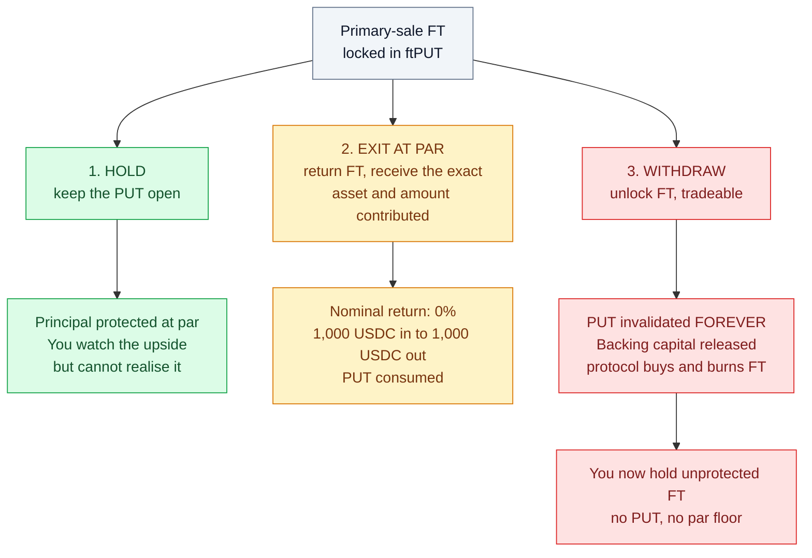
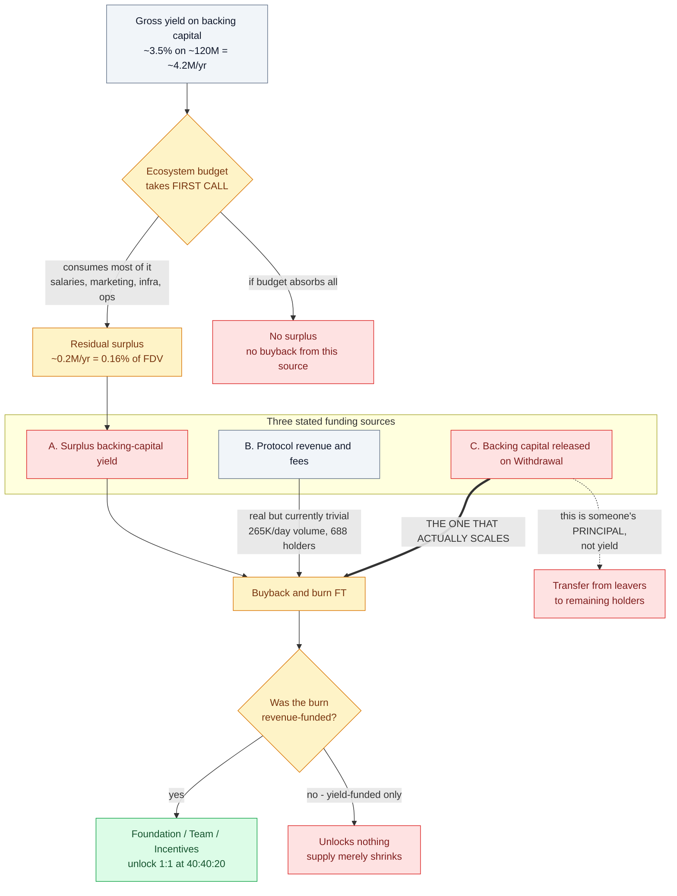
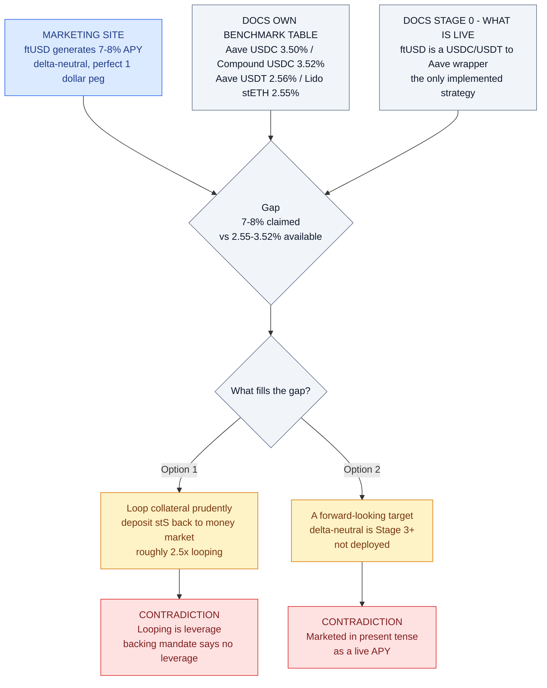
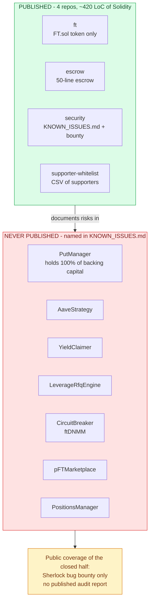

# Flying Tulip — Protocol Overview

Andre Cronje's "full-stack on-chain exchange". Compiled from official docs
(`docs.flyingtulip.com`), the `flyingtulipdotcom` GitHub org, and on-chain state.

**Compiled:** 2026-09-02

---

## 1. Corporate / fundraising

| Item | Value | Source |
|---|---|---|
| Private seed round | **$200M** | docs, press |
| Headline token valuation | **$1B** | press (The Block) |
| Public sale ("Capital Allocation") | On-chain, at same valuation | docs |
| Primary issue rate | **10 FT per $1** → implied **$0.10 / FT** | docs |
| Stated max supply | **10,000,000,000 FT**, pre-minted at deployment | docs |

## 2. The core invention: the Perpetual PUT

Primary-sale FT is not delivered freely. It is locked into a **Perpetual PUT**
(an NFT, `ftPUT`) that grants an **evergreen, perpetual American put struck at par**.

Three mutually exclusive-ish choices, available at any time:

1. **Hold** — keep the PUT open. Principal protected at par; you watch FT upside but
   cannot realise it.
2. **Exit at par** — return FT, receive **the exact asset and amount originally
   contributed** (1,000 USDC in → 1,000 USDC out; 2 ETH in → 2 ETH out). PUT consumed.
   Nominal return: **0%**.
3. **Withdraw** — unlock FT so you can trade it. PUT is **invalidated forever**.
   The backing capital that was reserved for your Exit is released and used by the
   protocol to **market-buy and burn FT**.

The critical property: **the three branches are one-way.** Branch 2 returns exactly your
principal and nothing more; branch 3 is the only way to realise upside and it destroys
the protection permanently. Protection and upside never coexist in the same hands at the
moment either matters — see [`W-01`](../findings/03-economics-high-yield.md#w-01--principal-protection-and-unlimited-upside-are-mutually-exclusive).

Key properties per docs:
- No vesting, no cliff, no lockup, no inflation, no additional minting.
- PUT attaches **only** to primary-issue FT. Secondary market FT has **no** PUT.
- "100% Capital Protection" — backing capital is **never spent**, kept in
  "safe, liquid, low-risk, no-leverage, no-bridging" yield positions.
- PUTs are tradeable on the `ftPUT` marketplace.

### Stated backing venues
- Major stables → **Aave v3**
- ETH → **stETH**
- SOL → **jupSOL**
- AVAX → **AVAX staking**
- USDe → **sUSDe**

## 3. Where "yield" supposedly comes from

Value does **not** flow to holders as cash. It flows as **buyback-and-burn**:

| Source | Description |
|---|---|
| A. Surplus backing-capital yield | **First call is the ecosystem budget** (salaries, marketing, infra, ops). Only the *surplus* is burned. |
| B. Protocol revenue & fees | ftUSD, Trade, Lend, Futures, Insurance revenue → buy FT "and, in many cases, burn it" |
| C. Released backing capital | When someone **Withdraws**, their reserved backing capital is spent buying + burning FT |

**Critical carve-out:** "Buyback-and-burn funded **only** by backing capital yield
**does not unlock anything**; they just reduce supply. **Revenue-funded** burns unlock
Foundation/Team/Incentives 1:1 at **40:40:20**."

Note the shape of that: source **A** is a *residual* behind the operating budget, source
**B** is currently trivial, and source **C** — the one that scales — is principal, not
yield. See [`W-02`](../findings/03-economics-high-yield.md#w-02--the-buyback-is-funded-mainly-by-principal-not-by-yield)
and [`W-04`](../findings/03-economics-high-yield.md#w-04--the-yield-is-junior-to-the-teams-operating-budget).

## 4. Product suite

| Product | Claim |
|---|---|
| **ftUSD** | "Generates **7-8% APY** through delta-neutral strategies while maintaining a perfect $1 peg" (marketing site) |
| **sftUSD** | Staked ftUSD. Only staked version accrues yield. Rewards paid **in FT**, claimed from a rewards vault, **no auto-compounding** |
| **Trade** | Volatility-adaptive pools (ftDNMM) |
| **Futures** | "Oracle-free" perps, <500ms, soft liquidations |
| **Lend** | Any-asset-against-any-collateral, dynamic LTV |
| **Insure** | Pay-as-you-go protection |

### ftUSD reality check (from the docs themselves)
- **Stage 0 (live): ftUSD is just a USDC/USDT → Aave wrapper.** That is the *only*
  implemented on-chain strategy.
- Delta-neutral carry is **Stage 3+** — roadmap, not deployed.
- Docs' own benchmark table (Ethereum): Aave v3 USDC **3.50%**, Aave v3 USDT **2.56%**,
  Compound v3 USDC **3.52%**, Lido stETH **2.55%**.
- The **7-8% figure does not appear anywhere in the documentation.**
- Illustrative pipeline for the future delta-neutral leg: supply USDC → borrow S →
  stake to stS → *"loop collateral prudently (e.g. deposit stS back to the money
  market) to increase safety buffers and carry"* — i.e. **looping = leverage**.
- "Unstaked ftUSD receives no yield; proceeds accrue to the **protocol treasury**."
- "All net strategy yield and protocol fee revenue is collected by the protocol
  treasury; then **at treasury discretion** distributed via buyback-and-distribute."

#### The 7-8% gap

#### What the "yield" is actually paid in

Realised USD return = (FT received) x (price you can exit at). Both legs are controlled by
the same party. That is a discretionary token distribution, not a yield.

## 5. What is actually open source

| Repo | Contents |
|---|---|
| `flyingtulipdotcom/ft` | **Only the FT ERC20/OFT token** (~370 LoC Solidity) + deploy scripts |
| `flyingtulipdotcom/escrow` | ~50-line "trusted token transfer" escrow |
| `flyingtulipdotcom/security` | `KNOWN_ISSUES.md` + Sherlock bounty pointer |
| `flyingtulipdotcom/supporter-whitelist` | Yearn/Keep3r/Fantom/Sonic supporter list |

**Read this as a coverage statement, not a criticism of intent.** Publishing
`KNOWN_ISSUES.md` naming your own residual risks is better practice than most. But the
third-party-audited surface is a **50-line helper contract**, while the contract
custodies all user collateral is unreviewed by the public.

**The protocol itself is closed-source.** The `KNOWN_ISSUES.md` names the real system:
`PutManager`, `AaveStrategy`, `YieldClaimer`, `LeverageRfqEngine`, `CircuitBreaker`
(ftDNMM), `pFTMarketplace`, `PositionsManager`, plus strategy-management roles and
timelocks. **None of that code is public.** The contract that custodies 100% of the
backing capital — `PutManager` — cannot be reviewed by the public; it is covered only
by a Sherlock bug bounty.

Bug bounty: https://audits.sherlock.xyz/bug-bounties/248
