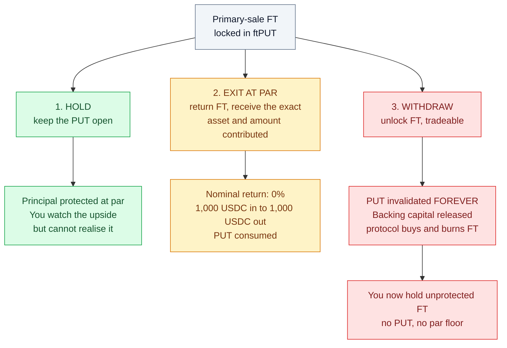
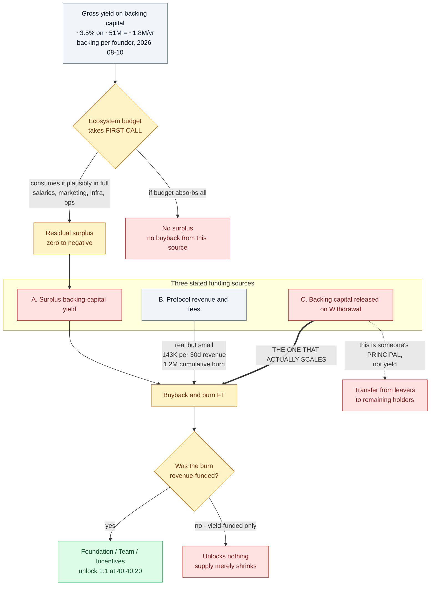
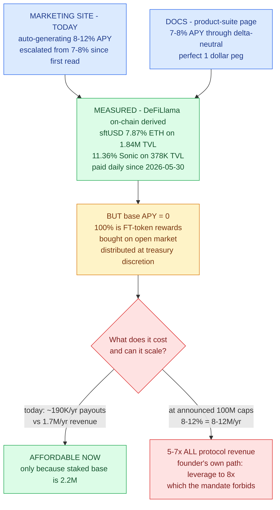
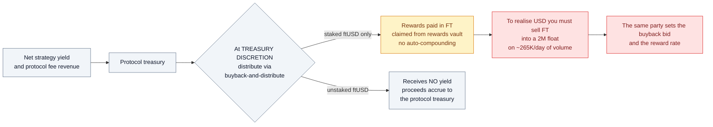
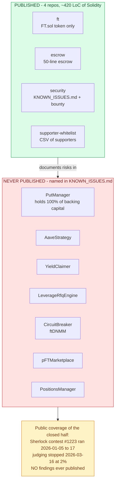
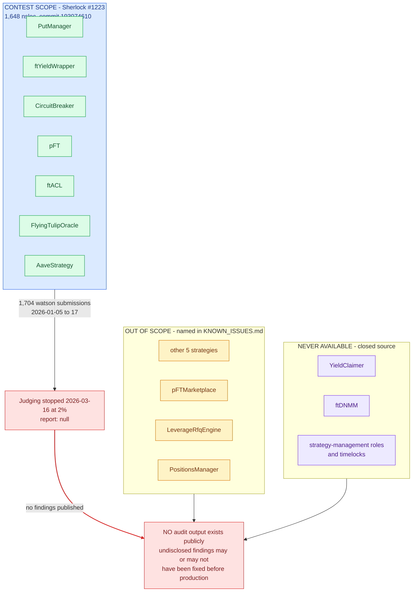

# Flying Tulip — Protocol Overview

Andre Cronje's "full-stack on-chain exchange". Compiled from official docs
(`docs.flyingtulip.com`), the `flyingtulipdotcom` GitHub org, on-chain state, and the
founder's public X statements.

**Compiled:** 2026-09-02. **Updated:** 2026-09-20 (marketed APY escalation, measured
sftUSD payouts, founder statements, points/rewards programs).

---

## 1. Corporate / fundraising

| Item | Value | Source |
|---|---|---|
| Private seed round | **$200M** | docs, press |
| Headline token valuation | **$1B** | press (The Block) |
| Public sale ("Capital Allocation") | On-chain, at same valuation | docs |
| Primary issue rate | **10 FT per $1** → implied **$0.10 / FT** | docs |
| Stated max supply | **10,000,000,000 FT**, pre-minted at deployment | docs — **stale**, see [`02-onchain-facts.md`](02-onchain-facts.md) (chain: 850M; burn disclosed on X) |

## 2. The core invention: the Perpetual PUT

Primary-sale FT is not delivered freely. It is locked into a **Perpetual PUT**
(an NFT, `ftPUT`) that grants an **evergreen, perpetual American put struck at par**.

Three mutually exclusive-ish choices, available at any time:

1. **Hold** — keep the PUT open. Principal protected at par; you watch FT upside but
   cannot realise it.
2. **Exit at par** — return FT, receive **the exact asset and amount originally
   contributed** (1,000 USDC in → 1,000 USDC out; 2 ETH in → 2 ETH out). PUT consumed.
   Nominal return: **0%**.
3. **Withdraw** — unlock FT so you can trade it. PUT is **invalidated forever**.
   The backing capital that was reserved for your Exit is released and used by the
   protocol to **market-buy and burn FT**.

The critical property: **the three branches are one-way.** Branch 2 returns exactly your
principal and nothing more; branch 3 is the only way to realise upside and it destroys
the protection permanently. Protection and upside never coexist in the same hands at the
moment either matters — see [`W-01`](../findings/03-economics-high-yield.md#w-01--principal-protection-and-unlimited-upside-are-mutually-exclusive).

Key properties per docs:
- No vesting, no cliff, no lockup, no inflation, no additional minting.
- PUT attaches **only** to primary-issue FT. Secondary market FT has **no** PUT.
- "100% Capital Protection" — backing capital is **never spent**, kept in
  "safe, liquid, low-risk, no-leverage, no-bridging" yield positions.
- PUTs are tradeable on the `ftPUT` marketplace.

### Stated backing venues
- Major stables → **Aave v3**
- ETH → **stETH**
- SOL → **jupSOL**
- AVAX → **AVAX staking**
- USDe → **sUSDe**

## 3. Where "yield" supposedly comes from

Value does **not** flow to holders as cash. It flows as **buyback-and-burn**:

| Source | Description |
|---|---|
| A. Surplus backing-capital yield | **First call is the ecosystem budget** (salaries, marketing, infra, ops). Only the *surplus* is burned. |
| B. Protocol revenue & fees | ftUSD, Trade, Lend, Futures, Insurance revenue → buy FT "and, in many cases, burn it" |
| C. Released backing capital | When someone **Withdraws**, their reserved backing capital is spent buying + burning FT |

**Critical carve-out:** "Buyback-and-burn funded **only** by backing capital yield
**does not unlock anything**; they just reduce supply. **Revenue-funded** burns unlock
Foundation/Team/Incentives 1:1 at **40:40:20**."

Scale check (founder's own numbers, 2026-08): PUT backing **$50.95M** → gross carry at
3.5% ≈ **$1.8M/yr**, before the ecosystem budget's first call. Protocol revenue
**$143K per 30 days** (≈ $1.7M/yr annualised). Cumulative buyback-and-burn **$1.2M**
(2026-09-18).

Note the shape of that: source **A** is a *residual* behind the operating budget on a
~$51M base, source **B** is real but small, and source **C** — the one that scales — is
principal, not yield. See [`W-02`](../findings/03-economics-high-yield.md#w-02--the-buyback-is-funded-mainly-by-principal-not-by-yield)
and [`W-04`](../findings/03-economics-high-yield.md#w-04--the-yield-is-junior-to-the-teams-operating-budget).

## 4. Product suite — claims vs. what is live

| Product | Claim (2026-09-20) |
|---|---|
| **ftUSD** | Marketing site: *"delta-neutral stablecoin maintaining $1 peg while **auto-generating 8-12% APY**"* (escalated from 7-8% since the first read). Docs product-suite page: *"generates **7-8% APY** through delta-neutral strategies while maintaining a perfect $1 peg"* |
| **sftUSD** | Staked ftUSD. Only staked version accrues yield. Rewards paid **in FT**, claimed from a rewards vault, **no auto-compounding** |
| **Trade** | Volatility-adaptive pools (ftDNMM) |
| **Futures** | "Oracle-free" perps, <500ms, soft liquidations |
| **Lend** | Any-asset-against-any-collateral, dynamic LTV |
| **Insure** | Pay-as-you-go protection |

### ftUSD reality check — measured, not just documented (2026-09-20)

**Deployed:** ftUSD is live — **3,913,448.58 supply** on Ethereum
(`0xf7d85ec4e7710f71992752eac2111312e73e9c9c`, 6 decimals), plus a Sonic deployment.
**Measured payout:** sftUSD stakers earn **7.87%** (Ethereum, $1.84M TVL) and **11.36%**
(Sonic, $378K TVL), daily since 2026-05-30 (DeFiLlama, on-chain-derived). **But the
entire measured APY is FT-token rewards** ("bought on open market") — **base/organic
APY is 0**. Docs' own benchmark table (Ethereum): Aave v3 USDC **3.50%**, Aave v3 USDT
**2.56%**, Compound v3 USDC **3.52%**, Lido stETH **2.55%**.

**The strategy contradiction.** The docs — updated **2026-09-16** — still say: *"At
launch, ftUSD is a USDC/USDT to Aave wrapper (Stage 0)"* and *"**The only on-chain
strategy currently implemented is stablecoin lending via Aave**"*; delta-neutral is
tagged roadmap (Stage 3+). The founder says the opposite: *"Delta Neutral on Ethereum
activated for ftUSD"* (2026-06-17), and (2026-09-16, asked about risk vs Aave):
*"ftUSD does carry additional risk, **the yield is from the delta hedge of stETH/ETH**
(on ethereum or stS/S on Sonic), so you do carry the additional native asset and staked
asset derivative risk."* The project's own artifacts contradict each other; the
"MultiCollateralDN" strategy contract is deployed but holds **0** of its named assets on
direct `eth_call`. At most: DN is live at ~$5M, undocumented.

**The leverage path.** Founder, 2026-08-21: *"DN scaling up, **still only 1x, safe up to
8x**."* And 2026-08-25: *"New stable invariant version will allow **looping**. At current
Lend rates would be **+9% per loop**."* Scaling the advertised yield to the announced
$100M caps requires the leverage the "no-leverage" backing mandate forbids.

**Distribution mechanics (docs' own words):** *"All net strategy yield and protocol fee
revenue is collected by the protocol treasury; then **at treasury discretion**
distributed via buyback-and-distribute."* *"Unstaked ftUSD receives no yield; proceeds
accrue to the protocol treasury."* New since first read: **Points** (2026-09-16,
*"redeemable anytime… claim of all future revenue"*) and **Rewards** (2026-09-18,
*"20% of protocol revenue used to buy FT from the open market"*).

#### The APY claim vs. the measured reality

#### What the "yield" is actually paid in

Realised USD return = (FT received) x (price you can exit at). Both legs are controlled by
the same party. That is a discretionary token distribution, not a yield.

### Founder statements on record (X, `@AndreCronjeTech`)

The founder's old handle `@AndreCronje` is **suspended**; he posts as
**`@AndreCronjeTech`** ("Founder @flyingtulip_. Creator of Yearn + Keep3r…").
Load-bearing statements, harvested read-only 2026-09-20:

| Date | Statement | Link |
|---|---|---|
| 2026-02-09 | "whatever is raised is deployed into **low risk yield (currently 100% into Aave)**. This allows the depositor to get their full refund at any time." | [post](https://x.com/AndreCronjeTech/status/2020864718630519238) |
| 2026-06-17 | "**Delta Neutral on Ethereum activated for ftUSD.** ~$4m TVL, forward projection ~9%, should only drop to ~6% post $20m tvl." | [post](https://x.com/AndreCronjeTech/status/2067299647400391037) |
| 2026-07-24 | "ftUSD has maintained its **> 7% APY target / anchor for 3 consecutive months**" | [post](https://x.com/AndreCronjeTech/status/2080636235421220896) |
| 2026-08-03 | "**Burned unallocated 9bn FT** bringing FDV to 100m." | [post](https://x.com/AndreCronjeTech/status/2084252341222396227) |
| 2026-08-10 | "**8.79bn unallocated FT permanently burned** … **$50.95m in PUT backing capital** … $1.14m in cumulative yield" | [post](https://x.com/AndreCronjeTech/status/2086806388114690269) |
| 2026-08-21 | "ftUSD earning 10% stable now for 3 months @ $5m. **DN scaling up, still only 1x, safe up to 8x.**" | [post](https://x.com/AndreCronjeTech/status/2090797766163177578) |
| 2026-08-26 | "$12.12m TVL … $3.86m in active loans … **$149k in 30-day fees … $143k in 30-day protocol revenue**" | [post](https://x.com/AndreCronjeTech/status/2092685779755499832) |
| 2026-09-07 | "**$2m mcap** $40m absolute max (assuming all PUT holders withdraw FT)" | [post](https://x.com/AndreCronjeTech/status/2097007707110711717) |
| 2026-09-15 | "USDC & USDT earning **8.68% stable now for over 6 months** on Ethereum … pure onchain DN." | [post](https://x.com/AndreCronjeTech/status/2099924067675430938) |
| 2026-09-16 | "ftUSD does carry additional risk, **the yield is from the delta hedge of stETH/ETH** … you do carry the additional native asset and staked asset derivative risk." | [post](https://x.com/AndreCronjeTech/status/2100294840986562825) |
| 2026-09-18 | "**8% - 12% stable yield** on USDC/USDT … $1.2m bb & burn … $2m mcap $48m fdv. All pure onchain." | [post](https://x.com/AndreCronjeTech/status/2100958345959964837) |

## 5. Token & denomination glossary

Every token/coin referenced in this audit, with its chain(s), decimals, unit/peg, and
role. Monetary figures elsewhere in this repo carry these units explicitly; this table
is the single source for what each unit means.

| Token | Chain(s) | Decimals | Unit / peg | Role |
|---|---|---|---|---|
| **FT** | ETH, BSC, Base, AVAX, Sonic | 18 | USD-priced; market ≈ **$0.108 USD**; issuer-pinned at oracle **10 FT per USD = $0.10 USD** | Protocol token; buyback-and-burn target; sftUSD reward currency |
| **pFT** (ftPUT NFT) | all PUT chains | — | Position NFT; amounts in **FT + collateral-token units**; strike in **USD, oracle 1e8 scale** | Perpetual PUT position; grants par-protected exit |
| **ftUSD** | ETH, Sonic | 6 | Pegged **1.00 USD** | Delta-neutral stablecoin |
| **sftUSD** | ETH, Sonic | 6 | Staked ftUSD; **rewards paid in FT** | Yield-bearing staked ftUSD |
| **Wrapper shares** | per collateral | — | **1:1 with principal** in token-native units; "not a share", **no yield embedded** | ftYieldWrapper position accounting |
| **Strategy shares** | per strategy | — | **1:1 with principal**; `valueOfCapital ≥ totalSupply` invariant | Strategy position accounting |
| **aToken** (aUSDC etc.) | per venue | mirrors underlying | Mirrors underlying | Aave position token; yield accrues here |
| **stETH** | ETH | 18 | ~1 ETH; **code assumes 1 stETH == 1 ETH** | Lido staked ETH (StEthStrategy) |
| **stAVAX** | AVAX | AVAX-denominated | AVAX-denominated; **unbonding queue** | Hypha staked AVAX (HyphaStAVAXStrategy) |
| **slisBNB** | BSC | BNB-denominated | BNB-denominated **via rateProvider**; oracle-priced | Lista staked BNB (ListaBNBStrategy) |
| **sUSDe** | ETH | ERC-4626 over USDe (USD) | USD; **7-day cooldown** | Ethena staked USDe (EthenaSUSDeStrategy) |
| **sUSDS** | ETH | ERC-4626 over USDS (USD) | USD | Spark/Sky staked USDS (SparkSUSDSStrategy) |
| **wETH / wBNB / wS** | ETH / BSC / Sonic | native | Native-denominated | Wrapped native collateral |
| **USDC, USDT, USDS, USDtb, USDe** | ETH (6 live); Sonic: USDC, wS | 6 | **USD-pegged**; oracle **1e8 scale** | Collateral stables |
| **CRV / CVX** | ETH | 18 | USD-priced | Third-party incentive tokens |
| **Contest / bounty money** | — | USDC | **76,500 USDC** prize pool | Sherlock contest #1223 prize |

> Units note: the oracle prices collateral in **USD at 1e8 scale** (i.e. 1.00 USD =
> 1e8 oracle units); FT is priced in USD at market but pinned by the issuer at
> 10 FT per USD. All monetary figures in this repo are stated with their unit.

## 6. What is actually open source

| Repo | Contents |
|---|---|
| `flyingtulipdotcom/ft` | **Only the FT ERC20/OFT token** (~370 LoC Solidity) + deploy scripts |
| `flyingtulipdotcom/escrow` | ~50-line "trusted token transfer" escrow |
| `flyingtulipdotcom/security` | `KNOWN_ISSUES.md` + Sherlock bounty pointer |
| `flyingtulipdotcom/supporter-whitelist` | Yearn/Keep3r/Fantom/Sonic supporter list |

**Read this as a coverage statement, not a criticism of intent.** Publishing
`KNOWN_ISSUES.md` naming your own residual risks is better practice than most. But the
third-party-audited surface is a **50-line helper contract**, while the contract
custodies all user collateral is unreviewed by the public.

**The protocol itself is closed-source.** The `KNOWN_ISSUES.md` names the real system:
`PutManager`, `AaveStrategy`, `YieldClaimer`, `LeverageRfqEngine`, `CircuitBreaker`
(ftDNMM), `pFTMarketplace`, `PositionsManager`, plus strategy-management roles and
timelocks. **None of that code is public.** The contract that custodies 100% of the
backing capital — `PutManager` — cannot be reviewed by the public; it is covered only
by a Sherlock bug bounty.

### The Sherlock contest — reviewed, but no output published

**Correction to the earlier framing.** The protocol was *not* merely "never published /
covered only by a bug bounty". A full Sherlock contest **did** run on the core
`ftPUT` codebase in January 2026 — the code was reviewed by 1,704 watson submissions —
but **no findings were ever published** and the code remains unpublished anywhere
official. Verified facts (Sherlock API + docs, 2026-09-20):

- **Contest:** [Sherlock #1223 "Flying Tulip"](https://audits.sherlock.xyz/contests/1223),
  ran **2026-01-05 → 01-17**, prize pool **76,500 USDC** (lead senior auditor
  pkqs90, 17,000 USDC; lead judge mstpr-brainbot, 5,000 USDC), **1,704 raw watson
  submissions**.
- **Scope (in):** `PutManager`, `ftYieldWrapper`, `CircuitBreaker`, `pFT`, `ftACL`,
  `FlyingTulipOracle`, `AaveStrategy` + interfaces — **1,648 nsloc** at commit
  `193074610…` (vendored at `contracts/sherlock-2026-01-ftput/`).
- **Out of scope:** the other 5 strategies, `pFTMarketplace`, `LeverageRfqEngine`,
  `PositionsManager`.
- **Outcome:** judging stopped **2026-03-16 at ~2%** (`judging_progress: 0.0205`);
  `report: null` — **no findings ever published**.
- **Still unpublished:** the official org has only the 4 repos above;
  `flyingtulipdotcom/ftPUT` → **404**. The docs audits page (updated 2026-09-16) still
  says **"Audit firm(s): TBA"** — no mention of the contest.

**Coverage summary.** The contest-scope contracts (green, inside the **blue** contest
box) were reviewed by this repo
now and by 1,704 watson submissions in January 2026; the out-of-scope contracts (amber)
were named but never contest-reviewed; the never-available contracts (purple) remain
closed source. The red edge is the operative fact: **judging stopped at 2% and no
findings were published** — so even the reviewed surface has no public audit output.
The code WAS reviewed, yet no audit result exists publicly, and undisclosed findings
may or may not have been fixed before production. (On-chain supply, distribution and
market figures live in [`02-onchain-facts.md`](02-onchain-facts.md); this section
covers only coverage.)

Bug bounty: https://audits.sherlock.xyz/bug-bounties/248
