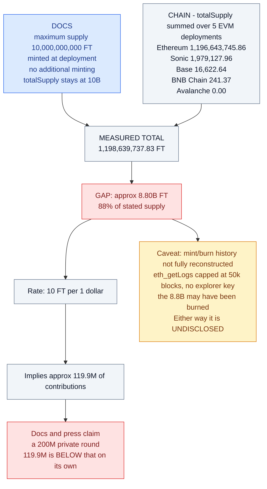
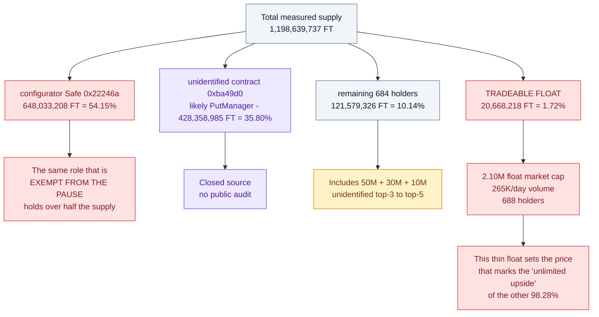

# Flying Tulip — Verified On-Chain Facts

All values were read live from public RPCs on **2026-09-02**. Reproduce with the
commands in `scripts/`.

Canonical FT token: **`0x5DD1A7A369e8273371d2DBf9d83356057088082c`**
(identical address on Ethereum, BSC, Base, Avalanche, Sonic).

---

## 1. Supply — docs say 10B, chain says ~1.2B

`totalSupply()` per chain:

| Chain | FT total |
|---|---|
| Ethereum | 1,196,643,745.86 |
| Sonic | 1,979,127.96 |
| Base | 16,622.64 |
| BNB Chain | 241.37 |
| Avalanche | 0.00 |
| **Total (EVM)** | **1,198,639,737.83 FT** |

**Stated max supply: 10,000,000,000 FT. Gap: ≈ 8.80B FT (88%).**

The docs assert *"maximum supply of 10 billion, minted at deployment"*, *"no
additional minting"*, and *"totalSupply stays at 10B, only the split between
circulating and non-circulating supply changes."* On-chain total is ~1.199B.

At the stated **10 FT per $1** rate, 1,198,639,737 FT implies **≈ $119.9M of
contributions** — *below* the publicly claimed **$200M private round** on its own.

> Caveat: I could not fully reconstruct the mint/burn history (public RPCs cap
> `eth_getLogs` at 50k blocks; no explorer API key). The 8.8B may have been burned in
> an event I could not page through. Either way it is an **undisclosed ~88% supply
> reduction** or stale documentation — materially relevant to anyone modelling FDV.



### Abandoned test deployment
`0x9B15Cce2D9C396B8B840C167374DCe873b2CcE6d` (Sonic) is in the repo's own
`deployments/sonic-mainnet/FT.json`. Live state:
- `name()` = **"Test name"**, `symbol()` = **"Test symbol"**
- `totalSupply()` = **9,999,995,990 FT**
- `paused()` = **true**, `owner()` = `0xa801864d0d24686b15682261aa05d4e1e6e5bd94` (an EOA, not the multisig)

A 10B-unit "Test name" deployment is permanently live on Sonic mainnet. Hygiene issue
only — it is not real FT supply — but it is exactly the kind of stale artefact that
gets picked up by token trackers.

## 2. Distribution — Ethereum (99.9% of supply is here)

`holdersCount` = **688**. Top holders:

| # | Address | Balance (FT) | Share | Identity |
|---|---|---|---|---|
| 1 | `0x22246a9183ce2ce6e2c2a9973f94aea91435017c` | 648,033,208 | **54.15%** | **the `configurator`** (verified via `configurator()`), 3-of-4 Gnosis Safe |
| 2 | `0xba49d0ac42f4fba4e24a8677a22218a4df75ebaa` | 428,358,985 | **35.80%** | unidentified contract (141-byte runtime; not a Safe; likely `PutManager`) |
| 3 | `0xaec73da67132a45d93e20cddf1b8cd13e2580870` | 50,000,000 | 4.18% | unknown |
| 4 | `0x4577286a6082df1f99adbf790c4104dd90abefbc` | 30,000,000 | 2.51% | unknown |
| 5 | `0x4de4043a9c6990b414bdcc106f15ef8ab3300c13` | 10,000,000 | 0.84% | unknown |

**Top 2 addresses control 89.95% of supply.**



## 3. Market data (Ethereum, 2026-09-02)

| Metric | Value |
|---|---|
| Price | **$0.10144** (≈ the $0.10 par) |
| `availableSupply` (float) | **20,668,218 FT** |
| Float market cap | **≈ $2.10M** |
| Fully-diluted (1.199B × price) | **≈ $121.6M** |
| 24h volume | **$264,564** |
| Holders | **688** |
| Contract created | 2025-11-17 (creator `0x44820497f8fe95a258a9522f0de2c04ab2bc3da3`) |

**FDV ≈ $121.6M vs. the $1B headline private-round valuation — roughly an 8x gap.**
Daily volume is ~0.13% of the claimed $200M private round.

## 4. Privileged roles

| Role | Address | Type | Powers |
|---|---|---|---|
| `owner()` | `0x1118e1c057211306a40A4d7006C040dbfE1370Cb` | Gnosis Safe, **3-of-5** | `setPaused`, `setName`, `setSymbol`, `transferConfigurator` |
| `configurator()` | `0x22246a9183ce2ce6e2c2a9973f94aea91435017c` | Gnosis Safe, **3-of-4** | `setPaused`, `transferConfigurator`, **pause-bypass transfers** |

### Signer overlap — the two roles are not independent

```
configurator Safe (0x22246a, 3-of-4):        owner Safe (0x1118e1, 3-of-5):
  0xb7b543337539219a5a1326acb71dba8bba408bc8   0xb7b543337539219a5a1326acb71dba8bba408bc8  <- same
  0x3c42749709bf354b3ae0db29fd2dd88089b21b4e   0x3c42749709bf354b3ae0db29fd2dd88089b21b4e  <- same
  0x09e2b49280f1879172b2c3345d08896921707881   0x09e2b49280f1879172b2c3345d08896921707881  <- same
  0xd0ca88388d1732594d611535314e9b6745396f5a   0xd0ca88388d1732594d611535314e9b6745396f5a  <- same
                                               0xf9e5af16243041ce3141284d225cafc0fc749a10
```

**4 of 5 owner signers are also configurator signers.** The "separation of duties"
between the role that can pause (`owner`) and the role that is exempt from the pause
(`configurator`) is largely cosmetic. There is no independent check on the configurator.


## 5. Pause state

`paused()` = **false** on Ethereum, BSC, Base, Avalanche and Sonic (canonical `0x5DD1…`).

Note the contract is **deployed paused** (`_pause()` in the constructor), so it had to
be unpaused by an insider after the 10B premint to the configurator.

## 6. Hardcoded role constants (`ft/utils/constants.ts`)

```ts
STANDARD_FT_DELEGATE     = 0x22246a9183ce2ce6e2c2a9973f94aea91435017c
STANDARD_FT_CONFIGURATOR = 0x22246a9183ce2ce6e2c2a9973f94aea91435017c   // same key
STANDARD_FINAL_OWNER     = 0x1118e1c057211306a40A4d7006C040dbfE1370Cb
```

Delegate and configurator are the **same address on every chain** — one 3-of-4 Safe
across Ethereum, BSC, Base, Avalanche, Sonic. Correlated-key risk: a single
compromise affects all deployments simultaneously. (Env overrides were added per
their own finding I-2, but the defaults hardcode one key.)

## 7. Correctness checks that PASSED

- `_EIP712_DOMAIN_TYPEHASH` = `0x8b73c3c6…b39400f` — **matches**
  `keccak256("EIP712Domain(string name,string version,uint256 chainId,address verifyingContract)")`
- `_PERMIT_TYPEHASH` = `0x6e71edae…d6126c9` — **matches**
  `keccak256("Permit(address owner,address spender,uint256 value,uint256 nonce,uint256 deadline)")`
- `DOMAIN_SEPARATOR()` includes `block.chainid` + `address(this)` → no cross-chain permit replay
- Nonce is consumed in both `permit` overloads → no replay; ERC-1271 path reentrancy
  is bounded by recursion depth/gas
- OFT credit/debit paths are correctly exempted from the pause (`endpoint` caller check)
