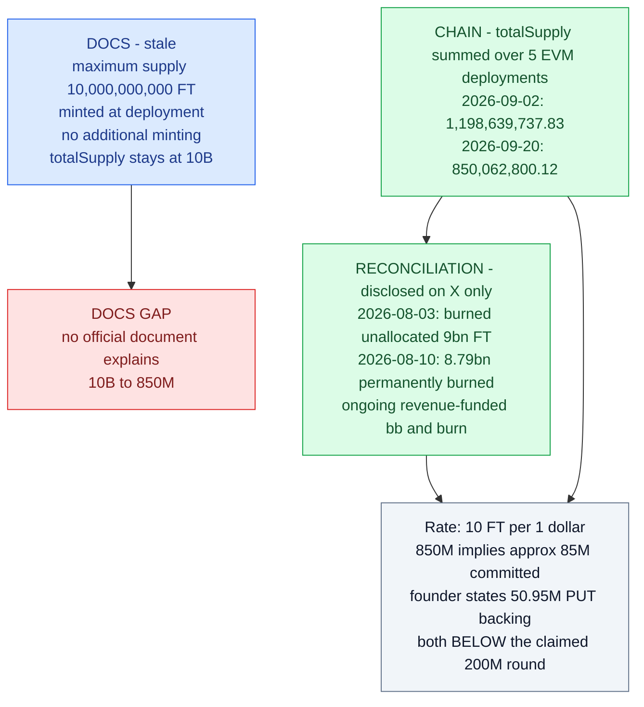
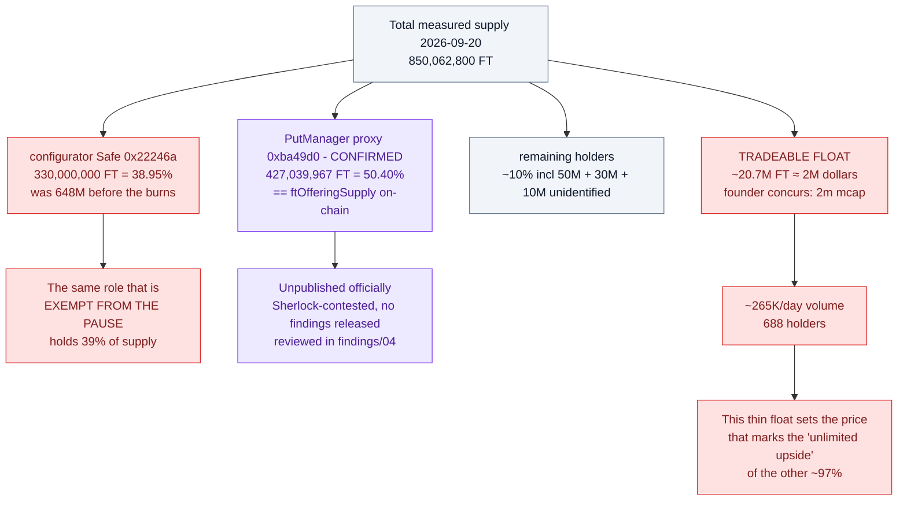
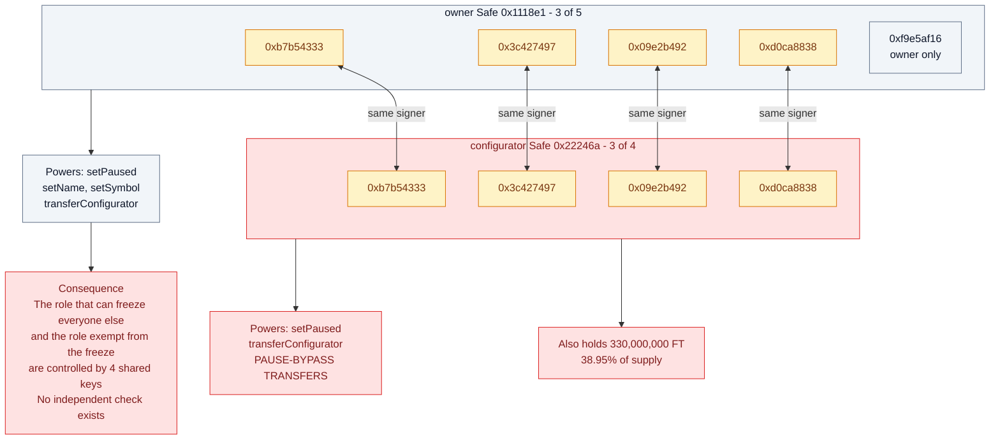
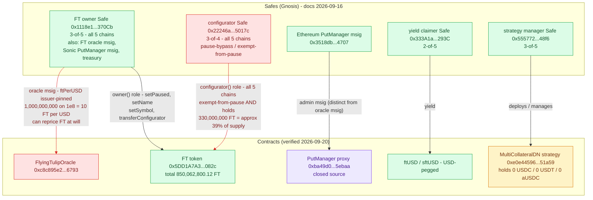

# Flying Tulip — Verified On-Chain Facts

Values were first read live from public RPCs on **2026-09-02** and re-verified on
**2026-09-20** (raw JSON-RPC `eth_call`/`eth_getCode` on all five chains). Where the two
reads differ, the 2026-09-20 value is authoritative and the change is noted. Reproduce
with the commands in `scripts/`.

Canonical FT token: **`0x5DD1A7A369e8273371d2DBf9d83356057088082c`**
(identical address — and identical 10,002-byte runtime — on Ethereum, BSC, Base,
Avalanche, Sonic).

---

## 1. Supply — docs say 10B, chain says 850M and shrinking

`totalSupply()` per chain (2026-09-20):

| Chain | FT total (2026-09-20) | FT total (2026-09-02) |
|---|---|---|
| Ethereum | 847,330,958.55 | 1,196,643,745.86 |
| Sonic | 2,714,977.56 | 1,979,127.96 |
| Base | 16,622.64 | 16,622.64 |
| BNB Chain | 241.37 | 241.37 |
| Avalanche | 0.00 | 0.00 |
| **Total (EVM)** | **850,062,800.12 FT** | **1,198,639,737.83 FT** |

**Stated max supply: 10,000,000,000 FT.** Supply fell **−348,576,937.71 FT (−29%) in 18
days**, concentrated on Ethereum.

The docs assert *"maximum supply of 10 billion, minted at deployment"*, *"no
additional minting"*, and *"totalSupply stays at 10B, only the split between
circulating and non-circulating supply changes."* None of that matches the chain: supply
was 1.199B at first read and is 850M now.

**Where the ~8.8B went — disclosed on X, not in the docs.** The founder stated on
2026-08-03: *"Burned unallocated 9bn FT bringing FDV to 100m"*, and on 2026-08-10:
*"8.79bn unallocated FT permanently burned."* The burn is real and publicly acknowledged
([posts](https://x.com/AndreCronjeTech/status/2084252341222396227));
the documentation was never updated. Burns are ongoing: the 18-day −348.6M move combines
further unallocated burns from the configurator's own balance with revenue-funded
buyback-and-burn (founder, 2026-09-17: *"From bb&burn, not non-circ."*; cumulative
buyback $1.2M per founder, 2026-09-18).

At the stated **10 FT per $1** rate, 850.06M FT implies **≈ $85.0M of contributions** if
every token is issued — still *below* the publicly claimed **$200M private round**. The
founder's own figure is lower again: *"$50.95m in PUT backing capital"* (2026-08-10),
consistent with issued supply only (850M − 330M configurator-held ≈ 520M FT ≈ $52M).

> Method note: mint/burn history is still not reconstructable from public RPCs
> (`eth_getLogs` capped at 50k blocks), but the founder's public statements resolve the
> direction of the discrepancy. What remains undocumented is the *reconciliation*: no
> official doc explains 10B → 850M.



### Abandoned test deployment
`0x9B15Cce2D9C396B8B840C167374DCe873b2CcE6d` (Sonic) is in the repo's own
`deployments/sonic-mainnet/FT.json`. State as of 2026-09-02 (not re-checked 2026-09-20):
- `name()` = **"Test name"**, `symbol()` = **"Test symbol"**
- `totalSupply()` = **9,999,995,990 FT**
- `paused()` = **true**, `owner()` = `0xa801864d0d24686b15682261aa05d4e1e6e5bd94` (an EOA, not the multisig)

A 10B-unit "Test name" deployment is permanently live on Sonic mainnet. Hygiene issue
only — it is not real FT supply — but it is exactly the kind of stale artefact that
gets picked up by token trackers.

## 2. Distribution — Ethereum (99.9% of supply is here)

`holdersCount` = **688** (2026-09-02; not re-measured). Top holders (2026-09-20):

| # | Address | Balance (FT, 2026-09-20) | Share | Identity |
|---|---|---|---|---|
| 1 | `0x22246a9183ce2ce6e2c2a9973f94aea91435017c` | 330,000,000 | **38.95%** | the `configurator` (same address verified at first read; 648,033,208 on 2026-09-02 — its balance absorbed most of the 18-day burn) |
| 2 | `0xba49d0ac42f4fba4e24a8677a22218a4df75ebaa` | 427,039,967 | **50.40%** | **`PutManager` proxy — CONFIRMED** (EIP-1167; `ftOfferingSupply()` on-chain equals its FT balance exactly; all 41 contest selectors present; see *Deployed PutManager state* below) |
| 3 | `0xaec73da67132a45d93e20cddf1b8cd13e2580870` | 50,000,000 | 5.90% | unknown (2026-09-02; not re-measured) |
| 4 | `0x4577286a6082df1f99adbf790c4104dd90abefbc` | 30,000,000 | 3.54% | unknown (2026-09-02; not re-measured) |
| 5 | `0x4de4043a9c6990b414bdcc106f15ef8ab3300c13` | 10,000,000 | 1.18% | unknown (2026-09-02; not re-measured) |

**Top 2 addresses control 89.35% of supply** (89.95% at first read).



## 3. Market data (Ethereum, 2026-09-20)

| Metric | Value | As of |
|---|---|---|
| Price | **$0.1079** (14 pairs, DexScreener) | 2026-09-20 |
| 24h volume | **$267,438** | 2026-09-20 |
| `availableSupply` (float) | **20,668,218 FT** ≈ **$2.10M** — founder concurs: *"$2m mcap"* (X, 2026-09-18) | 2026-09-02 |
| Fully-diluted (850.06M × price) | **≈ $91.7M** | 2026-09-20 |
| Holders | **688** | 2026-09-02 |
| Contract created | 2025-11-17 (creator `0x44820497f8fe95a258a9522f0de2c04ab2bc3da3`) | — |

**FDV ≈ $91.7M vs. the $1B headline private-round valuation — roughly an 11x gap.**
Note the founder's own "$48m fdv" (X, 2026-09-18) is inconsistent with market data
(850.06M × $0.108) by about 2x, while his "$2m mcap" matches the float exactly.
Daily volume is ~0.13% of the claimed $200M private round.

## 4. Privileged roles

| Role | Address | Type | Powers |
|---|---|---|---|
| `owner()` | `0x1118e1c057211306a40A4d7006C040dbfE1370Cb` | Gnosis Safe, **3-of-5** | `setPaused`, `setName`, `setSymbol`, `transferConfigurator` |
| `configurator()` | `0x22246a9183ce2ce6e2c2a9973f94aea91435017c` | Gnosis Safe, **3-of-4** | `setPaused`, `transferConfigurator`, **pause-bypass transfers** |

Re-verified 2026-09-20: `owner()` returns `0x1118e1c0…370Cb` on **all five chains**. The
`configurator()` read reverted on re-check, so role continuity is inferred from the #1
holder balance at the same address rather than re-read directly.

### Signer overlap — the two roles are not independent

```
configurator Safe (0x22246a, 3-of-4):        owner Safe (0x1118e1, 3-of-5):
  0xb7b543337539219a5a1326acb71dba8bba408bc8   0xb7b543337539219a5a1326acb71dba8bba408bc8  <- same
  0x3c42749709bf354b3ae0db29fd2dd88089b21b4e   0x3c42749709bf354b3ae0db29fd2dd88089b21b4e  <- same
  0x09e2b49280f1879172b2c3345d08896921707881   0x09e2b49280f1879172b2c3345d08896921707881  <- same
  0xd0ca88388d1732594d611535314e9b6745396f5a   0xd0ca88388d1732594d611535314e9b6745396f5a  <- same
                                               0xf9e5af16243041ce3141284d225cafc0fc749a10
```

**4 of 5 owner signers are also configurator signers.** The "separation of duties"
between the role that can pause (`owner`) and the role that is exempt from the pause
(`configurator`) is largely cosmetic. There is no independent check on the configurator.



## Smart contracts (verified 2026-09-20)

Complete inventory of deployed contracts, verified 2026-09-20 via live `eth_call` /
`eth_getCode` across the five chains, cross-checked against the official multisig page
(https://docs.flyingtulip.com/risks/multisigs/, updated 2026-09-16). Every row gives
role + chain + evidence (live read or official docs).

| Contract | Address | Chain(s) | Role / evidence |
|---|---|---|---|
| FT token | `0x5DD1A7A369e8273371d2DBf9d83356057088082c` | ETH / BSC / Base / AVAX / Sonic (same address) | Canonical token; same 10,002-byte runtime on every chain; 18 dec; total 850,062,800.12 FT (2026-09-20). `eth_getCode` |
| Abandoned test FT | `0x9B15Cce2D9C396B8B840C167374DCe873b2CcE6d` | Sonic | In repo `deployments/sonic-mainnet/FT.json`; "Test name"/"Test symbol"; 9,999,995,990 FT; paused; owner an EOA. Stale artifact, not real supply |
| PutManager proxy | `0xba49d0ac42f4fba4e24a8677a22218a4df75ebaa` | ETH | EIP-1167 minimal (141 bytes); impl `0x1e4e741e5f0f4f258def137e196871eddae4bf5` (19,098 bytes); msig `0x3518db98cb1fcb19e0c430b3e7f7f74b2a354707`; configurator `0x22246a…`; all 41 contest selectors present |
| PutManager proxy (same address) | `0xba49d0…` | Sonic | impl `0x90ae2cac15f8d58a258f7b4a243657754469922a` (18,798 bytes); msig `0x1118e1c0…370Cb`; pre-offering (0 supply, sale disabled, transferable false) |
| FlyingTulipOracle | `0xc8c895e2be9511006287ce02e51b5b198ab36793` | ETH | 2,531 bytes; `ftPerUSD()` = 1,000,000,000 on 1e8 = 10 FT/USD, issuer-pinned; oracle msig `0x1118e1c0…370Cb` |
| Aave oracle pointer | `0x54586be62e3c3580375ae3723c145253060ca0c2` | ETH | collateral feed pointer |
| Aave oracle pointer | `0xd63f7658c66b2934bd234d79d06aef5290734b30` | Sonic | collateral feed pointer |
| ftUSD | `0xf7d85ec4e7710f71992752eac2111312e73e9c9c` | ETH + Sonic | 6 dec, USD-pegged ($1.00); supply 3,913,448.58 ftUSD |
| sftUSD | `0xD1E5A86f1005F6356Bd022C587dE0f430CD2aeb1` | Sonic | yield wrapper; rewards paid in FT |
| MultiCollateralDN strategy | `0xe0e445967256ee60111e243e0f0f94dd1d351a59` | ETH | deployed; holds 0 USDC / 0 USDT / 0 aUSDC when checked |
| Safe — msig + treasury (FT `owner()`) | `0x1118e1c057211306a40A4d7006C040dbfE1370Cb` | all 5 chains | 3-of-5; FT owner; also Ethereum oracle msig and Sonic PutManager msig (docs, 2026-09-16) |
| Safe — `configurator()` | `0x22246a9183ce2ce6e2c2a9973f94aea91435017c` | all 5 chains | 3-of-4; holds 330,000,000 FT = 38.95% of supply (docs, 2026-09-16) |
| Safe — yield claimer | `0x333A1ad484b540EcAc1edFa73a066aB57275293C` | — | 2-of-5 (docs, 2026-09-16) |
| Safe — strategy manager | `0x5557729b169082f07d3131D560E2f2cb5e6c48f6` | — | 3-of-5 (docs, 2026-09-16) |
| Safe — Ethereum PutManager msig | `0x3518db98cb1fcb19e0c430b3e7f7f74b2a354707` | ETH | PutManager admin; distinct from oracle msig `0x1118e1…` (docs, 2026-09-16) |

## Deployed PutManager state

Ethereum proxy `0xba49d0…` state (live `eth_call`, 2026-09-20). Every figure carries its
unit; oracle prices are USD 1e8 scale.

| Field | Value |
|---|---|
| `saleEnabled` | **false** — sale closed |
| `transferable` | **true** |
| `ftACL` | `0x0` — disabled |
| `ftOfferingSupply` | 427,039,967.11 FT — equals the proxy's own FT balance |
| `ftAllocated` | 399,436,072.55 FT |
| `paused` | false |
| Collateral index | 6 (Ethereum) |

**Collateral index = 6 (Ethereum)** — live oracle prices (USD, 1e8 scale):

| Token | Oracle price (USD 1e8) |
|---|---|
| USDC | 0.99985 |
| WETH | 2,581.74 |
| USDT | 0.99970 |
| USDS | 0.99982 |
| USDtb | 1.00 |
| USDe | 0.99970 |

**Sonic proxy — pre-offering** (0 supply, sale disabled, transferable false),
collateral index = 2:

| Token | Address | Oracle price (USD) |
|---|---|---|
| USDC | `0x29219dd400f2bf60e5a23d13be72b486d4038894` | 0.99989 |
| wS | `0x039e2fb66102314ce7b64ce5ce3e5183bc94ad38` | 0.03440 |

## Governance topology — which Safe controls what

Safes from the official multisig page (docs, 2026-09-16); contracts verified live
2026-09-20. Red edges are the two reason-for-concern flows: the configurator is
exempt from the pause and sits on 330,000,000 FT, and the oracle msig (the FT-owner
Safe) can reprice FT at will.



## 5. Pause state

`paused()` = **false** on Ethereum, BSC, Base, Avalanche and Sonic (canonical `0x5DD1…`),
re-verified 2026-09-20.

Note the contract is **deployed paused** (`_pause()` in the constructor), so it had to
be unpaused by an insider after the 10B premint to the configurator.

## 6. Hardcoded role constants (`ft/utils/constants.ts`)

```ts
STANDARD_FT_DELEGATE     = 0x22246a9183ce2ce6e2c2a9973f94aea91435017c
STANDARD_FT_CONFIGURATOR = 0x22246a9183ce2ce6e2c2a9973f94aea91435017c   // same key
STANDARD_FINAL_OWNER     = 0x1118e1c057211306a40A4d7006C040dbfE1370Cb
```

Delegate and configurator are the **same address on every chain** — one 3-of-4 Safe
across Ethereum, BSC, Base, Avalanche, Sonic. Correlated-key risk: a single
compromise affects all deployments simultaneously. (Env overrides were added per
their own finding I-2, but the defaults hardcode one key.)

## 7. Correctness checks that PASSED

- `_EIP712_DOMAIN_TYPEHASH` = `0x8b73c3c6…b39400f` — **matches**
  `keccak256("EIP712Domain(string name,string version,uint256 chainId,address verifyingContract)")`
- `_PERMIT_TYPEHASH` = `0x6e71edae…d6126c9` — **matches**
  `keccak256("Permit(address owner,address spender,uint256 value,uint256 nonce,uint256 deadline)")`
- `DOMAIN_SEPARATOR()` includes `block.chainid` + `address(this)` → no cross-chain permit replay
- Nonce is consumed in both `permit` overloads → no replay; ERC-1271 path reentrancy
  is bounded by recursion depth/gas
- OFT credit/debit paths are correctly exempted from the pause (`endpoint` caller check)
